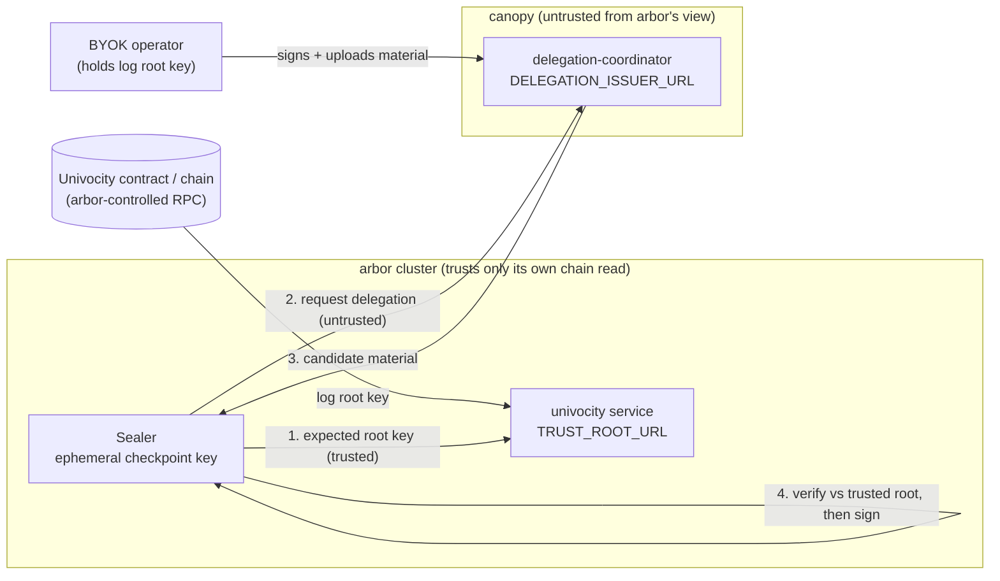

# ARC — Checkpoint delegation isolation (sealer ↔ untrusted canopy issuer)

**Status:** DRAFT
**Date:** 2026-06-21
**Related:**
[arc-univocity-instance-registration.md](arc-univocity-instance-registration.md),
[ADR-0005 webhook delivery](../adr/adr-0005-delegation-webhook-delivery.md),
[arbor plan-0003 non-custodial checkpoint support](../../../arbor/docs/plan-0003-non-custodial-checkpoint-support.md),
[arbor plan-0004 coordinator-backed BYOK lease proof](../../../arbor/docs/plan-0004-coordinator-backed-byok-lease-proof.md),
[plan-0021 delegation coordinator APIs](../plans/plan-0021-delegation-coordinator-apis.md),
[plan-0023 coordinator public-root](../plans/plan-0023-coordinator-public-root.md),
[devdocs ADR-0031 payments and contract involvement](../../../devdocs/adr/adr-0031-payments-and-univocity-contract-involvement.md),
[devdocs glossary](../../../devdocs/glossary.md)

---

## Purpose — the framing assumption

This ARC records the **architectural framing** for the univocity-instance
registration, payment-authority, and webhook work. It is the assumption every
subsequent design leans on:

> The existing pending-delegation model between Sealer and its two configurable
> URLs — an **untrusted request** URL and a **trusted check** URL — is
> sufficient to isolate the arbor cluster services **completely** from
> registration, payment authority, webhooks, and the kill switch.

Concretely: **arbor trusts its own connection to the blockchain** to verify
delegator validity, and **issues delegation requests over an untrusted
connection hosted by canopy**. Because of this, canopy can host data-plane
registration, payment-authority marking, webhook notification, and a kill
switch **without** compromising BYOK and **without** forcing custodial keys on
operators who want automated checkpoint signing.

This work changes only the **canopy** side of that boundary. No arbor service
needs to trust canopy for correctness.

## The two-URL sealer model

Sealer already separates *where it asks for delegation material* from *what it
trusts to validate that material* (arbor plan-0003 / plan-0004):

| Sealer config | Role | Backed by | Trust |
|---|---|---|---|
| `TRUST_ROOT_URL` | **trusted check** — expected log root key | arbor-operated univocity service reading **arbor's own chain RPC** | trusted |
| `DELEGATION_ISSUER_URL` | **untrusted request** — candidate delegation material | canopy **delegation-coordinator** | untrusted |

The sealer:

1. generates (or loads) an **ephemeral** checkpoint signing key;
2. reads the expected log root key from the **trusted check** (its own chain
   view);
3. **requests** a delegation from the **untrusted issuer**;
4. **cryptographically verifies** the returned delegation against the trusted
   root, the requested log, MMR range, chain/contract domain, and — critically —
   its own ephemeral delegated public key, **before** signing anything;
5. signs checkpoints with the verified delegated key.

The issuer endpoint name and any HTTP auth on it are **access control only**,
never log authority (arbor plan-0003 §"Endpoint authentication confusion").

## Why the signed delegation is not sensitive

The delegation binds **Sealer's ephemeral checkpoint signing public key**. Only
the holder of the matching ephemeral private key — the **runtime sealer
instance** — can use the delegation to produce a valid checkpoint signature. A
third party who intercepts the delegation (in transit, or at rest in the
coordinator) **cannot** use it to sign anything.

This single fact is what makes the rest of the design cheap and safe:

- the coordinator may store delegation material as an **untrusted** broker;
- the **webhook notification** payload (logId, MMR range, the ephemeral
  delegated public key) carries **no secret** — it is the same metadata
  `GET …/pending-delegation` already exposes;
- delivery of that notification does not need confidentiality, only **integrity
  and source authentication** (see [ADR-0005](../adr/adr-0005-delegation-webhook-delivery.md)).

## The kill switch is a liveness lever, not a safety hole

Canopy's ability to **stop surfacing delegation requests** for a registration
(the kill switch) operates entirely on the **untrusted** side. Because the
sealer validates every delegation against **arbor's own** chain read, canopy
withholding material can **never** cause an invalid checkpoint to be accepted —
it can only stop *this canopy instance* from helping seal *that* log.

A blocked operator still holds their BYOK keys and may take their material to
another canopy instance or run their own pipeline. This is the basis for the
"not censorship" property: the canopy operator declines to do unpaid work; the
mandate operator is free to move.

## Cluster isolation summary

- Arbor (ranger / sealer / custodian / univocity) needs **no** trust in canopy.
- Canopy preserves the platform's **pipe** property by hosting, on its side of
  the boundary: data-plane instance registration, payment-authority marking,
  webhook notification, and the kill switch.
- There are **no special config-time logs** and **no singleton logs**: canopy
  may register any number of payment-authoritative and regular instances, which
  is also what makes end-to-end testing feasible.

## Links to the dependent designs

- Registration model, payment graph, webhook CRUD, kill-switch flag:
  [arc-univocity-instance-registration.md](arc-univocity-instance-registration.md).
- Webhook notification delivery options:
  [ADR-0005](../adr/adr-0005-delegation-webhook-delivery.md).
- Payment stays off-chain / no contract linkage:
  [devdocs ADR-0031](../../../devdocs/adr/adr-0031-payments-and-univocity-contract-involvement.md).
