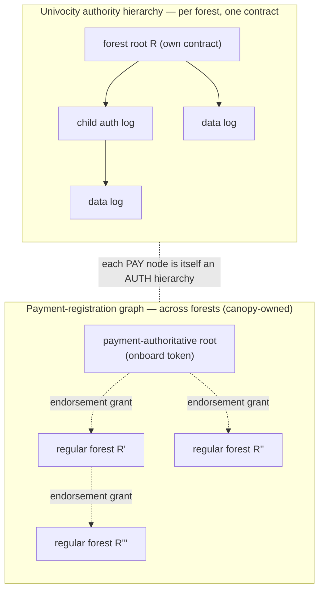
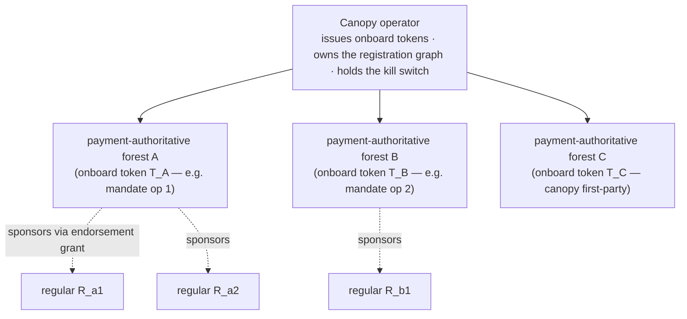
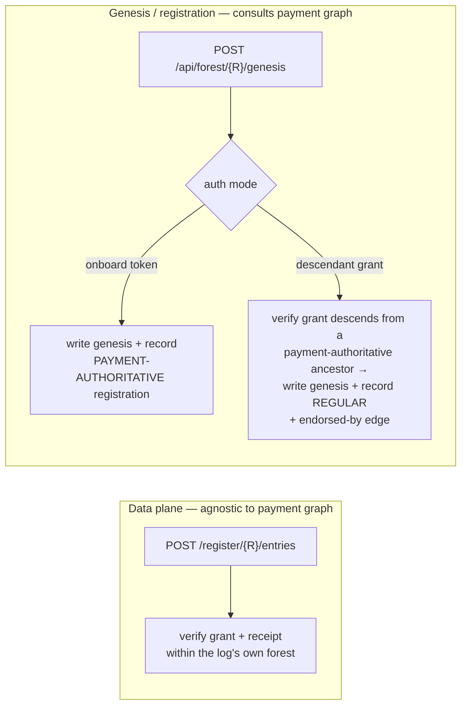

# ARC — Univocity instance registration, payment authority, and webhook notification

**Status:** DRAFT
**Date:** 2026-06-21
**Related:**
[arc-checkpoint-delegation-isolation.md](arc-checkpoint-delegation-isolation.md),
[ADR-0005 webhook delivery](../adr/adr-0005-delegation-webhook-delivery.md),
[plan-0018 forest genesis API](../plans/plan-0018-forest-genesis-api.md),
[plan-0028 forest genesis chain binding](../plans/plan-0028-forest-genesis-chain-binding.md),
[plan-0021 delegation coordinator APIs](../plans/plan-0021-delegation-coordinator-apis.md),
[grants.md](../grants.md),
[devdocs ADR-0031](../../../devdocs/adr/adr-0031-payments-and-univocity-contract-involvement.md),
[devdocs glossary](../../../devdocs/glossary.md)

---

## Purpose

Define how:

1. anyone can register a **BYOK Univocity instance** with a canopy operator as a
   self-serve, **data-plane** step (single click / POST), then use ordinary
   SCRAPI sign-and-register flows against it;
2. the canopy operator gains assurance that instance activity is **paid for**,
   without centralizing config or creating special/singleton logs;
3. the holder of a log's checkpoint signing key is **efficiently notified** that
   a delegation is requested (webhooks), with **polling remaining first-class**.

This ARC depends on the trust boundary in
[arc-checkpoint-delegation-isolation.md](arc-checkpoint-delegation-isolation.md).
It defines the **registration API shape** (composing the admin and grant-backed
paths) and the **webhook event schema + CRUD**. The webhook is **registered and
stored** by this work but **not invoked** yet; invocation/delivery is
[ADR-0005](../adr/adr-0005-delegation-webhook-delivery.md).

## Domain model — two graphs, never fused

A new BYOK Univocity instance is **a new forest with its own root and its own
contract** (one contract ↔ one `rootLogId`). Two distinct graphs exist; keeping
them separate is the crux of the model:

- **Univocity authority hierarchy** — *within* one forest / one contract:
  `R` → child auth logs → data logs. This is what grant/receipt verification
  (register-grant, register-signed-statement) checks against.
- **Payment-registration graph** — *across* forests: a payment-authoritative
  root (created with an onboard token) sits at the root; **regular** forests
  hang off it via **endorsement grants**. We "dogfood" Univocity here — the
  nodes are real forests and the edges are real, verified grants — but this
  graph answers a different question: *who vouches payment for this log?*



Payment coverage for any log = resolve its forest, then **walk up the
payment-registration graph** to a payment-authoritative root.

## Payment authority — a set of forests, sponsorship by grant

A single canopy operator typically holds a **set** of payment-authoritative
forests (one per onboard token it issued — e.g. one per mandate operator, plus
one it grants itself for first-party use). Each payment-authoritative operator
**sponsors** which third parties it covers, by **issuing them an endorsement
grant** that descends from its payment-authoritative root.



Key consequences (load-bearing):

1. A payment-authoritative root's **own** coverage comes **directly from the
   onboard token** — no self-grant, no regress.
2. A **regular** instance needs an **endorsement grant descending from** a
   payment-authoritative root, so the sponsoring operator decides whom it
   vouches for (the "independent endorser" role made concrete).
3. A payment-authoritative forest must be **live / sealing** to mint *completed*
   grants (grant + receipt) for its sponsorees — "payment-authoritative" is an
   operating forest, not a paper record.

Payment itself is **off-chain** and carries **no cryptographic proof**: canopy
hands an onboard token to an operator, remembers it, and reconciles dues from
public log + chain activity (out of scope here; consistent with
[ADR-0031](../../../devdocs/adr/adr-0031-payments-and-univocity-contract-involvement.md)).
If unfunded, canopy flips the kill switch (below).

## register-statement is agnostic; only genesis consults the payment graph

This is what keeps the pipe property intact. **Data-plane** APIs
(register-signed-statement, register-grant for child logs) do **not** know or
care whether a forest is payment-authoritative or regular — they verify within
the log's own forest exactly as today. Only the **genesis / registration** path
consults the payment-registration graph.



## Registration = genesis POST; curator token retired (clean cut)

`POST /api/forest/{R}/genesis` **becomes** the Univocity-instance registration
endpoint. The `CURATOR_ADMIN_TOKEN` gate is **removed** (clean cut, no alias).
Every forest is now created via one of two auth modes — there is no privileged
"curator / first-party" path, and canopy's own forests are simply
payment-authoritative forests for which canopy self-issued the onboard token.
This is what eliminates special config-time / singleton logs.

| Auth mode | Header | Effect | Registration class |
|---|---|---|---|
| **Onboard token** | `Authorization: Bearer <CANOPY_PAYMENTS_ONBOARD_TOKEN>` | write genesis (internal R2 writer, unchanged) | **payment-authoritative** |
| **Descendant grant** | `Authorization: Forestrie-Grant <completed grant>` | verify grant descends from a payment-authoritative ancestor; write genesis | **regular** + `endorsed-by` edge |

Unchanged: the **R2 writer** and genesis bytes (COSE_Key + chain binding, plan-0028);
`GET /api/forest/{R}/genesis` stays **public** (the demo curls it unauthenticated).

New bookkeeping (canopy-api): persist the **set of issued onboard tokens** and
the **registration record** per forest `{ class, onboardTokenRef | endorsedBy,
chainBinding, createdAt }`. Onboard-token validation moves from a constant-time
compare against one secret to **set membership / signature** against issued
tokens.

## Ownership split

| Record | Owner | Notes |
|---|---|---|
| Forest genesis document (trust anchor + chain binding) | **canopy-api** (R2 writer) | unchanged storage; auth extended |
| Issued onboard-token set + registration records (class, `endorsed-by`) | **canopy-api** | the payment-registration graph |
| Webhook config + `enabled` (kill-switch) flag | **delegation-coordinator** | `log_delegation_config` per log; co-located shard with `pending`, `public-root` |

canopy-api is the **controller**; the coordinator is the **enforcement point**.

## Registration API shape (canopy-api)

`POST /api/forest/{R}/genesis` (CBOR body as today: COSE_Key + `-68011` univocity
addr + `-68013` chain id, plan-0028), extended:

- **Auth:** onboard token **or** descendant grant (table above).
- **Optional** `webhookUrl`: on success, canopy-api **forwards** it to the coordinator
  webhook CRUD (single-post ergonomics for the demo). The coordinator remains
  the owner of webhook config; operators may also manage it directly.
- **Response:** 201 with `{ R, class, endorsedBy?, chainBinding }`; 401/403 on
  auth failure; 409 on `logId→R` uniqueness conflict (univocity-enforced).

## Endorsement grant shape (pinned)

An **endorsement grant** is how a payment-authoritative (or regular) forest
sponsors a new **regular** forest `R'`. It dogfoods the grant system through the
reserved `GF_DERIVED` code space rather than inventing a new credential.
Critically, **it creates nothing**: `R'` is created by its own bootstrap-key
holder via the self-auth path (the first creating grant is the first entry —
empty inclusion proof, and the on-chain accumulator directly commits the leaf).
The endorsement is purely cross-forest bookkeeping appended to the endorser's
log.

- **Marker:** `GF_DERIVED` (univocity `constants.sol`, bit 34; canopy 8-byte
  wire **byte 4, mask `0x04`** — the same byte that already carries
  `GF_CREATE` / `GF_EXTEND`). It is in the leaf commitment (tamper-evident) but
  is **not** enforced by native on-chain logic, and the arbor univocity service
  ignores bytes 0–6 (`grantClassFromFlags` reads byte 7 only). It marks the leaf
  as an external-protocol leaf, not a native log-creation grant.
- **`logId` = `R'`** (key 1): the endorsed new-forest root the leaf vouches for.
  **`ownerLogId` = `R_endorser`** (key 2): the endorsing forest root that seals
  the leaf (v1: the root, so canopy resolves the payment-graph node directly by
  `R_endorser` — no `logId → forest` resolver). Because the leaf creates no log,
  `logId = R'` carries **no** creation semantics.
- **`grantData`** (key 6): the derived-protocol payload — **not** a signer key.
  The signer-key meaning of `grantData` applies only to native log-creation
  grants; this leaf creates nothing, so `grantData` is free (v1: empty, or a
  digest of `R'`'s genesis anchor for tighter binding). `logId` (key 1) and
  `grantData` (key 6) are distinct fields; neither is overloaded.
- **Appended, not created.** The endorsement is added to the endorser's log as a
  **derived leaf via the extend/append path** (register-statement-style), **not**
  through the grant-creation path. This is what keeps `logId = R'` from
  colliding with the global `logId → R` index: the arbor service runs
  `IndexCreate` on grant **POST** (creation), whereas the append path does not —
  so the leaf never tries to bind `R'` into the endorser forest.
- **Verification at genesis (canopy):** `getGrantFromRequest` → require
  **`GF_DERIVED`** set → require `logId == path R'` →
  `grantAuthorize({ enforceInclusion: true })` (receipt inclusion under
  `R_endorser` + owner-signer) → `resolvePaymentAncestor(R_endorser)` reaches a
  payment-authoritative root → record a **regular** registration with
  `endorsed-by = R_endorser`.

**Seal uses existing machinery.** Producing the completed (sealed, receipted)
endorsement leaf uses the normal accumulator + checkpoint path; the endorser
holds its own checkpoint key and the new instance self-auths its own bootstrap
separately, so the on-chain `GC_DERIVED`-reverts-for-new-logs gate is **not** in
this path (the endorsement extends the endorser's existing log). The only
ordering note (per ranger): ordered material is needed to build the MMR that
backs the inclusion-proof receipt; the on-chain checkpoint may be published
before ranger builds that MMR. Implementation must confirm that a `GF_DERIVED`
appended leaf yields a `grantAuthorize`-verifiable completed grant.

## Webhook config CRUD (delegation-coordinator)

Per-log config lives in a dedicated DO SQLite table (independent of
`signing_routes`, so `enabled` is togglable for polling-only logs):

```
CREATE TABLE log_delegation_config (
  log_id_hex32 TEXT PRIMARY KEY,
  webhook_url  TEXT,
  enabled      INTEGER NOT NULL DEFAULT 1,
  created_at   INTEGER NOT NULL,
  updated_at   INTEGER NOT NULL
);
```

Source authentication for outbound delivery uses a **single coordinator ES256
identity key** (asymmetric) — see
[ADR-0006](../adr/adr-0006-webhook-source-authentication.md). FOR-92 stores
**no per-log secret**; only `webhook_url` and `enabled`.

CRUD surface (JSON):

| Method | Path | Auth | Purpose |
|---|---|---|---|
| `PUT` | `/api/logs/{logId}/webhook` | `COORDINATOR_APP_TOKEN` or per-log `issuerToken` | create/replace `{ url }` |
| `GET` | `/api/logs/{logId}/webhook` | same | read `{ webhookUrl?, enabled, createdAt, updatedAt }` |
| `DELETE` | `/api/logs/{logId}/webhook` | same | null `webhook_url` (polling-only thereafter) |
| `PUT` | `/api/logs/{logId}/enabled` | `COORDINATOR_APP_TOKEN` only | kill switch — canopy-api flips `enabled` |
| `GET` | `/api/logs/{logId}/enabled` | `COORDINATOR_APP_TOKEN` only | read `{ enabled }` |

**Acceptance for this work stream: e2e tests for the CRUD APIs.** The hook is
**stored but not invoked** at this stage.

## Webhook event schema (FOR-93 — ADR-0005)

The event the coordinator POSTs to `webhook_url` when it inserts a
`pending` row on a `POST /api/delegations` miss:

```jsonc
{
  // Deterministic idempotency key, NOT a random uuid:
  //   requestKey = H(logId || mmrStart || mmrEnd || delegatedPublicKeyHash)
  // This is exactly the coordinator's `pending` natural key
  // (unique index on log_id_hex32, mmr_start, mmr_end, delegated_pubkey_hash),
  // so it is stable across redeliveries, coordinator restarts, and multiple
  // sealer instances. The receiver dedups on it directly.
  "requestKey": "<hex>",
  "type": "delegation.required",
  "version": 1,
  "logId": "<32 hex>",
  "authLogId": "<32 hex>",
  "mmrStart": 2,
  "mmrEnd": 64,                          // checkpoint MMR range the delegation authorizes; monotonic mmrEnd ⇒ staleness/order
  "delegatedPublicKey": "<base64 CBOR>", // ephemeral sealer key — part of the key; NOT a secret
  "requestedAt": 1750000000,             // freshness only; idempotency does not depend on it
  "materialSubmitUrl": "https://coordinator…/api/delegations/material"
}
```

**Idempotency comes from the checkpoint/MMR identity, not a synthetic id.** A
checkpoint delegation is already identified by `(logId, mmrStart, mmrEnd,
delegatedPublicKey)` — the MMR range is the checkpoint state the delegation
authorizes. The **delegated public key must be part of the key**: it is
ephemeral (Sealer mints a fresh one per lease), so the same MMR range with a new
key is a genuinely different request that needs fresh material. MMR range alone
is necessary but not sufficient.

Transport security (integrity + source auth, **not** confidentiality — the
payload is non-sensitive per the isolation ARC). Per
[ADR-0006](../adr/adr-0006-webhook-source-authentication.md):

- `X-Forestrie-Webhook-Signature` — ES256 over a canonical `{timestamp}.{body}`
  string, signed with the coordinator identity key (FOR-93);
- `X-Forestrie-Webhook-Timestamp` + a receiver replay window (freshness only —
  separate from idempotency);
- receiver verifies with the coordinator's **published P-256 public key** (no
  per-log shared secret);
- receiver dedups on the deterministic `requestKey` and replies `2xx` fast; it
  then signs locally and uploads via the existing `POST
  /api/delegations/material` (itself an idempotent upsert at the coordinator).

## Kill switch

`enabled = 0` on the coordinator's per-log record causes the `POST
/api/delegations` issue path to **neither** notify the webhook **nor** serve
stored material — Sealer simply keeps receiving `202` (benign; see isolation
ARC). canopy-api flips the flag (per log, or cascaded across an `endorsed-by`
subtree it computes from its registration records).

## Security considerations

- **Non-curator forest creation** is bounded by univocity global `logId→R`
  uniqueness, the real cost of deploying a contract, and the kill switch. Canopy
  vouches for **payment only**, never the operator's trust anchor.
- **Webhook URL SSRF**: validate/deny internal addresses at registration; do not
  fetch the URL during registration.
- **Idempotency**: deterministic `requestKey` = the coordinator's `pending`
  natural key (no synthetic id; stable across redeliveries/restarts/instances).
- **Replay / freshness**: HMAC signature + timestamp window; low-risk here
  because the payload is non-sensitive and material submit is an idempotent
  upsert.
- **Onboard-token leakage**: blast radius = forests created under that token;
  mitigate by revoking the token (drop from the issued set) and killing the
  subtree.

## Deferred / out of scope

- **Delivery mechanism** for the webhook → [ADR-0005](../adr/adr-0005-delegation-webhook-delivery.md) (implemented FOR-93).
- **COSE delegation certificate assembly** baseline (production material shape) →
  separate work stream: a framework-agnostic, publishable
  `packages/libs/delegation-cose` (browser / Workers / Node / Bun; no
  canopy-internal deps) as the single source of truth, adopted by canopy e2e
  (retiring the ad-hoc helper) and `mandate-agent` (retiring the KS256 stub).
  Scope = certificate **assembly + verify** only, ES256 **and** KS256; the
  on-chain proof shape (univocity ADR-0006) is a deferred publisher follow-up.
- **Billing / reconciliation** of dues → out of scope (off-chain,
  [ADR-0031](../../../devdocs/adr/adr-0031-payments-and-univocity-contract-involvement.md)).
