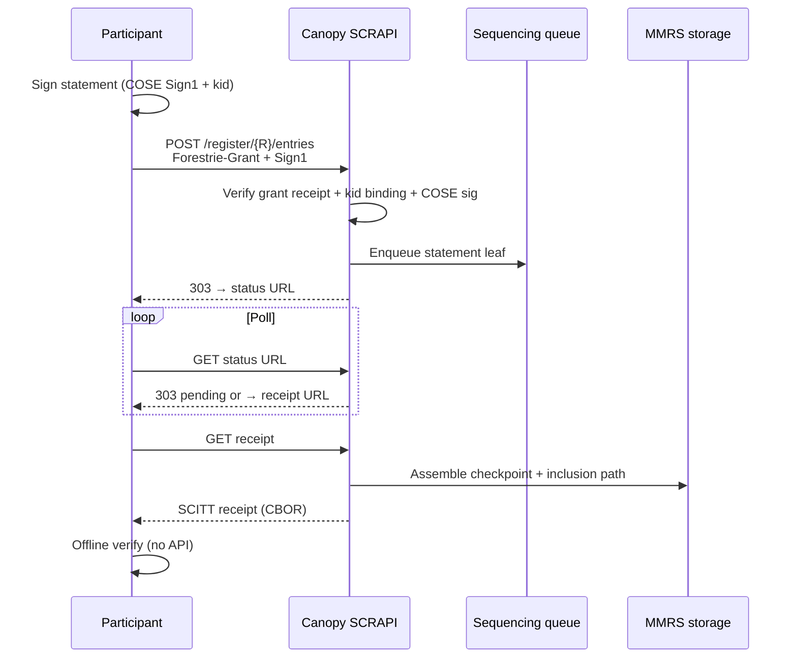

# SCITT transparency log — hackathon demo

**Status:** DRAFT  
**Date:** 2026-06-20  
**Related:** [grants.md](../grants.md), [register-statement](../api/register-statement.md),
[system e2e overview](../../packages/tests/canopy-api/tests/system/docs/overview.md),
[Univocity ARC-0017 §5.1](https://github.com/forestrie/univocity/blob/main/docs/arc/arc-0017-auth-overview.md#51-off-chain-ingress-vs-this-contract-forestrie--canopy)

Hands-on walkthrough for engineers at a hackathon: discover a SCRAPI transparency
service, register a **signed statement**, collect a **SCITT receipt**, and verify
that receipt **offline**. Forestrie-specific setup is confined to an appendix —
organizers run it once; participants use pre-provisioned credentials.

> **Tooling note:** This doc describes the target flow. Participant helper scripts
> (`sign-statement`, `verify-receipt`, etc.) are planned follow-up work. Until
> those land, use the placeholders in [§5](#5-tooling-gaps-and-workarounds).

---

## What you will prove

1. A COSE Sign1 **statement** (your document) is accepted by a SCRAPI-compatible
   transparency log.
2. After sequencing, the service returns a **SCITT receipt** (COSE Sign1 + MMR
   inclusion proof) tying your statement to a verifiable log position.
3. The receipt can be checked **without** calling the API again — inclusion and
   signature verify against the forest trust anchor.

---

## Prerequisites (organizer provides)

Participants need these values before starting. Organizers provision them once
(see [Appendix B](#appendix-b--organizer-setup-not-the-main-show)).

| Variable | Description |
| -------- | ----------- |
| `CANOPY_BASE_URL` | Worker origin, no trailing slash (e.g. `https://api-b-forest-2.forestrie.dev`) |
| `BOOTSTRAP_LOG_ID` | Root forest UUID (same as bootstrap path segment in SCRAPI URLs) |
| `COMPLETED_GRANT_B64` | Base64 **Forestrie-Grant** transparent statement: inner grant + receipt + idtimestamp |
| Statement signing key | ES256 PEM or equivalent — must match `grantData` in the completed grant |

Optional sanity check:

```bash
curl -sS "$CANOPY_BASE_URL/api/health" | jq .
curl -sS "$CANOPY_BASE_URL/.well-known/scitt-configuration" | jq .
```

Expect JSON for both. All other API bodies in this demo are **CBOR** (or COSE).

---

## Part 1 — Participant flow

### Step 1 — Discover the transparency service

SCRAPI discovery is JSON (easy curl):

```bash
curl -sS "$CANOPY_BASE_URL/.well-known/scitt-configuration" | jq .
```

Note `scrapiVersion`, `supportedSignatureAlgorithms`, and `baseUrl`.

Public forest genesis (trust anchor metadata + chain binding) is also readable:

```bash
curl -sS "$CANOPY_BASE_URL/api/forest/$BOOTSTRAP_LOG_ID/genesis" \
  -o genesis.cbor
```

Save `genesis.cbor` for offline verification later.

### Step 2 — Prepare a statement document

A statement is arbitrary bytes — typically a CBOR or JSON document you care about.
Example payload (CBOR-encoded before signing):

```json
{
  "kind": "hackathon-demo-statement",
  "v": 1,
  "message": "Hello SCITT"
}
```

The e2e suite uses the same pattern (`kind: canopy-e2e-first-statement`).

### Step 3 — Sign the statement (COSE Sign1)

The API expects **COSE Sign1** with:

- **Protected header `kid` (label 4)** equal to the statement signer binding in
  the grant's `grantData` (ES256: first 32 bytes of x‖y; KS256: 20-byte address).
- A **valid ES256 signature** over the Sign1 structure (not a placeholder).

```bash
# Planned: sign-statement helper (not yet published)
# sign-statement --payload statement.cbor --key demo.pem --kid-from-grant \
#   --out statement.cose
```

Until the helper exists, organizers may supply pre-signed `statement.cose` files
or run signing via Custodian / internal e2e utilities.

Reference: [arc-statement-cose-encoding.md](../arc/arc-statement-cose-encoding.md).

### Step 4 — Register the signed statement

```bash
curl -sS -D headers.txt -o /dev/null -X POST \
  "$CANOPY_BASE_URL/register/$BOOTSTRAP_LOG_ID/entries" \
  -H "Authorization: Forestrie-Grant $COMPLETED_GRANT_B64" \
  -H 'Content-Type: application/cose; cose-type="cose-sign1"' \
  --data-binary @statement.cose
```

**Success:** HTTP **303 See Other** with a `Location` header pointing at:

```text
/logs/{bootstrap}/{logId}/entries/{contentHash}
```

where `{contentHash}` is the lowercase hex SHA-256 of the COSE Sign1 bytes.

**Common errors** (CBOR Problem Details body):

| Status | Meaning |
| ------ | ------- |
| 401 / 403 | Grant missing, incomplete, or receipt invalid |
| 403 `signer_mismatch` | Statement `kid` ≠ grant `grantData` binding |
| 400 | Invalid COSE structure or signature verification failed |

The grant in `Authorization` is your **capability credential** — the API does not
look up grants from a central store. See [grants.md §7](../grants.md#7-register-signed-statement-verification-summary).

Extract the status URL:

```bash
STATUS_URL=$(grep -i '^location:' headers.txt | cut -d' ' -f2- | tr -d '\r')
# If Location is path-only:
case "$STATUS_URL" in http*) ;; *)
  STATUS_URL="$CANOPY_BASE_URL$STATUS_URL"
esac
echo "$STATUS_URL"
```

### Step 5 — Poll until the receipt is ready

Sequencing is asynchronous (Ranger commits leaves; Sealer signs checkpoints).
Poll the status URL until `Location` ends with `/receipt`:

```bash
while true; do
  curl -sS -D poll-headers.txt -o /dev/null "$STATUS_URL"
  LOC=$(grep -i '^location:' poll-headers.txt | cut -d' ' -f2- | tr -d '\r')
  echo "$(date -u +%H:%M:%S) → $LOC"
  case "$LOC" in */receipt) RECEIPT_URL="$LOC"; break ;; esac
  sleep 1
done

case "$RECEIPT_URL" in http*) ;; *)
  RECEIPT_URL="$CANOPY_BASE_URL$RECEIPT_URL"
esac
echo "Receipt URL: $RECEIPT_URL"
```

Typical wait: **30–90 seconds** on a healthy dev stack. If polling times out,
Ranger or Sealer may not be running — ask organizers.

Permanent receipt URL shape:

```text
/logs/{bootstrap}/{logId}/{massifHeight}/entries/{entryId}/receipt
```

`entryId` is 32 hex chars: `idtimestamp_be8 || mmrIndex_be8`.

### Step 6 — Download the SCITT receipt

```bash
curl -sS "$RECEIPT_URL" -o receipt.cbor
file receipt.cbor   # expect binary / CBOR
```

Content-Type: `application/scitt-receipt+cbor` (COSE Sign1 with inclusion proof
at header label **396**).

Inspect structure (decode only — no cryptographic verify yet):

```bash
# From canopy repo, when checked out:
cd scripts && pnpm exec tsx decode-receipt.ts ../../receipt.cbor
```

### Step 7 — Verify offline (stretch goal)

Offline verification confirms:

1. **MMR inclusion** — the statement's leaf commitment appears in the log at the
   claimed index (inclusion path in receipt header 396).
2. **Receipt signature** — signed by the log's checkpoint authority (from trust
   root / genesis chain).

```bash
# Planned: verify-receipt helper (not yet published)
# verify-receipt --receipt receipt.cbor --genesis genesis.cbor \
#   --grant-inner-hash <hex> --trust-anchor-from-genesis
```

Until this helper ships, treat Step 6 decode output as structural confirmation
only. Full verify logic lives in `packages/apps/canopy-api/src/grant/receipt-verify.ts`.

---

## Part 2 — What you built (conceptual)



---

## Appendix A — Forestrie trust model (5-minute read)

### Pipe, not store

Forestrie splits **fast ingress** from **strict verification**:

| Layer | Role |
| ----- | ---- |
| **Ingress** (Canopy enqueue, Ranger append) | Cheap sequencing by `logId` + content hash; no deep policy on every append |
| **Verification** (Canopy handlers, Sealer, Univocity contract) | Grant receipt inclusion, statement signer binding, COSE checks, on-chain checkpoint rules |

Canopy is a **transparency pipe**: it sequences quickly and verifies before
accepting registrations. Invalid checkpoints do not extend univocal on-chain
history. See
[Univocity ARC-0017 §5.1](https://github.com/forestrie/univocity/blob/main/docs/arc/arc-0017-auth-overview.md#51-off-chain-ingress-vs-this-contract-forestrie--canopy)
and [grants.md — Takeaways](../grants.md#takeaways).

### Why `Authorization: Forestrie-Grant`?

Standard SCITT registration assumes you hold a credential authorizing writes to a
log. Forestrie uses a **transparent statement** (COSE Sign1) whose payload is
the grant commitment and whose unprotected headers carry:

- **`-65538`** — full grant v0 CBOR
- **`-65537`** — idtimestamp (sequencing time)
- **`396`** — SCITT receipt proving grant inclusion in the authority MMR

The client **carries** this artifact; the service does not maintain a grant
catalog. That matches the "pipe not store" model for authorization evidence too.

### Univocity (on-chain anchor)

Each forest's genesis document binds to a **Univocity contract** (chain id +
contract address). On-chain `publishCheckpoint` enforces the same two gates as
off-chain registration: **grant in owner log** + **receipt signed by the correct
key**. Hackathon participants do not deploy contracts — organizers bind genesis
once. Details: [plan-0028](../plans/plan-0028-forest-genesis-chain-binding.md),
[plan-0032](../plans/plan-0032-univocity-imutable-e2e-provision.md).

---

## Appendix B — Organizer setup (not the main show)

Run **once** before the event. Participants never execute these steps.

### Overview

```text
1. Deploy / bind Univocity contract (chain anchor)
2. POST /api/forest/{R}/genesis  (curator token)
3. Mint root creation grant → POST /register/{R}/grants
4. Poll until SCITT receipt → build COMPLETED_GRANT_B64
5. (Contract-bootstrap) Configure delegation-coordinator for receipt sealing
6. Distribute env vars + statement signing key to participants
```

### Recommended path today

Use the same flow as system e2e:

```bash
# From canopy repo root (requires Doppler canopy/dev secrets)
doppler run --project canopy --config dev -- task test:e2e:preflight
```

Preflight provisions ephemeral Univocity (ES256 + KS256) and writes
`.work/e2e-univocity.env`. System specs in
[`grants-bootstrap.spec.ts`](../../packages/tests/canopy-api/tests/system/grants-bootstrap.spec.ts)
and [`bootstrap-log-first-entry.spec.ts`](../../packages/tests/canopy-api/tests/system/bootstrap-log-first-entry.spec.ts)
exercise the full path.

Flow documentation:

- [System e2e overview](../../packages/tests/canopy-api/tests/system/docs/overview.md)
- [Grants bootstrap](../../packages/tests/canopy-api/tests/system/docs/grants-bootstrap.md)
- [First signed entry](../../packages/tests/canopy-api/tests/system/docs/bootstrap-log-first-entry.md)

For a **long-lived hackathon forest**, replace ephemeral provision with a stable
contract address and genesis POST, then keep Ranger + Sealer + coordinator healthy
on the target lane.

**Mandate fork operators:** bootstrap a BYOK mandate instance first — see
[mandate FORKING.md](../../../mandate/FORKING.md) (onboard token,
payment-authoritative log, first user log). Return here for the participant
statement flow once `CANOPY_BASE_URL`, `BOOTSTRAP_LOG_ID`, and
`COMPLETED_GRANT_B64` are available.

### Secrets (organizers only)

| Secret | Purpose |
| ------ | ------- |
| `CURATOR_ADMIN_TOKEN` | `POST /api/forest/{R}/genesis` |
| Custodian or contract bootstrap keys | Sign root grant and statements |
| `DELEGATION_COORDINATOR_URL` + `COORDINATOR_APP_TOKEN` | Receipt sealing on contract-bootstrap roots |

Participants receive **only** `CANOPY_BASE_URL`, `BOOTSTRAP_LOG_ID`,
`COMPLETED_GRANT_B64`, and a demo statement signing key.

### Building `COMPLETED_GRANT_B64`

After register-grant returns 303, poll until receipt redirect, GET the receipt,
then attach receipt + idtimestamp to the transparent grant. E2e helper:
`buildCompletedGrantBase64` in
[`bootstrap-grant-flow.ts`](../../packages/tests/canopy-api/tests/utils/bootstrap-grant-flow.ts).

Planned repo script: `resolve-receipt-to-grant.ts` (under `perf/scripts/` today;
requires `SCRAPI_API_KEY` in some configs — verify against your deployment).

---

## §5 Tooling gaps and workarounds

The deployed API supports the full flow. Participant ergonomics do not yet.

| Gap | Impact | Workaround today | Planned |
| --- | ------ | ---------------- | ------- |
| No `sign-statement` CLI | Cannot build valid COSE Sign1 + kid from curl alone | Organizer pre-signs or runs Custodian / e2e helpers | `sign-statement` script |
| No `verify-receipt` CLI | Offline verify is manual / repo-internal | `decode-receipt.ts` for structure only | `verify-receipt` script |
| Forest bootstrap not self-serve | New forests need curator + contract + coordinator | Shared pre-provisioned forest | Hackathon provisioning task |
| CBOR payloads | Raw curl is awkward for encoding | Ship binary artifacts + thin shell wrappers | Helper scripts |
| Async receipt latency | Poll may take 30–90s | Document wait; verify stack health | — |
| Stale `verify-grant-flow.ts` | References removed `/api/grants/bootstrap` | Do not use; follow this doc | Update or remove script |

### Cannot self-bootstrap today

`POST /api/grants/bootstrap` was removed ([plan-0019](../plans/plan-0019-bootstrap-path-and-genesis-cache.md)).
SCRAPI paths are bootstrap-scoped:

```text
POST /register/{bootstrap-logid}/grants
POST /register/{bootstrap-logid}/entries
GET  /logs/{bootstrap-logid}/{logId}/entries/{contentHash}
GET  /logs/{bootstrap-logid}/{logId}/{massifHeight}/entries/{entryId}/receipt
```

---

## Further reading

- [grants.md](../grants.md) — grant shapes, creation paths, register-statement rules
- [register-statement API](../api/register-statement.md)
- [Canopy grant verification implementation](../arc/canopy-grant-verification-implementation.md)
- [devdocs architecture](https://github.com/forestrie/devdocs/blob/main/architecture.md)
- [draft-bryce COSE receipts MMR profile](https://robinbryce.github.io/draft-bryce-cose-receipts-mmr-profile/draft-bryce-cose-receipts-mmr-profile.html)
