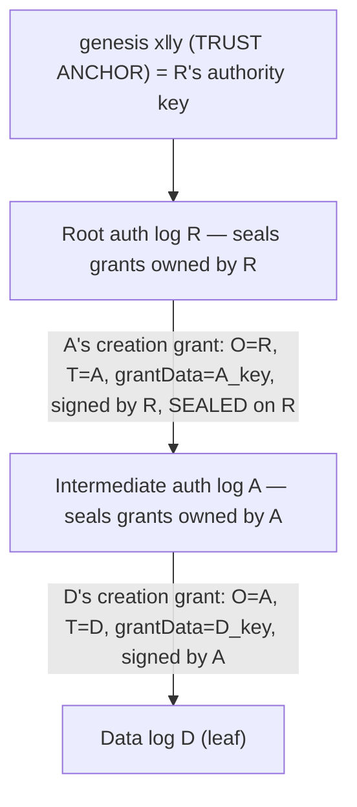

# Grants in Canopy

**Status:** DRAFT  
**Date:** 2026-03-28  
**Related:** [ARC-0001: Grant verification](arc-0001-grant-verification.md), [Univocity ARC-0017 — Authorization overview](https://github.com/forestrie/univocity/blob/main/docs/arc/arc-0017-auth-overview.md) (on-chain two-check model; [§5.1 ingress vs verifier](https://github.com/forestrie/univocity/blob/main/docs/arc/arc-0017-auth-overview.md#51-off-chain-ingress-vs-this-contract-forestrie--canopy)), [Univocity ARC-0017 — Log hierarchy](https://github.com/forestrie/univocity/blob/main/docs/arc/arc-0017-log-hierarchy-and-authority.md) (`authLogId`, `ownerLogId`, Phase 0), [Grant–statement signer binding (code paths)](arc-grant-statement-signer-binding.md), [Register-grant API](api/register-grant.md), [Plan 0007 grant type alignment](plans/plan-0007-grant-type-and-commitment-alignment.md)

This page is a **single entry point** for Forestrie grant **shapes**, **wire formats**, and how **creation** (register-grant) and **consumption** (register-signed-statement) differ in what they verify. The **authorization and evidence model** — what actually authorizes a request, and why register-grant sometimes needs a second, _public_ grant as evidence — is in [§10](#10-authorization-and-evidence-model); the request-body wire format for that evidence is [§11](#11-evidence-transport-parent-grant-post-body). Normative security obligations live in **ARC-0001**; this document orients readers before diving there.

This page is the **single external reference** cited from the grant-handling source code; the code links back to the sections here rather than to plans or ADRs.

---

## 1. Three log roles (bootstrap vs auth vs data)

Univocity models an **authority tree**. Canopy exposes HTTP paths that mention a **log id** in the URL; that id can refer to different **kinds** of log.

| Concept                       | Meaning                                                                                                                                                                                                                                                                                                                                              |
| ----------------------------- | ---------------------------------------------------------------------------------------------------------------------------------------------------------------------------------------------------------------------------------------------------------------------------------------------------------------------------------------------------- |
| **Bootstrap (root) auth log** | The **first** authority log in a deployment. It has **no parent** in the forest. Its first grant is special: there is no prior MMR leaf, so issuance uses a **platform bootstrap** path (Custodian) instead of a receipt. After sequencing, **grantData** on that leaf establishes **K(L)**—checkpoint signer material for root authority log **L**. |
| **Child auth log**            | A **descendant** authority log. Grants that **create** it are **leaves in the parent’s** authority MMR (**ownerLogId** = parent). The child’s **logId** is the **target** of those grants. Later grants may append under **ownerLogId** = child (or parent), per product rules.                                                                      |
| **Data log**                  | A **subject** log for transparency **statements** (entries). It is **owned** by an **authority log**: checkpoint and **grant policy** for that data log are expressed as leaves in **that auth log’s** MMR—not as special entry types inside the data log.                                                                                           |

An **auth log** UUID names an **AUTH_LOG** node in the tree. A **data log** UUID names a **DATA_LOG** subject; some **owning** authority log (via **ownerLogId** on grants targeting it) issues policy as MMR leaves. **Bootstrap** is not a separate log _kind_—it is the **root** auth log in the window before and through its first grant.

In the Forestrie / Univocity **authorization** story, a grant that can **authorize** anything—on-chain checkpoint publication, **Forestrie-Grant** issuance ([ARC-0001](arc-0001-grant-verification.md) §4–§5), or **`POST …/entries`** (§6)—is a **leaf in an authority log’s** MMR, i.e. under **ownerLogId** ([ARC-0001 §0.3](arc-0001-grant-verification.md)). Register-signed-statement consumes a grant already committed in the **owning** auth tree. Opaque **data log entry** payloads, even grant-shaped CBOR, do not replace that: `grantAuthorize` and receipts bind the **grant commitment** to **ownerLogId**’s authority MMR, not to entry bodies on the target data log.

**Verification**, not raw **inclusion** in a queue, enforces the model. The sequencing queue and log builders may treat ids as opaque (e.g. UUID + content hash only) and skip AUTH vs DATA classification—on purpose, for **throughput** and simpler workers. Producers must still set **ownerLogId** to the real **owning authority**; wrong ids or “grant as entry only” still fail checks against the correct authority MMR.

**`publishCheckpoint`** on Univocity applies the same **two gates** as in [ARC-0017 (auth overview)](https://github.com/forestrie/univocity/blob/main/docs/arc/arc-0017-auth-overview.md): **grant** inclusion in the target’s **owner** ([`authLogId` semantics](https://github.com/forestrie/univocity/blob/main/docs/arc/arc-0017-log-hierarchy-and-authority.md#42-single-authlogid-owning-data-or-parent-authority)) and a **receipt** verifiable under **rootKey** / bootstrap rules. A rejected checkpoint does not advance that log’s **split-view–protected**, **univocal** on-chain history. The split between cheap ingress and strict verification is spelled out in Univocity [§5.1](https://github.com/forestrie/univocity/blob/main/docs/arc/arc-0017-auth-overview.md#51-off-chain-ingress-vs-this-contract-forestrie--canopy); Forestrie-Grant HTTP paths follow the same idea ([Takeaways](#takeaways) below).

### Takeaways

- **Roles:** Auth log vs data log vs bootstrap (root’s first-grant story); data logs are **owned** by an auth log.
- **Where policy lives:** Authorizing grants are **authority MMR** leaves under **ownerLogId**; data-log **entries** are not a substitute.
- **Who enforces:** **Verifiers** (Canopy + contract), not sequencers’ log-kind checks; wrong **ownerLogId** still fails verification.
- **On-chain:** Invalid checkpoints do not extend **univocal** history; see Univocity ARC-0017 §5.1.

---

## 2. `logId` vs `ownerLogId` (authorized vs owning)

Every inner grant (Forestrie-Grant **v0**) carries two UUIDs (16-byte wire form in API docs; commitment uses 32-byte padded form in code—see `grant-commitment.ts`).

| Field            | Role                                                                                                                                                                                                                                                                                                    |
| ---------------- | ------------------------------------------------------------------------------------------------------------------------------------------------------------------------------------------------------------------------------------------------------------------------------------------------------- |
| `**logId`\*\*    | **Target** of the grant: the log being authorized or described by this grant (e.g. the **data log** receiving checkpoint/statement rights, or the **child auth log** being created). **`POST /register/grants`** and **`POST /register/entries`** use **`grant.logId`** only—no redundant path segment. |
| `**ownerLogId**` | **Owning authority log** under whose **authority MMR** this grant will be sequenced as a **leaf**. That is: the new leaf extends `**ownerLogId`’s\*\* Merkle history—not the target log’s, unless target and owner coincide (bootstrap).                                                                |

So:

- `**logId**` answers: _what entity does this grant apply to?_
- `**ownerLogId**` answers: _whose authority log accrues this leaf, and whose checkpoint signer **K(ownerLogId)** must issue the grant envelope (ARC-0001 §3–4)?_

**Bootstrap:** `**logId` = `ownerLogId**` (same root UUID): the first grant both **targets** and **extends** that root authority log.

**Child first grants:** `**logId` ≠ `ownerLogId**`: **`grant.logId**`is the **uninitialized child** (data or auth);`**ownerLogId**` is the **initialized parent** authority log that is ready to sponsor the first leaf for that child.

**Routine grants** on initialized logs: typically `**ownerLogId**` is the authority log that already contains policy, and `**logId**` is the data log (or child) being granted—exact pairing follows product/univocity rules; the commitment always commits **both** fields.

---

## 3. Wire format: Forestrie-Grant v0 and transparent statement

### 3.1 Inner grant (payload CBOR)

The **inner** artifact is a CBOR map with **keys 1–6 only**:

| Key | Field                    | Role                                                                               |
| --- | ------------------------ | ---------------------------------------------------------------------------------- |
| 1   | `logId`                  | Target log (canonical POST has no URL `logId`; value comes from the grant only).   |
| 2   | `ownerLogId`             | Authority log that owns the grant leaf.                                            |
| 3   | `grant`                  | 8-byte `**GF_***` bitmap (create/extend, auth-vs-data class, …).                   |
| 4–5 | `maxHeight`, `minGrowth` | Optional bounds (also in commitment preimage).                                     |
| 6   | `grantData`              | Opaque committed bytes; **only** v0 attestation slot for statement-signer binding. |

Keys **7** (`signer`) and **8** (`kind`) are **rejected** by decoders. There is **no** separate wire “signer”: anything committed about **who may sign statements** must live in `**grantData**` (or a future structured layout inside it—ARC-0001 §6.3).

### 3.2 Custodian transparent statement profile

For `**Authorization: Forestrie-Grant**`, the bytes are a **COSE Sign1** “transparent statement” where:

- **Payload** = **32-byte** `SHA-256(inner grant v0 CBOR)` (digest ties signature to exact grant bytes).
- **Unprotected** header `**-65538**` = **full** grant v0 CBOR (embedded copy).
- `**-65537**` = **idtimestamp** (8 bytes), required for **completed** grants on receipt paths.
- `**396**` = embedded **receipt** COSE Sign1 (MMR inclusion proof) when not on a bootstrap / first-grant shortcut path.

Decoding checks digest **matches** embedded grant bytes (`transparent-statement.ts`).

### 3.3 Grant commitment (what the chain commits)

The **grant commitment hash** (leaf **inner** hash input, modulo idtimestamp) is:

`SHA-256( logId(32) || grant_flags(32) || maxHeight_be(8) || minGrowth_be(8) || ownerLogId(32) || grantData )`

- `**grant**` on wire is 8 bytes; the preimage pads it to 32 bytes (`grant-commitment.ts`).
- `**PublishGrant.request**` / `**GC_***` is **not** in this preimage (may exist on-chain only).
- **Idtimestamp** is **not** in the grant preimage; it participates in the **leaf** hash with the commitment hash (`ARC-0001` §5.3).

Anything **not** in this preimage cannot be enforced by comparing to on-chain **PublishGrant** commitment—only by ancillary policy.

---

## 4. Signer commitments vs actual grant (envelope) signer

Two different questions must not be conflated:

| Question                                                                                   | Where answered                                                                                     | Typical key material                                                                                                                          |
| ------------------------------------------------------------------------------------------ | -------------------------------------------------------------------------------------------------- | --------------------------------------------------------------------------------------------------------------------------------------------- |
| **Who signed the transparent Forestrie-Grant?**                                            | **COSE Sign1** on `Authorization: Forestrie-Grant` (issuance / **envelope** signer).               | Must be **K(ownerLogId)** or an **authorised delegate** (ARC-0001 §4)—**bootstrap** uses Custodian as delegate when the log is uninitialized. |
| **Who may sign data statements** (`POST …/entries`) **for statement-registration grants?** | **grantData** only → `statementSignerBindingBytes(grant)` vs statement COSE **kid** (ARC-0001 §6). | Often **ES256 x‖y (64 bytes)**; binding uses **first 32 bytes (x)** when length is 64.                                                        |

Only **grantData** (inside the **commitment preimage**) binds who may sign **entries** on wire v0; there is no parallel “signer” field. The **envelope** (COSE on `Authorization: Forestrie-Grant`) proves **who issued** the leaf under **ownerLogId**. **grantData** is the issuer’s attestation of who may sign **statements**, for grants that satisfy `isStatementRegistrationGrant`.

### Child first-grant paths: issuance tied to grantData

On **child auth first** and **child data first**, `register-grant.ts` uses `verifyCustodianEs256GrantSign1WithGrantDataXy`: the transparent statement must verify against the **ES256** key encoded in the same **64-byte grantData (x‖y)**—so the signer holds **grantData**’s private key, not an abstract **K(parent)** alone.

That does **not** weaken **register-signed-statement**: §6 still requires **kid** = **`statementSignerBindingBytes(grant)`** from **grantData** only. One party holding both keys stays coherent. The **product gap** is narrower: **first-grant** registration cannot yet combine a **parent-signed** envelope with **grantData** that names a **different** endorsed entry signer ([ARC-0001 §6.3](arc-0001-grant-verification.md), D1–D6). **Root bootstrap** is different: Custodian verifies the envelope; **grantData** then fixes **K(L)** ([ARC-0001 §4.3](arc-0001-grant-verification.md)).

### Signer takeaways

- **Two keys:** Envelope = who **issued**; **grantData** = who may sign **entries** (§6 **`kid`**).
- **Child first path:** Envelope signer must equal **grantData** key today; parent-only issuance + different endorser is future work (§6.3).
- **Bootstrap:** Custodian envelope; **grantData** establishes root **K(L)**.

---

## 5. Flag shapes: statement registration vs “other” grants

`**GF_*` live in the 8-byte `grant` field** and **are** in the commitment preimage. `**GC\_\*`/`request**` is a separate on-chain field, **not\*\* in the preimage (ARC-0001 §6.0).

### 5.1 `isStatementRegistrationGrant` (register-signed-statement gate)

The API allows `**POST /register/entries**` only when this predicate holds (`statement-signer-binding.ts`):

1. **Data-log path:** `**GF_DATA_LOG**` set in the low class byte, `**GF_AUTH_LOG` not** set for class, and **extend capability** (including **GF_CREATE|GF_EXTEND\*\* first-grant pattern): `isDataLogStatementGrantFlags`.
2. **Root auth bootstrap / checkpoint shape:** low byte is **auth-only** (`GF_AUTH_LOG`, not `GF_DATA_LOG` in the **0x03** nibble) **and** `**GF_CREATE|GF_EXTEND**` on byte 4.

So **statement registration** is **either** a **data-log checkpoint grant** **or** the **root auth bootstrap-style** grant (same `statementSignerBindingBytes` rule from `**grantData**`).

### 5.2 Other grant shapes (checkpoint / tree growth)

Many grants are **not** meant for `**/entries**` auth: e.g. grants whose flags do not satisfy the above. They still extend an authority MMR when sequenced; their `**grantData**` semantics follow univocity / product rules. For **register-grant**, shape determines **which branch** runs (bootstrap, child first, receipt).

---

## 6. Register-grant creation paths

All successful paths **enqueue** the **grant commitment hash** under `ownerLogId` (truncated to the sequencing id as implemented). The **target log** `grant.logId` is the only operational id for the grant subject (no path duplicate on `POST /register/{bootstrap-logid}/grants`).

A **creation** grant has no receipt yet — it is being submitted to be sealed for the first time — so it cannot be authorized by inclusion. It is authenticated by verifying its COSE signature against the **authority key of its owner `O`**, with `O` chained to the trust anchor (forest genesis). How `O` is established differs by shape; see the model in [§10](#10-authorization-and-evidence-model).

| Path                                   | When                                                                                                                     | How the grant is authenticated                                                                                                                                                                                        | Parent evidence (POST body, [§11](#11-evidence-transport-parent-grant-post-body)) |
| -------------------------------------- | ------------------------------------------------------------------------------------------------------------------------ | --------------------------------------------------------------------------------------------------------------------------------------------------------------------------------------------------------------------- | --------------------------------------------------------------------------------- |
| **A. Root bootstrap**                  | Target uninitialized; `ownerLogId == logId`; `GF_CREATE\|GF_EXTEND`; `bootstrapEnv` set                                  | COSE verifies against `grantData` x‖y, which must equal the forest **genesis** key (the trust anchor)                                                                                                                 | none                                                                              |
| **B. Child auth first**                | Target uninitialized; `ownerLogId` is an **initialized** parent; `GF_AUTH_LOG` class; create+extend; 64-byte `grantData` | COSE verifies against the grant's own `grantData` x‖y; the parent must be MMRS-initialized                                                                                                                            | none                                                                              |
| **C. Child data first — root-owned**   | Target uninitialized; `GF_DATA_LOG` (not auth); `ownerLogId ==` the bootstrap root `R`; 64-byte `grantData`              | COSE verifies against the **genesis** key; readiness is `isLogInitializedMmrs(R)`                                                                                                                                     | none (`R` is the anchor)                                                          |
| **C. Child data first — intermediate** | as above, but `ownerLogId` is an intermediate auth log `A` (`!= R`)                                                      | `grantAuthorize` verifies **`A`'s** completed creation-grant receipt up to `R`; that grant must create `A` (logId match); the data grant's COSE then verifies against **`A`'s** authority key (`A`'s `grantData` x‖y) | **required**: `A`'s completed creation grant                                      |
| **D. Receipt-backed**                  | Target **initialized** (or no `bootstrapEnv`), or any case not matching A–C                                              | `grantAuthorize`: the grant's own embedded **receipt** (idtimestamp + MMR inclusion + signature by the owner-log receipt authority)                                                                                   | none                                                                              |

Only path **C-intermediate** consumes the request body; every other path ignores it. If `bootstrapEnv` is unset, only **D** applies for acceptance (queue still required).

---

## 7. Register-signed-statement: verification summary

This endpoint **appends** a statement to an existing log; it never _opens_ one. The supplied grant is a **single, self-authenticating credential** — it carries its own receipt — so **no parent evidence is ever required** here. This is the contrast with register-grant creation ([§6](#6-register-grant-creation-paths), [§10](#10-authorization-and-evidence-model)).

After resolving `Authorization: Forestrie-Grant` to a `Grant`:

1. **Inclusion** (the only authenticity check): the grant's embedded **receipt** must verify via `grantAuthorize` — MMR inclusion proof + signature by the owner-log receipt authority.
2. `isStatementRegistrationGrant(grant)` must be **true** (403 otherwise).
3. `grantData` non-empty; the statement COSE `kid` must match `statementSignerBindingBytes(grant)` (`signer_mismatch` if not).

Full envelope verification on `/entries` against `K(owner)` is a known gap; the `kid` binding is `grantData`-only and must stay tied to the **commitment** (see [§4](#4-signer-commitments-vs-actual-grant-envelope-signer)).

---

## 8. Quick reference: “which document?”

| Topic                                                    | Document                                                                    |
| -------------------------------------------------------- | --------------------------------------------------------------------------- |
| Formal model, §4/§5/§6 obligations, circularity, roadmap | [ARC-0001](arc-0001-grant-verification.md)                                  |
| Byte flow for `kid` vs `grantData`, pool / k6            | [arc-grant-statement-signer-binding](arc-grant-statement-signer-binding.md) |
| Parent-grant evidence wire format (POST body)            | [§11](#11-evidence-transport-parent-grant-post-body)                        |
| Legacy register-grant request shape (out of date)        | [api/register-grant.md](api/register-grant.md)                              |
| COSE / hashing details                                   | [arc-statement-cose-encoding.md](arc-statement-cose-encoding.md)            |

---

## 9. Implementation map

| Concern                           | Location                                                                                                       |
| --------------------------------- | -------------------------------------------------------------------------------------------------------------- |
| Inner grant + preimage            | `packages/apps/canopy-api/src/grant/grant.ts`, `grant-commitment.ts`, `codec.ts`                               |
| Flags / statement grant predicate | `grant-flags.ts`, `statement-signer-binding.ts`                                                                |
| Transparent statement decode      | `grant/transparent-statement.ts`                                                                               |
| Register-grant branches           | `scrapi/register-grant.ts`                                                                                     |
| Receipt + `grantAuthorize`        | `scrapi/auth-grant.ts`, `grant/receipt-verify.ts`                                                              |
| Parent-grant evidence (POST body) | `scrapi/auth-grant.ts` (`getParentGrantFromRequest`); see [§11](#11-evidence-transport-parent-grant-post-body) |
| Register-signed-statement         | `scrapi/register-signed-statement.ts`                                                                          |

---

## 10. Authorization and evidence model

This section is the conceptual core: it explains _what authorizes a register-grant request_, why creation sometimes needs a **second** grant, and why that second grant is **evidence**, not a credential.

### 10.1 One trust anchor, a chain of delegations

There is exactly **one** trust anchor per forest: the **genesis** key `x‖y`, provisioned by the curator and stored in `R2_GRANTS` at `forests/forest/{uuid-R}/genesis.cbor` (canonical dashed UUID path segment). It is also the authority key of the root auth log `R`. The same **forest genesis document** also carries **chain binding** (Univocity contract address and EIP-155 chain id); new forests require both on `POST /api/forest/{R}/genesis`. SCRAPI bootstrap verification still uses x‖y only until downstream consumers read chain binding ([plan-0028](plans/plan-0028-forest-genesis-chain-binding.md)). Every other log's authority is a signed, sealed delegation from its parent:



The single invariant that generates the whole model:

> A grant is **signed by the authority of its owner `O`** and **establishes the authority key (`grantData`) for its target `T`**.

### 10.2 Two artifacts, two security types

When register-grant opens a data log under an intermediate authority, two grants are involved. They are not two authorizations — one is the credential, the other is verification context:

|                    | Child grant (`Authorization`)                                                        | Parent grant (request body)                                                          |
| ------------------ | ------------------------------------------------------------------------------------ | ------------------------------------------------------------------------------------ |
| What it is         | the **signed assertion** "`O` authorizes `T`" — and the new resource                 | `O`'s issuer **certificate** + its inclusion **receipt**                             |
| Carries authority? | **yes** — its COSE signature proves possession of `O`'s private key (non-replayable) | **no** — public and replayable; its receipt is published. Possession conveys nothing |
| Role               | self-credentialing credential + resource                                             | verification **evidence** only                                                       |
| HTTP placement     | `Authorization: Forestrie-Grant <base64>`                                            | POST body `{ parentGrant }` ([§11](#11-evidence-transport-parent-grant-post-body))   |

The parent grant lives in the body, not in `Authorization`, precisely because it is **not** a credential: putting a public, freely-copyable artifact in `Authorization` would misrepresent it. The child grant stays in `Authorization` because its signature _is_ the proof of authority.

### 10.3 Why a second grant is needed only for intermediate child-data

A **creation** grant has no receipt yet (it is being submitted to be sealed), so `grantAuthorize` cannot authenticate it by inclusion. It is authenticated by its **signature** under `O`'s authority key, which the server must (a) obtain and (b) trust:

- The server keeps **no grant store**, and `R`'s MMR leaves hold only grant **commitment hashes**, not full grants — so `A`'s authority key (`A`'s `grantData`) is genuinely unrecoverable server-side. The caller must present `A`'s completed creation grant.
- That presented grant is re-verified, not trusted: `grantAuthorize` checks **`A`'s receipt** up to `R`, and the logId-match check confirms it created `A`. Then the child's COSE is verified against `A`'s authority key.

Every other shape needs only **one** grant:

- **Root bootstrap** and **root-owned data** (`O == R`): the authority key is the **genesis** anchor itself, so there is nothing to chain — no parent evidence.
- **Steady state / register-signed-statement** ([§7](#7-register-signed-statement-verification-summary)): the grant is already sealed and carries its **own** receipt, so it is self-authenticating.

So the "two grants" are simply two adjacent links of the delegation chain that meet at the log being created: one being authorized (the child credential), one being the proof-of-issuer (the public parent evidence).

---

## 11. Evidence transport: parent grant POST body

The parent grant for an intermediate child-data registration ([§6](#6-register-grant-creation-paths), path C-intermediate) is supplied as the **register-grant request body**:

- **Content-Type:** `application/cbor`.
- **Body:** a CBOR map with one field:

```
{ parentGrant: <bstr> }   ; raw COSE Sign1 bytes of the parent's completed transparent statement
```

- `parentGrant` is **raw bytes** (a CBOR byte string), not base64 — the body is binary CBOR. The bytes are exactly the parent's completed grant artifact (embedded grant + idtimestamp + receipt), the same artifact a caller obtained when the parent log was created.
- **Size cap:** the body is bounded (16 KiB) before reading; over-size requests get **413**. A grant plus its inclusion receipt is well within this even for tall trees.
- **Absence semantics:** no body, an empty body, or a CBOR map without `parentGrant` all mean _parent evidence absent_ (the handler proceeds, and path C-intermediate then returns **403**). A body that is not decodable CBOR, or a `parentGrant` that is not a decodable transparent statement, returns **400**.
- **Who reads it:** only register-grant's path C-intermediate consumes the body; all other shapes ignore it.

### Why a request parameter, not an embedded header or `Authorization`

The parent evidence is **public** (replicated freely), needed **only** at registration, and the child statement is a **signed, immutable** artifact. Therefore:

- It is **not** embedded inside the child transparent statement's unprotected headers — that would force callers to crack open and re-encode a signed artifact for no security gain (self-containment is low value when the evidence is public and widely available).
- It is **not** placed in `Authorization` — that header conveys the request credential, and the parent grant is evidence, not a credential ([§10.2](#102-two-artifacts-two-security-types)).

Carrying it by copy in the body keeps both artifacts in their canonical, signed, replicated forms and keeps `Authorization` meaning "the grant whose authority is asserted" uniformly across every endpoint.
