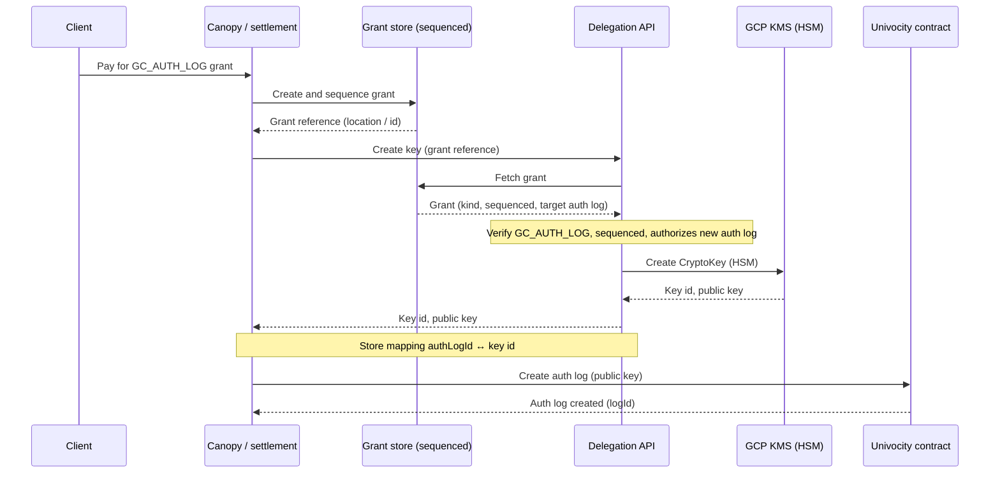
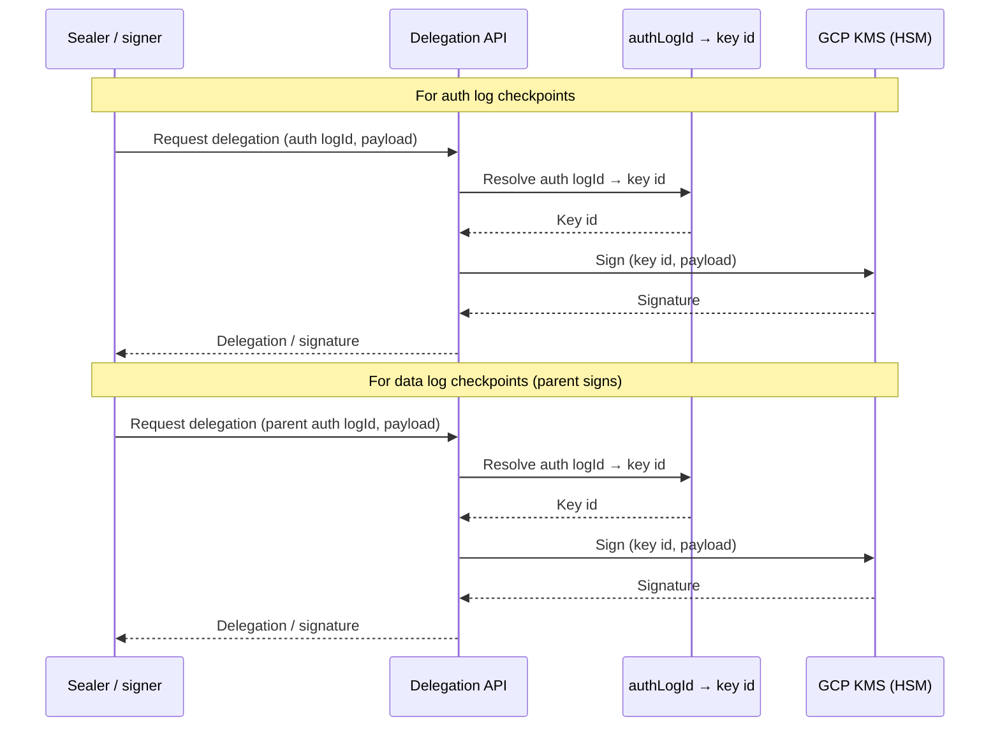

# Subplan 04: Assessment — key creation in the delegation service

**Status**: DRAFT  
**Date**: 2026-03-12  
**Parent**: [Plan 0004 overview](overview.md), [Subplan 04](subplan-04-signer-delegation-bootstrap-and-parent.md)

## 1. Proposed extension

- **Current subplan 04**: Signer (delegation service) supports “delegation for local key” (bootstrap) and “delegation for parent log” — i.e. **use of existing keys** to sign grants. Keys are assumed to already exist (bootstrap key configured; parent log keys pre-created or pre-registered).
- **Proposed extension**: The delegation service also **creates** log signing keys, but **only for auth logs**. Only grants of kind **GC_AUTH_LOG** result in creation of a new KMS key; that key becomes the new auth log’s root key (registered on-chain). **Data logs** do not get their own signing key: their checkpoints are signed by their **parent auth log**’s key. So key creation in the delegation service is scoped to “create key for this verified GC_AUTH_LOG grant”. No BYOK (bring-your-own-key). Rate limiting for key creation is achieved by **high pricing of GC_AUTH_LOG grants**, not by API-level rate limits.

### 1.1 Bootstrap key (operational)

- The **bootstrap key** is the key that will act as the root signer and that the univocity contract expects at bootstrap. It must **already exist in KMS before** the univocity contracts are deployed (or initialized): the contract is configured or initialized with that key’s public key, so the key must be created and its public key known first. The delegation service then supports “delegation for local key” (bootstrap) using that pre-existing KMS key. No key-creation API is used for the bootstrap key; it is created once by the operator (or automation) and configured in the signer.
- In a **simple deployment** where the bootstrap root auth log is the **only** auth log, “parent signs” still works cleanly: the same bootstrap key is the parent for that root auth log, so “delegation for parent log” (e.g. for signing grants that create data logs under the root) uses that same key. No additional auth-log keys are created until a GC_AUTH_LOG grant is issued and used.

## 2. Viability

### 2.1 GCP Cloud KMS

- **Key creation**: GCP Cloud KMS supports creating key rings and crypto keys via REST/API: `projects.locations.keyRings.create`, `projects.locations.keyRings.cryptoKeys.create`. Keys can be created with **HSM** or **software** protection level; HSM requires a key ring in an HSM-supported region and appropriate IAM (`cloudkms.cryptoKeys.create`, and for single-tenant HSM, `cloudkms.hsmSingleTenantKeyCreator`).
- **Programmatic flow**: The delegation service (running with a service account that has KMS key creation permissions) can call the KMS API to create a new `CryptoKey` in a designated key ring (e.g. one key ring per environment, many keys per log). Key rings are typically created once; keys can be created per log. **Viable** for adding “create key” to the delegation service.

### 2.2 Binding to grant and log

- **Contract expectation**: Univocity contract stores per-log state including `rootKey` (e.g. `logRootKey(logId)` returns rootKeyX, rootKeyY). When a **new** log is created on-chain, the transaction must supply the public key for that log. So the key used for the new log must exist (and its public key be known) **before or at** log creation.
- **Flow (auth logs only)**: (1) Client pays for a **GC_AUTH_LOG** grant → grant created and sequenced. (2) Caller calls delegation API with **grant reference**. (3) Delegation API **verifies** the grant (kind = GC_AUTH_LOG, exists, sequenced, authorizes the new auth log). (4) Delegation API **creates** a new CryptoKey in GCP KMS (HSM). (5) API returns **key id** and **public key** (for contract registration). (6) Caller uses the public key when creating the auth log on-chain. (7) Sealer/signer resolve auth logId → key id → sign checkpoints for that auth log. **Data logs** under that auth log have their checkpoints signed by this same auth log key (parent signs). **Viable** as long as grant verification and key-creation ordering are clearly defined.

**Key creation and auth log registration (steps 1–6):**

**Checkpoint signing — auth log and data logs (step 7):**

### 2.3 Where key creation fits

- The **delegation service** already holds the trust boundary for HSM/KMS: it never exports private key material and only returns delegation/signing capability. Adding “create key, return public key and key id” keeps all key material and key lifecycle inside the same service. **Viable** and **coherent** with the existing delegation/signer role.

## 3. Security

### 3.1 Authorization

- **Who may create keys?** Only callers that can prove they hold a **valid GC_AUTH_LOG grant** that authorizes the new auth log. The delegation API must:
  - Accept a **grant reference** (e.g. grant document URL or content-addressable id).
  - **Verify** the grant: kind = GC_AUTH_LOG; fetch and parse; ensure sequenced (or otherwise valid per policy); ensure it authorizes the **target auth log** (or derive from grant); optionally verify not expired / not revoked.
- **Who is the caller?** Two possibilities: (a) **Canopy** (or settlement path) after payment and grant creation — caller is a trusted backend with the grant it just created. (b) **End-client** with grant in hand — caller presents the grant and the API verifies it and that the requested log matches. (a) is simpler for auth (service-to-service); (b) allows “client creates key” without giving the client key material. Decide which model (or both with different auth).
- **Rate limiting**: Key creation is **economically rate-limited** by the high price of GC_AUTH_LOG grants. No separate API-level rate limit is required for key creation; idempotency (one key per grant) avoids duplicate keys on retries.

### 3.2 Key isolation and binding

- **One key per auth log**: Each new **auth log** gets its own KMS CryptoKey (or key version); data logs do not get keys — their checkpoints are signed by the parent auth log’s key. Key ring holds one key per auth log; label or metadata (e.g. auth logId) can identify the key for resolution.
- **Binding key ↔ auth log**: The delegation service should store a mapping **authLogId ↔ KMS key id** (and optionally grantId) so that (1) when the same grant is presented again, the API can return the existing key (idempotent); (2) the sealer/signer can resolve auth logId → key id for signing checkpoints (for that auth log and for any data logs under it). Subplan 02 (auth log status) today returns `rootKeyX, rootKeyY` from the **contract**; for a newly created key, the contract will only have it after log creation. So the delegation service is the source of “which key id to use for this auth logId” until (and possibly after) the key is registered on-chain. Design question: does subplan 02 (or the signer) hold the mapping “authLogId → key id” for not-yet-on-chain or newly created logs, or is that entirely inside the delegation service?

### 3.3 No private key export

- Key creation in KMS keeps the private key inside HSM. The delegation service only ever requests **signing** (asymmetric sign) or **delegation**; it does not export the private key. So adding “create key” does not change the “no key material leaves the service” invariant. **Secure** as long as the service account and IAM are restricted to key creation and sign only.

### 3.4 Audit and revocation

- **Audit**: GCP Cloud Audit Logs can log key creation and use. The delegation service should log **which grant and auth logId** triggered each key creation for accountability and forensics.
- **Revocation**: If a grant is revoked or an auth log is retired, policy may require **disabling or destroying** the key in KMS. Key lifecycle (disable/destroy) and who can trigger it (operator vs. automated policy) should be decided.

## 4. Design questions to resolve before updating subplan 04

These should be answered and then reflected in subplan 04 (and related docs).

1. **When is the key created?**  
   - **Option A**: Immediately after grant creation (e.g. canopy/settlement calls “create key for this GC_AUTH_LOG grant” right after creating the grant; public key stored with grant or in a side table; auth log creation on-chain uses that public key).  
   - **Option B**: Lazy (key is created on first request that presents the grant, e.g. when the client or system first needs to create the auth log or sign for it).  
   A is simpler for “create auth log on-chain” (public key already available); B avoids creating keys for grants that are never used.

2. **Who calls the key-creation API?**  
   - **Canopy** (or settlement worker) after payment and grant creation (trusted backend; grant is already verified).  
   - **End-client** (presents grant location; API fetches and verifies grant, then creates key).  
   Affects auth model (service-to-service vs. client token + grant proof).

3. **Binding: one key per GC_AUTH_LOG grant (one key per new auth log).**  
   Each GC_AUTH_LOG grant creates exactly one new auth log; the created key is that auth log’s root key. Data logs do not get keys. So **one key per auth log**; the API binds the created key to the new auth log (logId derived from or specified with the grant). The question is whether the API is “create key for grant” (implicitly the auth log from that grant) or “create key for authLogId, proof = grant”.

4. **Idempotency.**  
   If the same grant (or grant + authLogId) is presented twice, should key creation return **existing key id and public key** (idempotent) or fail? Idempotent is safer for retries and avoids duplicate keys.

5. **Public key and contract registration.**  
   The contract needs the **auth log**’s public key at log creation time. Should the key-creation response **always** include the public key (e.g. PEM or raw bytes) for the caller to submit to the chain? And who submits the auth-log-creation transaction — canopy, client, or another service? That flow (key creation → auth log creation on-chain) should be explicit in the plan.

6. **Key ring and key naming.**  
   One key ring per environment (e.g. `forestrie-log-keys-prod`) with many CryptoKeys (one per auth logId or per grant)? Naming/labels for keys (authLogId, grantId) for lookup and audit. Key ring location (region) must support HSM if using HSM protection level.

7. **Subplan 02 and “which key for auth logId”.**  
   Today subplan 02 reads **from the contract** (logRootKey(logId)). For a key that was just created but not yet registered on-chain, the contract does not yet have it. So either (a) the delegation service is the source of truth for “authLogId → key id” until the key is on-chain, and the sealer/signer call the delegation service for that mapping, or (b) key creation is only done at the moment of log creation and the key is registered on-chain in the same flow, so subplan 02 always has it. Clarify the ordering (key creation vs. log creation on-chain) and how the sealer resolves key for a new auth log. (Data log checkpoints always use the parent auth log’s key, resolved via the auth log’s logId.)

8. **BYOK.**  
   Confirmed out of scope: no bring-your-own-key; all auth log signing keys are created by the delegation service in GCP KMS (or, for bootstrap, pre-created in KMS before contract deploy/init).

Once these are decided, subplan 04 can be updated to include **key creation for GC_AUTH_LOG** (create key in GCP KMS upon verified GC_AUTH_LOG grant; return key id and public key; idempotent per grant; mapping authLogId ↔ key id for delegation and sealer/signer; data logs use parent auth log key for checkpoints) alongside the existing “delegation for bootstrap” (pre-existing key) and “delegation for parent log” capabilities.

---

## 5. Future BYOK: delegation API calling out to external remote signer (sketch)

A possible future extension is to allow **bring-your-own-key (BYOK)** by having the delegation API **call out to an external remote signer** instead of (or in addition to) using local KMS. The client (or a third party) operates a remote signer that holds the key; the delegation service does not hold the key but forwards signing requests to that signer and returns the resulting delegation or signature. This section sketches the idea only to surface **architectural and security concerns** that would need to be addressed before design or implementation.

### 5.1 Sketch

- **Current model**: Delegation service holds keys in (or creates keys in) GCP KMS; clients request “delegation for bootstrap” or “delegation for parent log” and receive a delegation/signature without ever touching the key.
- **BYOK model**: For a given auth log (or key identity), the “key” may live in an **external remote signer** (e.g. client-operated HSM, vendor HSM service, or enclave). The delegation API, when asked for a delegation for that key, **calls the remote signer** (e.g. HTTP or gRPC) with the payload to sign; the remote signer signs and returns the signature (or a short-lived delegation). The delegation API then returns the same shape of response to the client as for local KMS, so the rest of the system (queue consumer, sealer) is unchanged. Key creation would not apply to BYOK keys (the client brings the key and registers its public key / endpoint with the system).

### 5.2 Architectural concerns to address

| Concern | Description |
|--------|-------------|
| **Protocol** | How does the delegation API talk to the remote signer? Request/response shape (payload hash or blob, key id, algorithm); timeouts; retries; idempotency. Need a contract that supports “sign this digest for key X” without exposing private material. |
| **Discovery / registration** | How does the delegation API know *which* auth log (or key id) maps to *which* remote signer endpoint? Registration flow: who can register a remote signer for a given log/key? Binding must be established before the first signing request. |
| **Key identity** | How is the remote signer’s key tied to the auth logId (or grant) on our side? The contract expects a specific public key for each log. The delegation API must either (a) store a mapping “authLogId → remote signer endpoint + key id / public key”, or (b) receive the public key at registration and enforce that the remote signer signs with the matching key. Attestation or proof that the remote signer holds the advertised key may be required. |
| **Availability and fallback** | If the remote signer is down or slow, checkpoint signing and grant signing fail. No local fallback for BYOK keys. Need policy: timeouts, retries, and whether the system can “degrade” or must fail fast. Operational burden on the client to keep the remote signer available. |
| **Unified vs. split path** | Delegation API could have one code path that chooses “local KMS” vs “remote signer” by lookup (authLogId → backend). Alternatively, separate endpoints or parameters. Unified path keeps callers simple but complicates the delegation service; split path keeps concerns separate but duplicates contract shape. |

### 5.3 Security concerns to address

| Concern | Description |
|--------|-------------|
| **Trust and attestation** | The delegation API today trusts only its own KMS. With a remote signer, the API must trust that the remote signer (1) holds the claimed key and (2) signs only what the delegation API sends. Without attestation (e.g. TEE, HSM vendor cert), a malicious or compromised remote could sign arbitrary payloads or mis-bind key to log. Criteria for “allowed” remote signers (e.g. allowlist, vendor list, client-provided with grant proof) need definition. |
| **Key binding** | Ensuring that the key used for a given auth log is the one registered on-chain. If registration is client-driven, the client could register a remote signer that uses a *different* key than the one submitted to the contract, leading to invalid signatures. Binding must be enforced (e.g. public key at registration must match contract, and remote signer must prove possession of that key). |
| **No key material through delegation API** | The delegation API should still never handle private key material. With remote signer, private key stays at the remote; the API only forwards digest/payload and receives signature. So the invariant holds as long as the API does not become a conduit for key export. Protocol design must avoid any “return private key” or “export key” capability. |
| **Who can register a remote signer?** | If any client can register a remote signer for any log, an attacker could point a log at a signer they control. Registration must be gated: e.g. only with a valid grant for that auth log, or only by the same identity that created the grant. Authorization model for “register remote signer for authLogId X” is critical. |
| **Revocation and lifecycle** | How is a remote signer “unregistered” or revoked? If the key is compromised or the client wants to rotate, the mapping (authLogId → remote signer) must be updatable or removable. Impact on in-flight delegations and checkpoint signing must be considered. |
| **Audit** | All signing requests today can be audited via KMS and delegation service logs. With remote signers, the delegation API can log “requested signature from remote X for log Y,” but it cannot audit what happens inside the remote. Audit trail is partial; forensics may require cooperation with the remote signer operator. |

### 5.4 Summary

Supporting BYOK via a delegation API that calls out to an external remote signer is **architecturally feasible** but introduces protocol design, discovery/registration, key binding, trust, and operational concerns. This section does not propose a design; it identifies that these areas must be addressed before any future BYOK work is scoped into subplan 04 or a follow-on plan.
