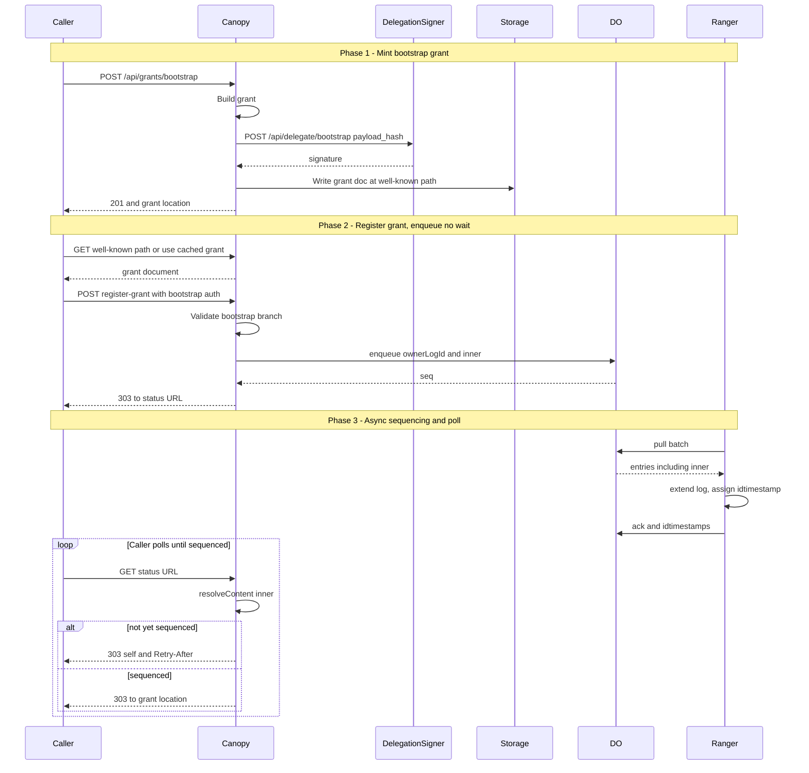
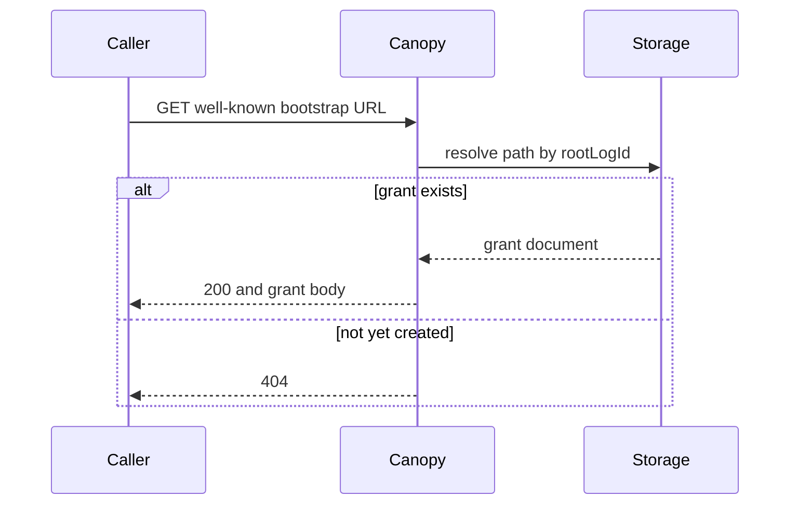

# Subplan 08: Grant-first root bootstrap

**Status**: DRAFT  
**Date**: 2026-03-14  
**Parent**: [Plan 0004 overview](overview.md)  
**Related**: [Plan 0005 grant and receipt as single artifact](../plan-0005-grant-receipt-unified-resolve.md), [ARC-0001 grant verification](../arc-0001-grant-verification.md) (receipt-based inclusion and signer binding), [Subplan 04 delegation-signer in Canopy](subplan-04-delegation-signer-in-canopy.md), [Subplan 06 canopy settlement → grant](subplan-06-canopy-settlement-to-issue-grant-queue.md), [Subplan 02 REST auth log status](subplan-02-rest-auth-log-status.md), [Subplan 03 grant-sequencing](subplan-03-grant-sequencing-component.md)

## 1. Scope

- **Root bootstrap** uses a **grant-first** model: the bootstrap grant is created and signed **once** (offline or via a one-time API) and published at a well-known URL. No runtime “trigger” from checkpoint-publisher or sealer.
- **register-grant** and **register-signed-statement** both require **auth** (a signed grant) on every call. For the first call that creates the root, the caller supplies the pre-published bootstrap grant as auth; the API allows it when logId is not initialized and auth is signed by the bootstrap key (no inclusion check). All other calls require inclusion of auth in the authority log.
- **SCITT**: Every call is authenticated by a grant; the endpoint satisfies “authenticated” without a separate trigger flow.
- **Out of scope**: Child auth log creation (same pattern; specified when we add that flow). Retrospective parent assignment for logs created during bootstrap. Trigger-based bootstrap (superseded by this subplan).

## 2. Dependencies

| Dependency | Use |
|------------|-----|
| **Subplan 01** | Grant encoding, inner hash, leaf commitment. |
| **Subplan 02** | GET /api/root, GET /api/logs/{logId}/config — decide “logId not initialized”. |
| **Subplan 03** | Grant-sequencing (enqueue ownerLogId, inner to same DO); dedupe by inner. |
| **Subplan 04** | Delegation-signer POST /api/delegate/bootstrap (sign bootstrap grant); GET /api/public-key/:bootstrap (verify bootstrap signature). |
| **Univocity contracts deployment** | Canopy obtains the **univocal checkpoint** directly from the contracts (RPC), not from the Univocity REST service in Arbor. Required for inclusion verification (see §3.3.1). |

## 3. Design summary

### 3.1 Bootstrap grant creation (one-time)

**Chosen: canopy one-time API (Option B).** Canopy exposes **POST /api/grants/bootstrap** with **no authentication required**. It is safe for anyone to call: only the canopy service can obtain a signature from the delegation-signer (which holds the bootstrap key); callers cannot produce a valid bootstrap grant without it. The handler builds the bootstrap grant (subplan 01), calls delegation-signer POST /api/delegate/bootstrap for the signature, and **returns the grant in the response** (e.g. as base64-encoded SCITT transparent statement once receipt is attached, or as grant CBOR for the caller to persist and use). Per [Plan 0005](../plan-0005-grant-receipt-unified-resolve.md), **grant storage and well-known paths are the caller's responsibility** in the current phase; writing to a well-known path (e.g. `grants/bootstrap/<rootLogId>.cbor`) is **deferred**. The handler does **not** run grant-sequencing; the first register-grant(logId, auth) with that grant as auth performs sequencing. Config: ROOT_LOG_ID; delegation-signer URL.

**Operational helper (Option A).** An ops script that calls delegation-signer POST /api/delegate/bootstrap with the digest of the bootstrap grant inner, builds the full grant, and writes it to storage can be a useful alternative (e.g. for air-gapped or one-off mint). The implementation plan below covers only Option B; Option A may be documented as an operational runbook if desired.

**Sequence diagram (3.1):** Bootstrap grant mint and async registration until sequenced.



### 3.2 Caller obtains bootstrap grant

- After creation, the caller obtains the bootstrap grant from the **POST /api/grants/bootstrap response** (e.g. grant in response body) or from an ops script that builds and signs it. Per [Plan 0005](../plan-0005-grant-receipt-unified-resolve.md), **GET at a well-known URL** (e.g. GET /grants/bootstrap) is **deferred**; in the current phase the caller uses the grant returned by POST or supplied by ops, and provides it when calling register-grant in the **Authorization** header: `Authorization: Forestrie-Grant <base64>` (transparent statement).

**Authorization (3.2):** No auth required; the bootstrap grant document is public so any caller can obtain it and use it as auth at register-grant. Only the *signed* grant (produced by canopy via delegation-signer) is valid; callers cannot forge it.

```text
FUNCTION get_bootstrap_grant():
    url = config.BOOTSTRAP_GRANT_URL
        OR (config.GRANT_STORAGE_BASE + "/grants/bootstrap")
        OR ("/grants/authority/" + config.ROOT_LOG_ID + "/bootstrap")
    grant_doc = HTTP_GET(url)   // no Authorization header required
    IF response.status == 404 THEN
        RETURN error("Bootstrap grant not yet created")
    RETURN parse_grant(grant_doc)
```

**Sequence diagram (3.2):**



### 3.3 register-grant(logId, auth [, grantPayload?])

- **Bootstrap case:** If (1) logId is not initialized on chain (GET /api/root → exists false, or GET /api/logs/{logId}/config → 404), and (2) auth.logId = auth.ownerLogId = logId, and (3) auth has GF_CREATE (and GF_EXTEND), and (4) auth is signed by the bootstrap key (verify against bootstrap public key), then **allow** without inclusion check. Enqueue (ownerLogId = logId, inner = InnerHashFromGrant(auth)) to DO (grant-sequencing). Return 303 to status URL as today. Idempotency: dedupe by inner (subplan 03).
- **Non-bootstrap:** auth must be a **completed** grant (have idtimestamp) and its inclusion in its owner log must be verified via a **grant receipt** (see §3.3.1); then enqueue grantPayload or auth as specified (child-auth-log flow to be detailed later).

**3.3.1 Receipt-based inclusion verification (all auth flows).** Whenever Canopy must verify that a grant is included in an authority log (register-grant non-bootstrap, register-signed-statement, or any future auth flow), it uses **receipt-based verification** as defined in **[ARC-0001: Grant verification](../arc-0001-grant-verification.md)**. Summary:

- Per [Plan 0005](../plan-0005-grant-receipt-unified-resolve.md), the **caller supplies the grant** in the **Authorization** header: `Authorization: Forestrie-Grant <base64>` (base64-encoded SCITT transparent statement: one COSE Sign1 with grant as payload and receipt in unprotected headers, label 396). No X-Grant-Location fetch; no X-Grant-Receipt-Location; no server-built receipt in this phase.
- The grant must be **completed** (have an 8-byte idtimestamp). Where the caller obtains it is out of scope.
- **Verification:** Decode the supplied artifact to GrantResult (grant + receipt); `verify_grant_receipt(grant, receipt)` verifies MMR inclusion. See ARC-0001 §5 for receipt pseudo code and §8–§9 for implementation locations.

**Env:** An **inclusion env** (sequencing queue + shard count) is used when inclusion verification is required. Grant-completion env (R2, receipt-building) is **deferred** per Plan 0005; receipt comes from the supplied artifact only.

**Authorization (3.3) — pseudo code:**

```text
FUNCTION register_grant_authorized(logId, request, grantPayload?):
    grant_result := get_grant_from_request(request)   // base64 decode → COSE decode; grant + receipt from artifact (Plan 0005)
    IF grant_result is error THEN RETURN 400 or 403
    auth := grant_result.grant
    IF NOT valid_grant_shape(auth) THEN RETURN 400

    log_initialized := univocity_get_log_config(logId) != 404

    IF NOT log_initialized
       AND auth.logId == logId AND auth.ownerLogId == logId
       AND (auth.grantFlags & (GF_CREATE | GF_EXTEND)) == (GF_CREATE | GF_EXTEND)
       AND verify_signature(auth, bootstrap_public_key)
    THEN
       // Bootstrap branch: allow without inclusion
       enqueue(ownerLogId := logId, inner := InnerHashFromGrant(auth))
       RETURN 303 status_url
    END IF

    // Non-bootstrap: receipt-based inclusion (receipt from artifact, §3.3.1, ARC-0001, Plan 0005)
    IF NOT auth.idtimestamp OR length(auth.idtimestamp) < 8 THEN
        RETURN 403 "Grant must be completed (idtimestamp required)"
    IF NOT verify_grant_receipt(auth, grant_result.receipt) THEN RETURN 403
    enqueue(grantPayload OR auth)
    RETURN 303 status_url
```

**Sequence diagram (3.3):**

```mermaid
sequenceDiagram
    participant Caller
    participant Canopy
    participant Univocity
    participant Contracts
    participant DO

    Caller->>Canopy: POST register-grant with logId and auth
    Canopy->>Canopy: resolve auth from body or header
    Canopy->>Univocity: GET log config or root
    Univocity-->>Canopy: 200 config or 404

    alt bootstrap branch
        Canopy->>Canopy: validate bootstrap grant
        Canopy->>DO: enqueue ownerLogId and inner
        DO-->>Canopy: ack
        Canopy-->>Caller: 303 to status URL
    else non-bootstrap branch
        Canopy->>Canopy: require completed grant; get receipt (X-Grant-Receipt-Location or build); verify_grant_receipt
        alt receipt missing or invalid
            Canopy-->>Caller: 403
        else receipt valid
            Canopy->>DO: enqueue grantPayload or auth
            Canopy-->>Caller: 303 to status URL
        end
    end
```

### 3.4 register-signed-statement(logId, auth, statement)

- **Shape:** Every call must supply auth (grant location, e.g. X-Grant-Location, or inline). No unauthenticated path.
- **Validation:** Auth must be a completed grant and in the authority log (receipt-based verification per §3.3.1 and [ARC-0001](../arc-0001-grant-verification.md)). Statement signer must match `statementSignerBindingBytes` (ARC-0001 §6). Root must already exist (bootstrap grant already sequenced) before any statement is registered.

**Authorization (3.4) — pseudo code:**

```text
FUNCTION register_signed_statement_authorized(logId, request, statement):
    grant_result := get_grant_from_request(request)   // Plan 0005: Authorization: Forestrie-Grant (base64 transparent statement)
    IF grant_result is error THEN RETURN 400 or 401
    grant := grant_result.grant
    IF NOT valid_grant_shape(grant) THEN RETURN 400

    // Receipt-based inclusion (§3.3.1, ARC-0001, Plan 0005 — receipt from artifact)
    IF NOT grant.idtimestamp OR length(grant.idtimestamp) < 8 THEN RETURN 403
    IF NOT verify_grant_receipt(grant, grant_result.receipt) THEN RETURN 403
    IF statement.signer != statementSignerBindingBytes(grant) THEN RETURN 403   // ARC-0001 §6

    IF NOT univocity_root_exists() THEN RETURN 409 or 503
    enqueue_statement(logId, statement)
    RETURN 303 status_url
```

**Sequence diagram (3.4):**

```mermaid
sequenceDiagram
    participant Caller
    participant Canopy
    participant Contracts
    participant DO

    Caller->>Canopy: POST register-signed-statement with auth and statement
    alt auth missing
        Canopy-->>Caller: 401
    else auth present
        Canopy->>Canopy: resolve grant from auth
        Canopy->>Canopy: require completed grant; get receipt; verify_grant_receipt (ARC-0001)
        alt receipt missing or invalid
            Canopy-->>Caller: 403
        else receipt valid
            Canopy->>Canopy: verify statement signer matches grant signer
            alt signer mismatch
                Canopy-->>Caller: 403
            else valid
                Canopy->>DO: enqueue statement
                Canopy-->>Caller: 303 to status URL
            end
        end
    end
```

### 3.5 Ordering

1. Bootstrap grant is created and published (POST /api/grants/bootstrap or ops script).
2. First caller calls register-grant(rootLogId, bootstrapGrant). API validates bootstrap case, enqueues auth’s inner, returns 303.
3. Grant-sequencing + ranger extend the root authority log.
4. Subsequently, root “exists” for univocity (after first publishCheckpoint with that grant). All register-grant and register-signed-statement use auth with inclusion check.

### 3.6 Services unchanged

- **Univocity (02):** GET /api/root, GET /api/logs/{logId}/config — no change.
- **Delegation-signer (04):** POST /api/delegate/bootstrap, GET /api/public-key/:bootstrap — no change.
- **Grant-sequencing (03):** Same DO, same enqueue; no change.
- **Checkpoint-publisher / sealer:** Do **not** trigger bootstrap; first register-grant caller uses the pre-published bootstrap grant.

## 4. Deliverables

| Deliverable | Description |
|-------------|-------------|
| **Bootstrap grant mint** | POST /api/grants/bootstrap (no auth required; only canopy can sign via delegation-signer). Return grant in response. Storage at well-known path deferred ([Plan 0005](../plan-0005-grant-receipt-unified-resolve.md)). Option A (ops script) optional. |
| **Well-known bootstrap grant URL** | **Deferred** (Plan 0005). Caller obtains bootstrap grant from POST response or ops; supplies it in Authorization: Forestrie-Grant at register-grant. |
| **register-grant auth and bootstrap branch** | Caller supplies grant in **Authorization: Forestrie-Grant &lt;base64&gt;** (Plan 0005). If logId not initialized and auth is bootstrap-signed and auth.logId = auth.ownerLogId = logId and auth has GF_CREATE/GF_EXTEND → allow, enqueue. Else **receipt-based inclusion** (§3.3.1, ARC-0001): receipt from artifact only. |
| **register-signed-statement auth required** | Caller supplies grant in **Authorization: Forestrie-Grant &lt;base64&gt;**. **Receipt-based inclusion** (§3.3.1, ARC-0001) then signer match. No unauthenticated path. |
| **Bootstrap key verification** | Canopy (or verifier) verifies “auth signed by bootstrap key” using GET /api/public-key/:bootstrap or config. |

## 5. Verification

- Bootstrap grant created once and published at well-known URL; GET returns the grant.
- First register-grant(rootLogId, bootstrapGrant) succeeds (bootstrap branch), enqueues inner, returns 303; grant-sequencing runs; no duplicate leaf on retry (dedupe by inner).
- register-grant with non-bootstrap auth when logId not initialized and auth not bootstrap-signed → rejected (e.g. 403).
- register-signed-statement without auth or with auth not included → rejected (e.g. 401).
- After bootstrap grant sequenced, register-signed-statement with a valid included grant succeeds.

## 5.1 Verification scenario → step mapping

| Scenario | Steps involved | Test type |
|----------|----------------|-----------|
| Bootstrap grant at well-known URL | 8.1, 8.2 | Integration: POST then GET returns grant |
| First register-grant (bootstrap branch) | 8.3, 8.4, 8.5, 8.8 | Integration: 303, then poll until sequenced |
| Non-bootstrap register-grant rejected without valid receipt | 8.4, 8.5b, 8.6 | Integration: no receipt or invalid receipt → 403 |
| register-signed-statement without auth → 401 | 8.7 | Unit or integration |
| register-signed-statement with completed grant and valid receipt succeeds | 8.5b, 8.6 (receipt), 8.7, 8.8 | E2E after bootstrap sequenced |

## 6. Agent-optimised implementation plan

| Step | Action | Input | Output | Location / hint | Verification |
|------|--------|-------|--------|------------------|--------------|
| **8.1** | One-time bootstrap grant API | No auth required. Config: ROOT_LOG_ID, delegation-signer URL. | POST /api/grants/bootstrap: build bootstrap grant (subplan 01), call delegation-signer for signature. **Return grant in response** (e.g. body). Do not enqueue. Storage at well-known path **deferred** (Plan 0005). Idempotent if needed (e.g. 200 with same grant). | Canopy: canopy-api or worker. | Only canopy produces valid signed grant; caller uses response. |
| **8.2** | Well-known bootstrap grant GET | **Deferred** (Plan 0005). | — | Caller obtains bootstrap grant from POST response or ops. | — |
| **8.3** | Bootstrap public key for verification | Delegation-signer GET /api/public-key/:bootstrap or config | Cached bootstrap public key for signature verification | Canopy: register-grant and any verifier. Fetch once at startup or on first use; cache. | Bootstrap-signed auth verifies. |
| **8.4** | register-grant: get grant from request | **Authorization: Forestrie-Grant &lt;base64&gt;** (Plan 0005) | get_grant_from_request(request): read Authorization header (Forestrie-Grant scheme); base64 decode → COSE decode; yield GrantResult (grant + receipt from unprotected headers). Validate grant shape. No fetch. | Canopy: register-grant. Grant must be in header; no X-Grant-Location fetch. | register-grant receives grant from header. |
| **8.5** | register-grant: bootstrap branch | logId, auth; univocity GET /api/root or GET /api/logs/{logId}/config | If logId not initialized (02): check auth.logId = auth.ownerLogId = logId, auth has GF_CREATE and GF_EXTEND, auth signature verifies with bootstrap key (8.3) → allow. Enqueue (ownerLogId = logId, inner = InnerHashFromGrant(auth)). Return 303 to status URL. Else → 8.6. | Same. Call subplan 02 (univocity client) for “logId initialized?”. Call subplan 03 (grant-sequencing) with auth’s inner. | First register-grant(rootLogId, bootstrapGrant) sequences bootstrap grant. |
| **8.5a** | Univocal checkpoint from chain (optional future) | ownerLogId; config UNIVOCITY_CONTRACT_RPC_URL, UNIVOCITY_CONTRACT_ADDRESS | get_univocal_checkpoint_from_contracts(ownerLogId): RPC to Univocity contract. Used when chain-based verification is added. Current implementation uses receipt-based verification (ARC-0001). | Canopy: shared client or service. | Optional; receipt-based path does not require chain. |
| **8.5b** | Checkpoint from storage (receipt building) | **Deferred** (Plan 0005). | Receipt comes from supplied artifact only in this phase. buildReceiptForEntry (R2) remains for future use when server-built receipt is reintroduced. | — | — |
| **8.6** | register-grant: non-bootstrap branch | grant_result (from 8.4), inclusion_env | Require **completed** grant (idtimestamp). Receipt from grant_result.receipt (artifact). **verify_grant_receipt(auth, grant_result.receipt)** per [ARC-0001](../arc-0001-grant-verification.md). If valid, enqueue grantPayload or auth; return 303. | Canopy: register-grant. Subplan 03 dedupe by inner. | Non-bootstrap requires valid receipt in artifact; 403 when missing or invalid. |
| **8.7** | register-signed-statement: require auth | **Authorization: Forestrie-Grant &lt;base64&gt;** (transparent statement), inclusion_env | get_grant_from_request(request); reject 401 if header missing or not Forestrie-Grant. **verify_grant_receipt(grant, grant_result.receipt)**; verify statement signer matches `statementSignerBindingBytes(grant)` (ARC-0001 §6). | Canopy: register-signed-statement handler. | No unauthenticated path; receipt from artifact then signer match. |
| **8.8** | Config and wiring | ROOT_LOG_ID, delegation-signer URL, univocity service URL (for 8.5). Inclusion: sequencing queue + shard count. | Env loaded at startup. Bootstrap key (8.3); inclusion_env passed to register-grant and register-signed-statement. grant_completion_env not used in this phase (Plan 0005). | Canopy. | Receipt-based verification using receipt from artifact only. |

**Data flow (concise).** Caller (or ops) calls POST /api/grants/bootstrap (8.1); canopy builds and signs grant, **returns grant in response**. Caller uses that grant (or from ops), supplies it at register-grant in **Authorization: Forestrie-Grant &lt;base64&gt;** (8.4). Bootstrap branch (8.5) → enqueue auth's inner → 303 → grant-sequencing runs. Subsequent calls: grant in Authorization header (8.4); receipt from artifact; **verify_grant_receipt(grant, grant_result.receipt)** (ARC-0001, Plan 0005); then enqueue or signer check + enqueue.

**Files to add or touch (canopy).** Bootstrap grant mint handler (8.1); bootstrap key fetcher/cache (8.3); **grant layer** (ARC-0001): leaf commitment, receipt parse/verify (`src/grant/`); **get_grant_from_request** (Plan 0005); register-grant and register-signed-statement: get_grant_from_request → **verify_grant_receipt** (8.6, 8.7); config and inclusion_env wiring (8.8). Well-known GET (8.2) and grant_completion_env deferred. Subplan 02 and 04 unchanged.

**6.1 Step order and dependencies.** 8.1; 8.3 (before 8.5); 8.4 (before 8.5 and 8.6); grant layer (ARC-0001) before 8.6, 8.7; 8.5; 8.6; 8.7; 8.8 last. 8.2 and 8.5b deferred.

**6.2 Per-step testability.** Unit tests: mock delegation-signer, univocity REST, DO. Integration: 8.1 (POST returns grant); 8.4+8.5+8.3 (bootstrap branch); 8.4+8.6 (non-bootstrap with grant in Authorization header and receipt from artifact). E2E: 8.7 with grant in Authorization header and valid receipt in artifact. Pass criteria: 8.1 — POST returns grant; 8.4 — get_grant_from_request from Authorization: Forestrie-Grant; 8.5 — bootstrap branch enqueues and 303; 8.6 — invalid/missing receipt in artifact → 403, valid → 303; 8.7 — no grant → 401, invalid receipt or signer mismatch → 403, valid → 303.

**6.3 Ambiguities resolved.** Grant supply: **Authorization: Forestrie-Grant &lt;base64&gt;** (Plan 0005). No X-Grant-Location fetch; no X-Grant-Receipt-Location. Receipt is part of the artifact (unprotected header 396). univocity_root_exists() (3.4): may use GET /api/root (Subplan 02).

## 7. References

- [Plan 0005 Grant and receipt as single artifact](../plan-0005-grant-receipt-unified-resolve.md) — caller supplies grant in Authorization: Forestrie-Grant &lt;base64&gt;; no fetch or storage in this phase.
- [ARC-0001 Grant verification](../arc-0001-grant-verification.md) — receipt-based inclusion and signer binding; verification pseudo code and implementation locations.
- [Subplan 04 delegation-signer in Canopy §4.3.D](subplan-04-delegation-signer-in-canopy.md) (source of grant-first design).
- Overview: §2 (subplans), §3 (context). Subplans 01, 02, 03, 04, 06.
