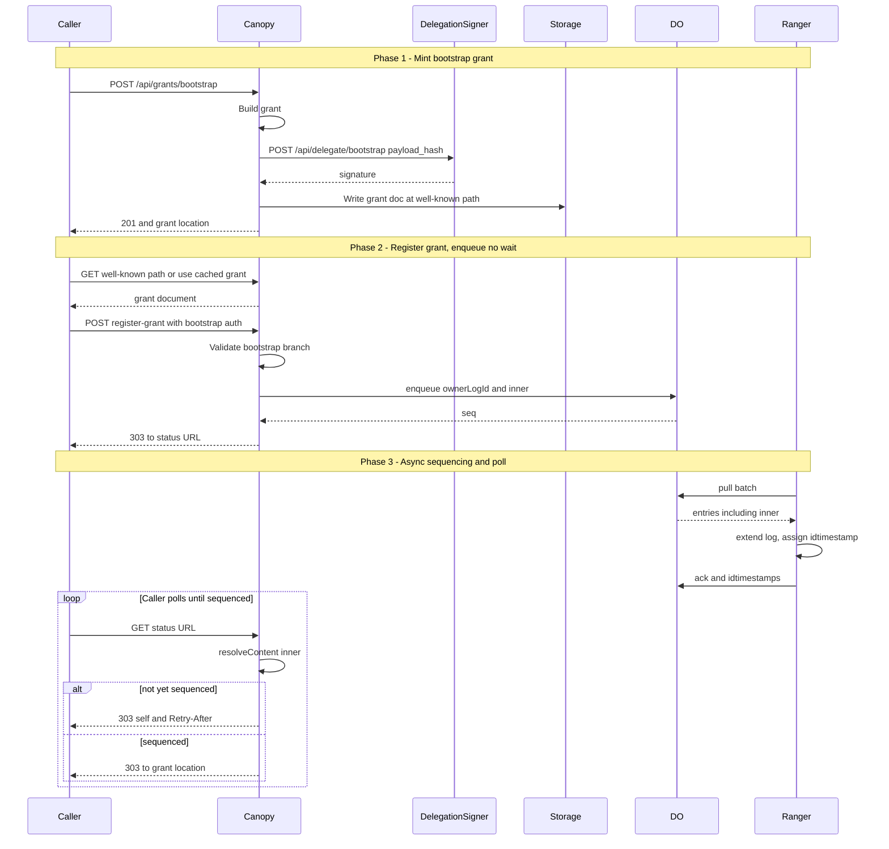
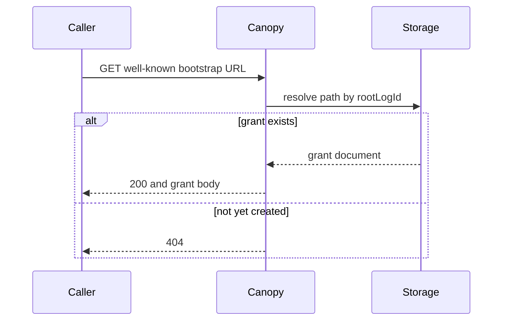
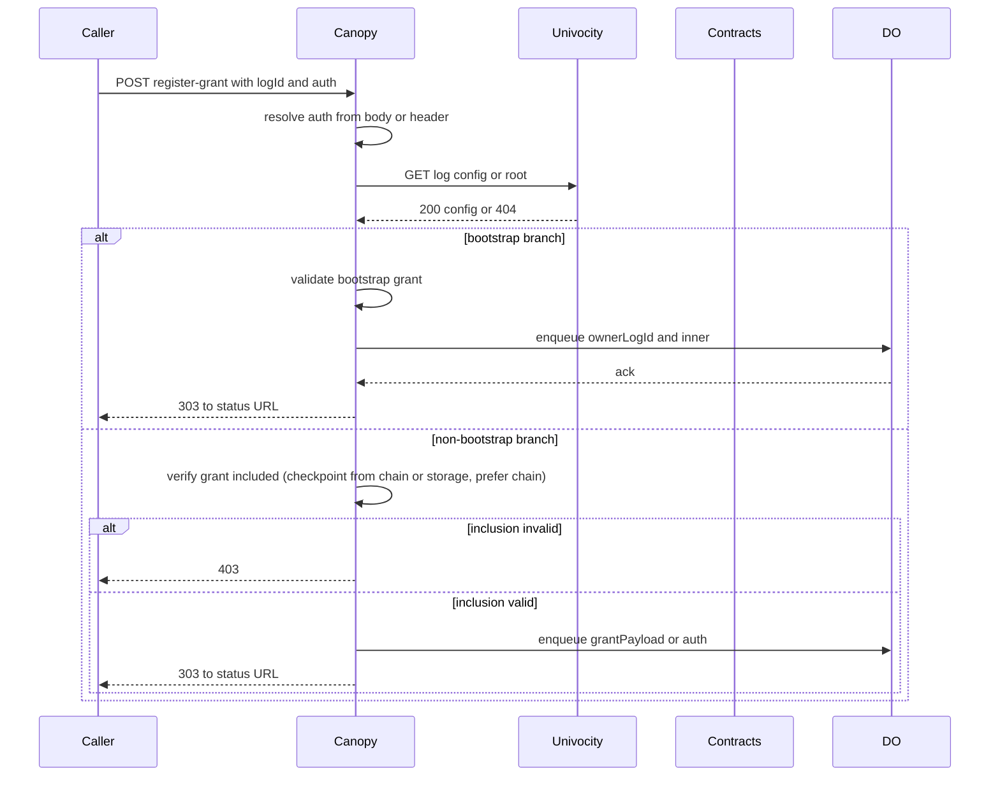
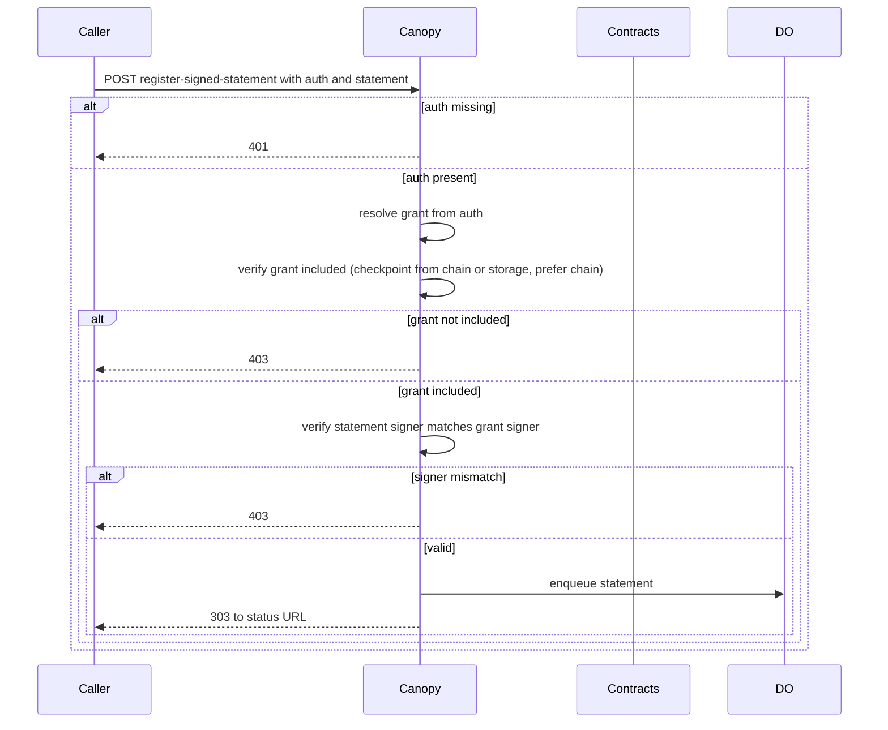

# Subplan 08: Grant-first root bootstrap

**Status**: DRAFT  
**Date**: 2026-03-14  
**Parent**: [Plan 0004 overview](overview.md)  
**Related**: [Subplan 04 delegation-signer in Canopy](subplan-04-delegation-signer-in-canopy.md), [Subplan 06 canopy settlement → grant](subplan-06-canopy-settlement-to-issue-grant-queue.md), [Subplan 02 REST auth log status](subplan-02-rest-auth-log-status.md), [Subplan 03 grant-sequencing](subplan-03-grant-sequencing-component.md)

## 1. Scope

- **Root bootstrap** uses a **grant-first** model: the bootstrap grant is created and signed **once** (offline or via a one-time API) and published at a well-known URL. No runtime “trigger” from checkpoint-publisher or sealer.
- **register-grant** and **register-signed-statement** both require **auth** (a signed grant) on every call. For the first call that creates the root, the caller supplies the pre-published bootstrap grant as auth; the API allows it when logId is not initialized and auth is signed by the bootstrap key (no inclusion check). All other calls require inclusion of auth in the authority log.
- **SCITT**: Every call is authenticated by a grant; the endpoint satisfies “authenticated” without a separate trigger flow.
- **Out of scope**: Child auth log creation (same pattern; specified when we add that flow). Retrospective parent assignment for logs created during bootstrap. Trigger-based bootstrap (superseded by this subplan).

## 2. Dependencies

| Dependency | Use |
|------------|-----|
| **Subplan 01** | Grant encoding, inner hash, leaf commitment. |
| **Subplan 02** | GET /api/root, GET /api/logs/{logId}/config — decide “logId not initialized”. |
| **Subplan 03** | Grant-sequencing (enqueue ownerLogId, inner to same DO); dedupe by inner. |
| **Subplan 04** | Delegation-signer POST /api/delegate/bootstrap (sign bootstrap grant); GET /api/public-key/:bootstrap (verify bootstrap signature). |
| **Univocity contracts deployment** | Canopy obtains the **univocal checkpoint** directly from the contracts (RPC), not from the Univocity REST service in Arbor. Required for inclusion verification (see §3.3.1). |

## 3. Design summary

### 3.1 Bootstrap grant creation (one-time)

**Chosen: canopy one-time API (Option B).** Canopy exposes **POST /api/grants/bootstrap** with **no authentication required**. It is safe for anyone to call: only the canopy service can obtain a signature from the delegation-signer (which holds the bootstrap key); callers without access to the delegation-signer cannot produce a valid bootstrap grant. The handler builds the bootstrap grant (subplan 01), calls delegation-signer POST /api/delegate/bootstrap for the signature, writes the grant document to storage at a well-known path (e.g. `grants/bootstrap/<rootLogId>.cbor`), and returns the grant location. It **does not** run grant-sequencing; the first register-grant(logId, auth) with that grant as auth performs sequencing. Idempotent: if a grant already exists at the well-known path, return 200 with existing location. Config: root log id (ROOT_LOG_ID); delegation-signer URL; grant storage base.

**Operational helper (Option A).** An ops script that calls delegation-signer POST /api/delegate/bootstrap with the digest of the bootstrap grant inner, builds the full grant, and writes it to storage can be a useful alternative (e.g. for air-gapped or one-off mint). The implementation plan below covers only Option B; Option A may be documented as an operational runbook if desired.

**Sequence diagram (3.1):** Bootstrap grant mint and async registration until sequenced.



### 3.2 Caller obtains bootstrap grant

- After creation (canopy API or ops script), the bootstrap grant is at a **well-known URL**, e.g. GET /grants/bootstrap or GET /grants/authority/{rootLogId}/bootstrap. Caller fetches once and caches. Config: BOOTSTRAP_GRANT_URL or derive from grant storage base + known path.

**Authorization (3.2):** No auth required; the bootstrap grant document is public so any caller can obtain it and use it as auth at register-grant. Only the *signed* grant (produced by canopy via delegation-signer) is valid; callers cannot forge it.

```text
FUNCTION get_bootstrap_grant():
    url = config.BOOTSTRAP_GRANT_URL
        OR (config.GRANT_STORAGE_BASE + "/grants/bootstrap")
        OR ("/grants/authority/" + config.ROOT_LOG_ID + "/bootstrap")
    grant_doc = HTTP_GET(url)   // no Authorization header required
    IF response.status == 404 THEN
        RETURN error("Bootstrap grant not yet created")
    RETURN parse_grant(grant_doc)
```

**Sequence diagram (3.2):**



### 3.3 register-grant(logId, auth [, grantPayload?])

- **Bootstrap case:** If (1) logId is not initialized on chain (GET /api/root → exists false, or GET /api/logs/{logId}/config → 404), and (2) auth.logId = auth.ownerLogId = logId, and (3) auth has GF_CREATE (and GF_EXTEND), and (4) auth is signed by the bootstrap key (verify against bootstrap public key), then **allow** without inclusion check. Enqueue (ownerLogId = logId, inner = InnerHashFromGrant(auth)) to DO (grant-sequencing). Return 303 to status URL as today. Idempotency: dedupe by inner (subplan 03).
- **Non-bootstrap:** auth must be a grant whose inclusion in its owner log is verified (see §3.3.1); then enqueue grantPayload or auth as specified (child-auth-log flow to be detailed later).

**3.3.1 Inclusion verification (all auth flows).** Whenever Canopy must verify that a grant is included in an authority log (register-grant non-bootstrap, register-signed-statement, or any future auth flow), it uses a **single verification interface** that accepts an inclusion env. The env may supply **either** or **both** of:

- **Chain:** univocal checkpoint from the Univocity contracts (RPC). Config: `UNIVOCITY_CONTRACT_RPC_URL`, `UNIVOCITY_CONTRACT_ADDRESS`.
- **Storage:** signed checkpoint read from object storage using the regular forestrie schema (e.g. `v2/merklelog/checkpoints/{massifHeight}/{logId}/{massifIndex}.sth`). Config: R2 bucket for massifs/checkpoints and massif height, **or** an object storage root URL to fetch checkpoints by path.

**Requirement:** At least one of chain config or storage config must be provided. If **both** are provided, **prefer the chain check** (use chain first; storage is not used when chain is configured). Caching may be introduced later; the abstraction hides the source from register-grant and register-signed-statement, which simply pass the env through.

**Contract and verification (implementation).** When using chain: the univocal checkpoint is the signed checkpoint (or MMR root) for that log as published on-chain; Canopy calls the contract via RPC. When using storage: Canopy reads the signed checkpoint (.sth) for the relevant massif from R2 or from the object storage root URL, then verifies inclusion against that checkpoint. **verify_grant_included(grant, env):** (1) inner = InnerHashFromGrant(grant); (2) resolveContent(ownerLogId, inner) to obtain leaf index and massif index (or null → not included); (3) obtain checkpoint for that log (from chain **or** from storage, preferring chain when both envs present); (4) verify leaf commitment matches MMR at that index and MMR root matches checkpoint (subplan 03 leaf formula). If any step fails, return false. Full MMR verification can be implemented for both sources.

**Authorization (3.3) — pseudo code:**

```text
FUNCTION register_grant_authorized(logId, auth, grantPayload?):
    auth := resolve_auth(auth)   // from body or X-Grant-Location
    IF NOT valid_grant_shape(auth) THEN RETURN 400

    log_initialized := univocity_get_log_config(logId) != 404
        // or GET /api/root

    IF NOT log_initialized
       AND auth.logId == logId AND auth.ownerLogId == logId
       AND (auth.grantFlags & (GF_CREATE | GF_EXTEND))
            == (GF_CREATE | GF_EXTEND)
       AND verify_signature(auth, bootstrap_public_key)
    THEN
       // Bootstrap branch: allow without inclusion
       enqueue(ownerLogId := logId, inner := InnerHashFromGrant(auth))
       RETURN 303 status_url
    END IF

    // Non-bootstrap: require inclusion (see §3.3.1; checkpoint from chain or storage, prefer chain)
    IF NOT verify_grant_included(auth, inclusion_env) THEN
        RETURN 403
    enqueue(grantPayload OR auth)   // per child-auth-log or single-grant
    RETURN 303 status_url
```

**Sequence diagram (3.3):**



### 3.4 register-signed-statement(logId, auth, statement)

- **Shape:** Every call must supply auth (grant location, e.g. X-Grant-Location, or inline). No unauthenticated path.
- **Validation:** Auth must be in the authority log (inclusion check per §3.3.1: checkpoint from chain or storage, prefer chain). Statement signer must match auth.signer (existing rule). Root must already exist (bootstrap grant already sequenced) before any statement is registered.

**Authorization (3.4) — pseudo code:**

```text
FUNCTION register_signed_statement_authorized(logId, auth, statement):
    IF auth is missing (no X-Grant-Location and no inline grant) THEN
        RETURN 401

    grant := resolve_auth(auth)
    IF NOT valid_grant_shape(grant) THEN RETURN 400

    IF NOT verify_grant_included(grant, inclusion_env) THEN
        RETURN 403

    IF statement.signer != grant.signer THEN RETURN 403

    // Root must exist (bootstrap already sequenced) before any statement
    IF NOT univocity_root_exists() THEN RETURN 409 or 503

    enqueue_statement(logId, statement)
    RETURN 303 status_url
```

**Sequence diagram (3.4):**



### 3.5 Ordering

1. Bootstrap grant is created and published (POST /api/grants/bootstrap or ops script).
2. First caller calls register-grant(rootLogId, bootstrapGrant). API validates bootstrap case, enqueues auth’s inner, returns 303.
3. Grant-sequencing + ranger extend the root authority log.
4. Subsequently, root “exists” for univocity (after first publishCheckpoint with that grant). All register-grant and register-signed-statement use auth with inclusion check.

### 3.6 Services unchanged

- **Univocity (02):** GET /api/root, GET /api/logs/{logId}/config — no change.
- **Delegation-signer (04):** POST /api/delegate/bootstrap, GET /api/public-key/:bootstrap — no change.
- **Grant-sequencing (03):** Same DO, same enqueue; no change.
- **Checkpoint-publisher / sealer:** Do **not** trigger bootstrap; first register-grant caller uses the pre-published bootstrap grant.

## 4. Deliverables

| Deliverable | Description |
|-------------|-------------|
| **Bootstrap grant mint** | POST /api/grants/bootstrap (no auth required; safe because only canopy can sign via delegation-signer). Produce and publish bootstrap grant at well-known path. Option A (ops script) is an optional operational helper, not in implementation plan. |
| **Well-known bootstrap grant URL** | Stable path (e.g. /grants/bootstrap or /grants/authority/{rootLogId}/bootstrap) so callers can GET and cache. |
| **register-grant auth and bootstrap branch** | Accept auth (grant or location). If logId not initialized and auth is bootstrap-signed and auth.logId = auth.ownerLogId = logId and auth has GF_CREATE/GF_EXTEND → allow, enqueue auth’s inner. Else require inclusion (§3.3.1: checkpoint from chain or storage, prefer chain; at least one source required). |
| **register-signed-statement auth required** | Require auth on every call; verify inclusion (§3.3.1: same env, chain or storage) and signer match. No unauthenticated path. |
| **Bootstrap key verification** | Canopy (or verifier) verifies “auth signed by bootstrap key” using GET /api/public-key/:bootstrap or config. |

## 5. Verification

- Bootstrap grant created once and published at well-known URL; GET returns the grant.
- First register-grant(rootLogId, bootstrapGrant) succeeds (bootstrap branch), enqueues inner, returns 303; grant-sequencing runs; no duplicate leaf on retry (dedupe by inner).
- register-grant with non-bootstrap auth when logId not initialized and auth not bootstrap-signed → rejected (e.g. 403).
- register-signed-statement without auth or with auth not included → rejected (e.g. 401).
- After bootstrap grant sequenced, register-signed-statement with a valid included grant succeeds.

## 5.1 Verification scenario → step mapping

| Scenario | Steps involved | Test type |
|----------|----------------|-----------|
| Bootstrap grant at well-known URL | 8.1, 8.2 | Integration: POST then GET returns grant |
| First register-grant (bootstrap branch) | 8.3, 8.4, 8.5, 8.8 | Integration: 303, then poll until sequenced |
| Non-bootstrap register-grant rejected without inclusion | 8.4, 8.5a, 8.6 | Integration: auth not in log → 403 |
| register-signed-statement without auth → 401 | 8.7 | Unit or integration |
| register-signed-statement with included grant succeeds | 8.5a, 8.6 (inclusion), 8.7, 8.8 | E2E after bootstrap sequenced |

## 6. Agent-optimised implementation plan

| Step | Action | Input | Output | Location / hint | Verification |
|------|--------|-------|--------|------------------|--------------|
| **8.1** | One-time bootstrap grant API | No auth required (anyone may call). Config: ROOT_LOG_ID, delegation-signer URL, grant storage base. | POST /api/grants/bootstrap: build bootstrap grant (subplan 01), call delegation-signer POST /api/delegate/bootstrap for signature (canopy has Bearer to delegation-signer), write grant doc to storage at well-known path (e.g. grants/bootstrap/{rootLogId}.cbor). Do **not** enqueue. Return 201 with grant location. Idempotent: if grant already at path, 200 with existing location. Safe for unauthenticated callers: only this service can obtain the bootstrap signature. | Canopy: canopy-api or worker. Server-side uses configured token or service identity to call delegation-signer. | Anyone can call; only canopy produces valid signed grant. GET well-known path returns grant. |
| **8.2** | Well-known bootstrap grant GET | Request to e.g. GET /grants/bootstrap or GET /grants/authority/:rootLogId/bootstrap | 200 with grant document (or redirect to storage path). 404 if not yet created. | Canopy: serve-grant or new route. Resolve from storage by rootLogId (config or path param). | Caller can fetch bootstrap grant by URL. |
| **8.3** | Bootstrap public key for verification | Delegation-signer GET /api/public-key/:bootstrap or config | Cached or config bootstrap public key (PEM or bytes) for signature verification | Canopy: register-grant and any verifier. Fetch once at startup or on first use; cache. Config override optional. | Bootstrap-signed auth verifies. |
| **8.4** | register-grant: accept auth | Request body or X-Grant-Location (auth grant) | Parse auth (grant); if by location, fetch grant from storage. Validate grant shape (logId, ownerLogId, grantFlags, signature). | Canopy: register-grant handler. Auth may be inline (CBOR body) or reference (header → fetch). | register-grant receives auth. |
| **8.5** | register-grant: bootstrap branch | logId, auth; univocity GET /api/root or GET /api/logs/{logId}/config | If logId not initialized (02): check auth.logId = auth.ownerLogId = logId, auth has GF_CREATE and GF_EXTEND, auth signature verifies with bootstrap key (8.3) → allow. Enqueue (ownerLogId = logId, inner = InnerHashFromGrant(auth)). Return 303 to status URL. Else → 8.6. | Same. Call subplan 02 (univocity client) for “logId initialized?”. Call subplan 03 (grant-sequencing) with auth’s inner. | First register-grant(rootLogId, bootstrapGrant) sequences bootstrap grant. |
| **8.5a** | Univocal checkpoint from chain | ownerLogId; config UNIVOCITY_CONTRACT_RPC_URL, UNIVOCITY_CONTRACT_ADDRESS | get_univocal_checkpoint_from_contracts(ownerLogId): RPC to Univocity contract (e.g. getCheckpoint(logId)). Return checkpoint (MMR root or signed checkpoint). Used by unified inclusion verification. Do not use Arbor REST. | Canopy: shared client or service. | Unit: mock RPC returns checkpoint; integration: real contract returns checkpoint for initialized log. |
| **8.5b** | Checkpoint from storage | ownerLogId, massifIndex (from resolveContent); R2 bucket or object storage root URL; massif height; forestrie path schema | get_checkpoint_from_storage(logId, massifIndex, env): Read signed checkpoint at v2/merklelog/checkpoints/{massifHeight}/{logId}/{massifIndex}.sth from R2 or fetch via objectStorageRootUrl. Return MMR root (or signed checkpoint) for verification. Used when chain config absent or as fallback when chain preferred but both provided (prefer chain). | Canopy: shared module. | Unit: mock R2/HTTP returns .sth; integration: real R2 returns checkpoint. |
| **8.6** | register-grant: non-bootstrap branch | auth, inclusion_env | verify_grant_included(auth, inclusion_env): at least one of chain or storage config required; prefer chain when both set. Obtain checkpoint (8.5a or 8.5b), verify auth included. If valid, enqueue grantPayload or auth; current single-grant: return 303 to status or existing grant location. | Canopy: register-grant. Passes inclusion_env to verification only. Subplan 03 dedupe by inner. | Non-bootstrap register-grant requires inclusion; 403 when not included. |
| **8.7** | register-signed-statement: require auth | Every POST /logs/{logId}/entries, inclusion_env | Require X-Grant-Location (or equivalent); reject 401 if missing. Fetch grant; verify_grant_included(grant, inclusion_env); verify statement signer matches grant.signer. | Canopy: register-signed-statement handler. Passes inclusion_env through. | No unauthenticated register-signed-statement; inclusion from chain or storage. |
| **8.8** | Config and wiring | ROOT_LOG_ID, delegation-signer URL, univocity service URL (for 8.5). Inclusion: **either** chain (UNIVOCITY_CONTRACT_RPC_URL, UNIVOCITY_CONTRACT_ADDRESS) **or** storage (R2 massifs bucket + massif height, or object storage root URL); **both** allowed, prefer chain. | Env or config loaded at startup. Bootstrap key (8.3); univocity client for 8.5; inclusion env built from chain and/or storage config; register-grant and register-signed-statement receive same inclusion_env. | Canopy. | All config documented; at least one inclusion source required when inclusion is used. |

**Data flow (concise).** Any caller (or ops) calls POST /api/grants/bootstrap (8.1); canopy builds and signs grant via delegation-signer, publishes to well-known path. Caller GETs bootstrap grant (8.2), calls register-grant(rootLogId, auth) (8.4, 8.5) → bootstrap branch → enqueue auth’s inner → 303 → grant-sequencing runs. Subsequent calls use auth with inclusion: Canopy passes inclusion_env to verify_grant_included; verification uses chain and/or storage (prefer chain when both configured). Caching may be added later without changing callers.

**Files to add or touch (canopy).** Bootstrap grant mint handler (8.1); well-known GET route (8.2); bootstrap key fetcher/cache (8.3); univocal checkpoint from chain (8.5a); checkpoint from storage (8.5b); **unified verify_grant_included(grant, inclusion_env)** that accepts chain and/or storage env, prefers chain; register-grant and register-signed-statement only forward inclusion_env (8.6, 8.7); config (8.8). Subplan 02 (univocity) and 04 (delegation-signer) unchanged.

**6.1 Step order and dependencies.** Implement in order: 8.1 → 8.2; 8.3 (before 8.5); 8.4 (before 8.5 and 8.6); 8.5a and 8.5b (before unified verification and 8.6, 8.7); 8.5; 8.6; 8.7; 8.8 last. Steps 8.3, 8.5a and 8.5b can be developed in parallel once 8.4 exists.

**6.2 Per-step testability.** Each step is individually testable. Unit tests: mock delegation-signer, univocity REST, contract RPC, R2/HTTP for checkpoints, DO. Integration: 8.1+8.2; 8.4+8.5+8.3 (bootstrap branch); 8.4+8.5a or 8.5b+8.6 (non-bootstrap with chain or storage). E2E: 8.7 with included grant after bootstrap sequenced. Pass criteria: 8.1 — POST 201 and GET returns grant, idempotent 200; 8.2 — GET 200 or 404; 8.3 — bootstrap key verifies bootstrap-signed auth; 8.4 — auth from body or X-Grant-Location, invalid → 400; 8.5 — bootstrap branch enqueues and 303; 8.5a — get_univocal_checkpoint_from_contracts returns checkpoint (mock or real contract); 8.5b — get_checkpoint_from_storage returns checkpoint (mock or real R2/URL); 8.6 — not included → 403, included → 303; 8.7 — no auth → 401, not included → 403, signer mismatch → 403, valid → 303; 8.8 — config loads; inclusion requires at least one of chain or storage.

**6.3 Ambiguities resolved.** Auth by reference: header **X-Grant-Location** (URL or path); fetch from grant storage (same as bootstrap). Config: **ROOT_LOG_ID**, **DELEGATION_SIGNER_URL**, grant storage base, **UNIVOCITY_SERVICE_URL** (8.5). Inclusion: **either** chain (**UNIVOCITY_CONTRACT_RPC_URL**, **UNIVOCITY_CONTRACT_ADDRESS**) **or** storage (R2 massifs bucket + **MASSIF_HEIGHT**, or **OBJECT_STORAGE_ROOT_URL** for checkpoint fetch by path); **both** allowed, prefer chain. univocity_root_exists() (3.4): may use GET /api/root (Subplan 02).

## 7. References

- [Subplan 04 delegation-signer in Canopy §4.3.D](subplan-04-delegation-signer-in-canopy.md) (source of grant-first design).
- Overview: §2 (subplans), §3 (context). Subplans 01, 02, 03, 04, 06.
