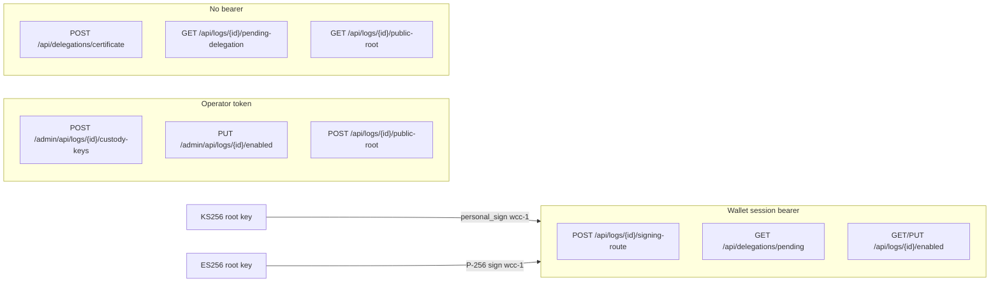

# plan-0038 — Wallet-challenge coordinator e2e (FOR-129 follow-up)

**Status:** DRAFT  
**Date:** 2026-06-23  
**Linear:** FOR-138 (implementation tracker)  
**Related:** [plan-0021](plan-0021-delegation-coordinator-apis.md),
[plan-0037](plan-0037-mode-c-onboarding-coordinator-forward.md),
[adr-0008](../adr/adr-0008-authority-source-route-boundaries.md),
[devdocs arc-0023](https://github.com/forestrie/devdocs/blob/main/arc/arc-0023-wallet-challenge-control-plane-auth.md),
FOR-129, FOR-137

## Problem

FOR-129 (#33) split coordinator routes into **operator** (`/admin/api/`,
`COORDINATOR_APP_TOKEN`), **public** (certificate POST, pending-delegation
GET, public-root GET), and **user session** (`/api/` with wallet-challenge
bearer when `ENABLE_WALLET_CHALLENGE=true`).

Post-merge CI was unblocked by **weakening** e2e coverage (#34, #35):

| Workaround | Location | Why it is not acceptable |
|------------|----------|---------------------------|
| `test.skip` | `coordinator-api.spec.ts` signing-route test | User-route auth never exercised in deploy coordinator project |
| `postSigningRouteBestEffort` (accept 401) | bootstrap + stretch system specs | Signing-route setup silently skipped; no assertion that session path works |
| Removed signing-route step | `coordinator-byok-material.spec.ts` | BYOK material flow no longer registers wallet mode on coordinator |
| Public `pending-delegation` instead of session `GET /api/delegations/pending` | coordinator BYOK specs | Shard fan-out + session auth on aggregate pending not tested |

These were **expedient deploy fixes**, not the target test model. This plan
defines the replacement.

## Auth model (target)



**Service routes** keep using `COORDINATOR_APP_TOKEN` (and optional per-log
`issuerToken` on webhook). **User routes** require a control-plane session
minted via `POST /api/auth/challenge` → sign envelope →
`POST /api/auth/session`.

## Design principles

1. **No silent skips** on deployed dev when wallet-challenge is enabled.
   Opt-in stretch env vars (`E2E_*_STRETCH=1`) remain for expensive paths;
   they must not mask auth regressions inside the coordinator project.
2. **Reuse the mandate exchange shape** — same message, scopes, and envelope
   as `@mandate/coordinator-types` / `control-plane-session-core.ts`; e2e
   signs with a test-held private key instead of Privy.
3. **Split by root alg** — KS256 and ES256 are separate e2e tracks until both
   session exchanges are implemented on the coordinator.
4. **Signing-route is not required for sealer** — bootstrap/stretch may omit
   signing-route **only after** a dedicated coordinator spec proves the session
   path; until then, KS256 bootstrap must POST signing-route via session.

## Implementation

### Phase 1 — Shared e2e session helper (KS256)

**New file:** `packages/tests/canopy-api/tests/utils/wallet-challenge-session-e2e.ts`

Callable API (Playwright `APIRequestContext` or `fetch`):

```typescript
export async function exchangeKs256ControlPlaneSession(opts: {
  request: { fetch?: ...; post: ... }; // Playwright-compatible
  coordinatorUrl: string;
  authLogId: string; // UUID wire form
  scopes: ControlPlaneScope[];
  privateKeyHex: string; // 32-byte secp256k1 hex
}): Promise<{ token: string; expiresAt: number }>;

export function sessionAuthHeaders(token: string): { Authorization: string };

export async function postSigningRouteWithSession(opts: {
  request: ...;
  coordinatorUrl: string;
  logId: string;
  sessionToken: string;
  mode?: "wallet" | "http";
}): Promise<void>; // throws on non-2xx
```

**Signing:** `viem/accounts` `privateKeyToAccount` + `signMessage` on
`buildKs256ControlPlaneMessage(envelope)` — mirror
`delegation-coordinator/test/unit/wallet-challenge.test.ts`.

**Message builder:** add devDependency on `viem` to `@canopy/api-e2e`; copy
`buildKs256ControlPlaneMessage` into the e2e util (or extract a tiny
`@canopy/coordinator-wallet-challenge` workspace package shared with
delegation-coordinator — follow-up refactor).

**Precondition:** `POST /api/logs/{authLogId}/public-root` with operator token
and KS256 address must succeed before challenge (coordinator matches signer to
registered root).

### Phase 2 — Coordinator project: KS256 user-route suite

**New spec:** `tests/coordinator/coordinator-wallet-challenge-ks256.spec.ts`

Serial flow (fresh log per run):

1. Operator: `POST public-root` (KS256 address from test key)
2. Session: exchange with scopes `delegations:read`, `logs:signing-route:write`,
   `logs:signing-route:read`
3. Session: `POST signing-route { mode: "wallet" }` → 200
4. Session: `GET signing-route` → `mode: wallet`
5. Service: `POST /api/delegations` miss → 202
6. Session: `GET /api/delegations/pending?authLogId=` → entry present
7. Public: `POST /api/delegations/certificate` (runner-signed material)
8. Service: `POST /api/delegations` → 200 with stored cert
9. Session: `GET pending` → entry cleared
10. Session: `PUT /api/logs/{id}/enabled` user gate + `GET` two-authority body
11. Negative: operator token on `GET pending` → 401

**Restore** `coordinator-api.spec.ts` signing-route test by delegating to this
suite or merging the signing-route + pending steps here and deleting the skip.

**Restore** `coordinator-byok-material.spec.ts` only for ES256 track (Phase 3);
KS256 BYOK material path lives in the new spec.

### Phase 3 — ES256 session exchange (coordinator + e2e)

**Blocker:** `POST /api/auth/session` returns **501** for `alg: ES256`
(`post-auth-session.ts`).

**Coordinator work (separate PR / FOR-139):**

- Verify P-256 signature over `buildEs256ControlPlaneMessage` (or shared wcc-1
  UTF-8 message with ES256 root)
- Match recovered public key to registered ES256 `public-root` x‖y
- Unit tests parallel to KS256 flow

**E2e:** `exchangeEs256ControlPlaneSession` using WebCrypto `sign` on the
challenge message with runner-held ES256 root key (same keys as
`generateEs256RootKeyPair` / bootstrap PEM).

Then update:

- `coordinator-byok-material.spec.ts` — restore signing-route via session
- `byok-checkpoint-seal.spec.ts` — session signing-route before seal stretch
- `coordinator-delegation-issuance.spec.ts` — session signing-route
- `bootstrap-delegation-coordinator.ts` — ES256 variant uses session;
  KS256 variant uses session (remove `postSigningRouteBestEffort`)

### Phase 4 — Remove expedient workarounds

Delete or narrow `postSigningRouteBestEffort`:

- **Delete** once Phase 2+3 callers use `postSigningRouteWithSession` or
  documented omission (bootstrap ES256 blocked until Phase 3).
- **Bootstrap:** after KS256 session path is green, replace best-effort with
  required session POST for KS256; ES256 throws clear error if session
  exchange still 501 (fail loud, not skip).

Re-enable strict assertions:

```typescript
// coordinator-api.spec.ts — remove test.skip
expect(signingRoute.status()).toBe(200);
```

### Phase 5 — CI wiring

| Workflow | Change |
|----------|--------|
| Deploy Workers post-deploy | Coordinator project must run new KS256 wallet-challenge spec |
| `tests-system.yml` push | Consider `require_coordinator_e2e: true` when coordinator secrets present (optional; today coordinator only runs on deploy) |
| Doppler dev | Document test KS256 key optional env `E2E_COORDINATOR_WALLET_CHALLENGE_KEY_HEX` for local runs without bootstrap key file |

## Test matrix (acceptance)

| Behavior | Spec | Auth |
|----------|------|------|
| Operator custody-keys | `coordinator-api.spec.ts` | App token |
| Public certificate ingest | `coordinator-api.spec.ts` | None |
| Session signing-route CRUD | `coordinator-wallet-challenge-ks256.spec.ts` | KS256 session |
| Session aggregate pending | same | KS256 session |
| ES256 BYOK material round-trip | `coordinator-byok-material.spec.ts` | ES256 session (after FOR-139) |
| Bootstrap delegation loop | `bootstrap-delegation-coordinator.ts` | KS256 session; ES256 after FOR-139 |
| Webhook + admin enabled | `coordinator-webhook.spec.ts` | App token (unchanged) |
| App token rejected on user route | `coordinator-wallet-challenge-ks256.spec.ts` | Negative |

## Non-goals

- Privy embedded-wallet e2e (covered in mandate `control-plane-sign-verify.spec.ts`)
- Cloudflare edge rate limit (FOR-137)
- Mandate UI browser tests

## Rollout order

1. Phase 1 + 2 (KS256 coordinator spec green on dev deploy)
2. Remove `test.skip` and `postSigningRouteBestEffort` for KS256 paths
3. FOR-139 ES256 session exchange
4. Phase 3 ES256 e2e + bootstrap ES256 signing-route
5. Delete `postSigningRouteBestEffort`

## References

- Mandate exchange: `mandate/packages/apps/ui/src/lib/coordinator/control-plane-session-core.ts`
- Coordinator unit flow: `packages/apps/delegation-coordinator/test/unit/wallet-challenge.test.ts`
- Route boundaries: `packages/apps/delegation-coordinator/test/unit/route-boundary-auth.test.ts`
