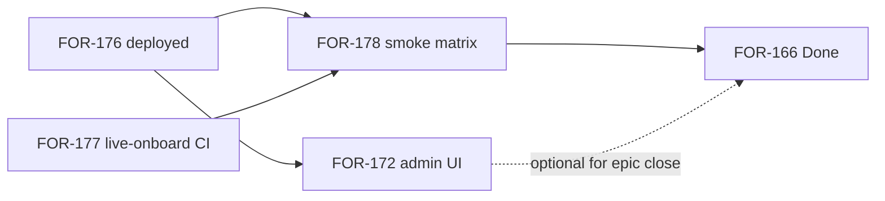

# Plan 0040 — Onboard epic closure backlog (FOR-172, FOR-178)

**Status:** DRAFT  
**Date:** 2026-06-27  
**Related:**
[plan-0039](plan-0039-self-service-onboard-provisioning.md),
[ADR-0009](../adr/adr-0009-self-service-onboard-provisioning.md),
[FOR-166](https://linear.app/forestrie/issue/FOR-166),
[FOR-172](https://linear.app/forestrie/issue/FOR-172),
[FOR-178](https://linear.app/forestrie/issue/FOR-178)

---

## Context

Package A closure stack through FOR-177 is merged and dev-deployed:

| Step | Issue | Outcome |
|------|-------|---------|
| R1 | FOR-175 | Review pass merged (canopy #40) |
| R2 | FOR-176 | Dev auto-approve in wrangler (canopy #41); deploy-workers green |
| R3 | FOR-177 | Mandate `live-onboard` CI job (mandate #9) |

**Remaining epic work:** operator UI (FOR-172) and cross-repo sign-off (FOR-178).
FOR-172 is **not** required to close FOR-166 functionally — mandate CLI + dev
auto-approve cover the fork path — but it is required for **clickable ops** and
was in the original epic scope.

---

## Dependency graph



**Recommended order:** FOR-178 first (validates end-to-end path), then FOR-172
(ops polish). Either order is acceptable if FOR-178 records manual ops steps via
CLI until UI ships.

---

## FOR-178 — Cross-repo live smoke + close FOR-166

**Goal:** Run the acceptance matrix on deployed dev lane; post sign-off; close epic.

**Branch:** none unless smoke reveals gaps (fix-forward PRs on `main`).

### Prerequisites (verify before matrix)

- [ ] Canopy dev deploy includes `ONBOARD_AUTO_APPROVE=true` (FOR-176)
- [ ] GitHub **dev** / Doppler `canopy` has `SUPPORTED_CHAINS_RPC` with Alchemy
- [ ] Mandate Doppler `e2e` + GitHub **live-signer** secrets:
  `E2E_CANOPY_API_URL`, `E2E_CANOPY_CHAIN_ID`, `E2E_CANOPY_UNIVOCITY_ADDR`
- [ ] Mandate `live-onboard` job green on latest `workflow_dispatch`

### Acceptance matrix

| # | Step | Command / action | Expected |
|---|------|------------------|----------|
| 1 | Request | `doppler run -- task onboard:request` (mandate) | `201`, redeem code |
| 2 | Poll | `task onboard:status` | `approved` (auto-approve or ops) |
| 3 | Redeem | `task onboard:redeem` | Plaintext bearer once |
| 4 | Provision | `task provision` | PA genesis `201` |
| 5 | Consume | Repeat genesis with same token | `403` / binding consumed |
| 6 | Binding | Request with wrong Univocity addr | `422` |
| 7 | CI | `gh workflow run live-owned-wallet.yml -R forestrie/mandate` | `live-onboard` green |
| 8 | Docs | [FORKING.md §2](../../mandate/FORKING.md) | Matches lived path |

Row 6 can use mandate CLI with intentional wrong addr or curl CBOR create.

### Deliverables

1. Comment on [FOR-178](https://linear.app/forestrie/issue/FOR-178) with:
   - request IDs from rows 1–4
   - deploy-workers run URL (FOR-176)
   - live workflow run URL (row 7)
2. Update [plan-0039](plan-0039-self-service-onboard-provisioning.md) → **COMPLETE**
3. Mark FOR-178 → Done; FOR-166 → Done

### Estimated effort

**~2–4 hours** (mostly Doppler/env alignment and one full provision cycle).

### Failure modes

| Symptom | Likely cause | Fix |
|---------|--------------|-----|
| Create `502`/gate fail | RPC / Univocity addr | Check `SUPPORTED_CHAINS_RPC`, chain id |
| Stuck `pending` | Auto-approve off or wrong chain | FOR-176 vars or manual ops approve |
| Redeem `410` | Expired approved | Re-request; check TTL vars |
| Provision `403` | Token consumed or wrong binding | New redeem; verify `consumedForestR` |
| `live-onboard` red | Secrets or undeployed API | Sync Doppler → GitHub live-signer |

---

## FOR-172 — Canopy admin UI completion

**Superseded by [plan-0041](plan-0041-canopy-admin-ops-console.md)** — grill-validated
design, scenario matrix, and Linear stack FOR-180–FOR-183.

Quick summary: static `canopy-admin` Pages app; prerequisite API JSON parity
(FOR-180); then request queue, tokens, kill switch tabs; deploy + runbook.

---

## Linear updates (when executing)

| Issue | Action after work |
|-------|-------------------|
| FOR-176 | Done (deploy #41 merged + deploy-workers green) |
| FOR-177 | Done (mandate #9 merged) |
| FOR-178 | In Progress during matrix → Done on sign-off |
| FOR-172 | Backlog → In Progress when UI branch starts |
| FOR-166 | Done when FOR-178 complete (FOR-172 may remain open) |

---

## Commands reference

```bash
# FOR-178 local smoke (mandate worktree, Doppler)
doppler run --project mandate-forestrie --config dev -- task test:live:onboard
doppler run -- task onboard:request -- --label smoke-$(date +%s) ...
doppler run -- task provision

# Dispatch CI live suite
gh workflow run live-owned-wallet.yml -R forestrie/mandate --ref main
gh run list -R forestrie/mandate --workflow=live-owned-wallet.yml --limit 1
gh run watch <run-id> -R forestrie/mandate --exit-status

# Dev deploy (if needed)
gh workflow run deploy-workers.yml -R forestrie/canopy \
  -f environment=dev -f app=canopy-api -f run_e2e=true
```
