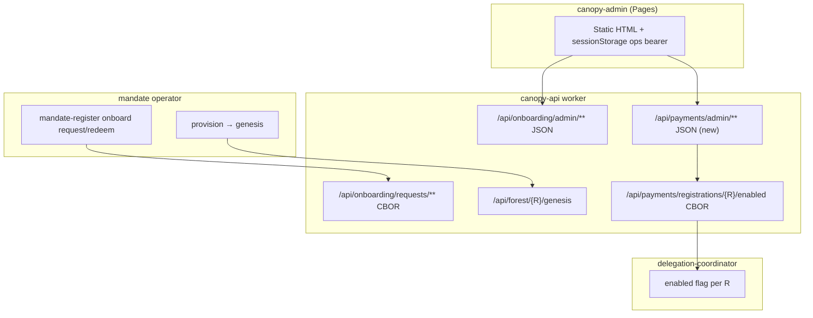

# Plan 0041 — Canopy admin ops console (FOR-172)

**Status:** DRAFT  
**Date:** 2026-06-27  
**Related:**
[plan-0040](plan-0040-onboard-epic-closure-backlog.md),
[ADR-0009](../adr/adr-0009-self-service-onboard-provisioning.md),
[FOR-172](https://linear.app/forestrie/issue/FOR-172),
[devdocs glossary — payment-authoritative](../../../devdocs/glossary.md),
[ARC-021.1 ops mint](../../../devdocs/arc/arc-021-payment-onboarding/01-ops-admin-token.md)

---

## Purpose

Give the **canopy operator** a browser-based console to manage the
self-service onboard control plane without curl: review **onboard requests**,
approve or reject with audit context, inspect **onboard token metadata**, and
toggle the **registration kill switch** on payment-authoritative forests.

This completes the human-ops path that complements mandate CLI self-service
(FOR-173) and dev-lane auto-approve (FOR-174). Production lanes expect human
approve via this UI or CBOR ops routes.

---

## Domain terms (grill — do not conflate)

| Term | Meaning in this UI | UI must NOT |
|------|-------------------|-------------|
| **onboard request** | Pending application in R2 (`onboarding/requests/`) | Show redeem code or bearer |
| **redeem code** | One-time secret at request create; mandate operator holds it | Display in admin list (never stored plaintext) |
| **onboard token** | `CANOPY_PAYMENTS_ONBOARD_TOKEN` bearer; minted at **redeem** | Show plaintext (only hash/ref in token list) |
| **onboard token ref** | `onboardTokenRef` on request after redeem; links request → token record | Confuse with request id |
| **payment-authoritative forest** | Root `R` registered via onboard bearer at genesis | Treat as onboard request id |
| **registration kill switch** | Coordinator `enabled` flag for existing PA registration (`FOR-91`) | Confuse with onboard token revoke or Mode C Privy revoke |
| **ops mint** | Break-glass `POST /api/payments/onboard-tokens` (ARC-021.1) | Merge into self-service request UI in v1 |

Wallet-challenge session (FOR-133) and Mode C Privy onboarding (FOR-112) are
**out of scope** — different control planes.

---

## System context



**Wider components:**

| Component | Role |
|-----------|------|
| `canopy-api` | Onboard lifecycle, token store, genesis auth, kill-switch proxy |
| `delegation-coordinator` | Persists per-forest `enabled` (FOR-91) |
| `mandate/register` | Self-service request/redeem CLI; consumes bearer at genesis |
| `R2_GRANTS` | `onboarding/requests/`, onboard token records, registrations |
| `canopy-admin` | Ops-only static UI; no backend of its own |

---

## Grill findings (code vs docs)

### 1. Admin approve/reject return CBOR today

`POST /api/onboarding/admin/requests/{id}/approve|reject` call
`handleOpsApprove` / `handleOpsReject`, which respond with **CBOR** — not JSON.
The stub UI calls `response.json()` and will fail on success.

**Decision:** Admin JSON routes must return `application/json` bodies. CBOR ops
routes (`/api/onboarding/requests/...`) unchanged for mandate CLI.

### 2. Reject reason is CBOR-only

`handleOpsReject` reads `rejectReason` only from `application/cbor` bodies.
Admin reject needs `application/json` `{ "rejectReason": "..." }` (optional).

### 3. Kill switch is CBOR-only; CORS omits PUT

`GET/PUT /api/payments/registrations/{R}/enabled` use CBOR (FOR-91).
Worker CORS allows `GET, POST, OPTIONS` only — **PUT preflight fails** from
browser.

**Decision:** Add JSON admin mirror:

| Method | Path |
|--------|------|
| `GET` | `/api/payments/admin/registrations/{R}/enabled` |
| `PUT` | `/api/payments/admin/registrations/{R}/enabled` |

Body: `{ "enabled": boolean }`. Same auth as payments ops (`CANOPY_OPS_ADMIN_TOKEN`).
Extend CORS: `PUT` in `Access-Control-Allow-Methods`.

### 4. No list-all-registrations API

v1 kill-switch tab: **manual forest UUID entry** + quick-pick from token list
`consumedForestR` values. Do not add list-registrations in v1.

### 5. Token list shows metadata only

`GET /api/onboarding/admin/tokens` returns `OnboardTokenRecord[]` (hash, label,
status, chainBinding, consumedForestR, requestId). Never plaintext bearer.

### 6. Dev auto-approve may empty the pending queue

Request tab lists **all statuses** (filter chips: all | pending | approved |
rejected | redeemed | expired). Default: pending first, then recent.

---

## Scenario matrix (acceptance)

| # | Scenario | Actor | Expected |
|---|----------|-------|----------|
| S1 | Pending request visible | Ops | Row shows label, chain, contact, expiresAt |
| S2 | Approve pending | Ops | Status → approved; mandate can redeem |
| S3 | Reject with reason | Ops | Status → rejected; reason in detail + list |
| S4 | Reject without reason | Ops | Status → rejected; reason absent |
| S5 | Approve non-pending | Ops | Error toast; no state change |
| S6 | Missing ops token | Ops | Config prompt; API calls blocked |
| S7 | Invalid ops token | Ops | 401 on fetch; clear error |
| S8 | Token list after redeem | Ops | Entry with requestId, ref hash prefix, active |
| S9 | Token list after genesis | Ops | `consumedForestR` populated |
| S10 | Kill switch read | Ops | Shows enabled true/false for registered R |
| S11 | Kill switch disable | Ops | PUT enabled=false; coordinator updated |
| S12 | Kill switch re-enable | Ops | PUT enabled=true |
| S13 | Unknown forest R | Ops | 404 registration not found |
| S14 | Pagination | Ops | Load more requests when cursor present |
| S15 | CORS from Pages origin | Ops | Preflight succeeds for GET/POST/PUT |

Rows S1–S7,S14–S15: automatable via API unit tests + manual UI checklist.  
Rows S8–S13: manual UI against dev lane after mandate provision smoke.

---

## Implementation stack

**Repo:** canopy  
**Worktree:** `~/Dev/personal/forestrie/.worktrees/canopy-for-183-smoke-check`  
**Graphite branch:** `for/admin-ui-1-api-json` → `for/admin-ui-2-requests` →
`for/admin-ui-3-tokens-killswitch` → `for/admin-ui-4-pages-deploy`

| Phase | Linear | Branch | Deliverable |
|-------|--------|--------|-------------|
| A | FOR-180 | `for/admin-ui-1-api-json` | JSON admin responses, reject JSON body, payments admin JSON, CORS PUT, tests |
| B | FOR-181 | `for/admin-ui-2-requests` | Tab shell, config bar, request list/detail, approve/reject modal |
| C | FOR-182 | `for/admin-ui-3-tokens-killswitch` | Token inventory tab, kill-switch tab |
| D | FOR-183 | `for/admin-ui-4-pages-deploy` | Pages deploy, README, manual AC checklist |

**Dependency:** A → B → (C ∥ partial B) → D. C needs A for kill-switch JSON.

---

## Phase A — API parity (FOR-180)

### Changes

1. `handleOpsApprove` / `handleOpsReject`: accept `isAdminJsonRoute` flag;
   return `jsonResponse` for admin paths.
2. `handleOpsReject`: parse JSON `{ rejectReason?: string }` when
   `Content-Type: application/json`.
3. New handlers in `handle-payments-request.ts` (or `payments-admin.ts`):
   `GET/PUT .../admin/registrations/{R}/enabled` → JSON.
4. `index.ts`: CORS `Allow-Methods` includes `PUT`.
5. Tests: `onboard-admin-json.test.ts`, extend `registration-enabled.test.ts`
   for JSON admin routes.

### Acceptance criteria (automated)

```bash
pnpm --filter @canopy/api test -- test/onboard-admin-json.test.ts
pnpm --filter @canopy/api test -- test/registration-enabled.test.ts
```

- [ ] Admin approve returns JSON `{ requestId, status }`
- [ ] Admin reject with JSON reason persists `rejectReason` on record
- [ ] Admin reject empty body → rejected without reason
- [ ] JSON admin GET/PUT enabled matches CBOR semantics (401, 404, 503)
- [ ] OPTIONS preflight includes PUT

---

## Phase B — Request queue UI (FOR-181)

### UX

- Persistent config: base URL + ops bearer → `sessionStorage`
- Tab bar: **Requests** | Tokens | Kill switch
- Requests table: label, status badge, chainId, univocityAddr (truncated),
  contactEmail, createdAt, expiresAt
- Status filter chips + Refresh + Load more (cursor)
- Row expand or side panel: mandateOrigin, plannedForestR, rejectReason,
  onboardTokenRef (post-redeem)
- Actions (pending only): Approve confirm; Reject modal with optional reason

### Security

- Escape HTML when rendering user-provided fields (label, email, reason)
- Never log ops token to console in production build
- No token in query strings

### Acceptance criteria (manual)

- [ ] S1–S7, S14–S15 pass on dev lane with Doppler ops token
- [ ] Approve → mandate `onboard redeem` succeeds without ops curl

---

## Phase C — Tokens + kill switch (FOR-182)

### Token tab

- `GET /api/onboarding/admin/tokens`
- Columns: label, status, chainId, requestId, hash prefix, consumedForestR,
  createdAt, expiry
- Click `consumedForestR` → switches to Kill switch tab with R prefilled

### Kill switch tab

- Input: forest UUID `R` (canonical dashed form)
- Load → shows current `enabled`
- Toggle → PUT JSON `{ enabled: !current }`
- Error states: 404 (not registered), 503 (coordinator down)

### Acceptance criteria (manual)

- [ ] S8–S13 pass after FOR-178-style provision smoke
- [ ] Disable → coordinator reflects disabled (re-fetch GET)

---

## Phase D — Deploy + runbook (FOR-183)

### Deploy

- Cloudflare Pages project `canopy-admin` (or Forestrie naming convention)
- Build: static publish of `packages/apps/canopy-admin/` (no bundler v1)
- Optional: GitHub workflow `deploy-canopy-admin.yml` on push to `main` when
  `packages/apps/canopy-admin/**` changes

### Docs

- `packages/apps/canopy-admin/README.md`: access URL, sessionStorage auth,
  required Doppler secrets for local open-file dev, link to plan-0041
- Manual checklist embedded for PR sign-off

### Acceptance criteria

- [ ] Pages URL loads over HTTPS
- [ ] README documents dev-lane smoke steps (cross-link FOR-178 matrix rows)
- [ ] FOR-172 closed when A–D merged

---

## Out of scope (v1)

- Ops mint UI (`/api/payments/onboard-tokens`) — break-glass stays curl/CLI
- Onboard token revoke UI — separate from kill switch
- Webhook delivery inbox (FOR-171)
- SSO / OAuth for ops users
- Playwright e2e against Pages (defer unless CI URL stabilized)
- SPA framework (React/Vue) — stay single-file static HTML until pain threshold

---

## Validation commands

```bash
# Phase A
pnpm --filter @canopy/api test -- test/onboard-admin-json.test.ts

# Phase B–C manual
# 1. Open canopy-admin (file:// or Pages preview)
# 2. doppler run -- task onboard:request ...  (mandate)
# 3. Approve in UI → task onboard:redeem → task provision
# 4. Verify token tab + kill switch

# Full regression
pnpm --filter @canopy/api test -- test/onboard-*.test.ts
```

---

## Linear orchestration

Parent: [FOR-172](https://linear.app/forestrie/issue/FOR-172)

| Issue | Title |
|-------|-------|
| FOR-180 | Admin JSON API parity + CORS for browser ops console |
| FOR-181 | Request queue UI (list, detail, approve, reject) |
| FOR-182 | Token inventory + registration kill-switch tabs |
| FOR-183 | Pages deploy + ops runbook; close FOR-172 |
