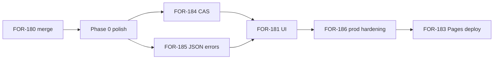

# Plan 0042 — Admin ops console remediation (review findings)

**Status:** DRAFT  
**Date:** 2026-06-22  
**Related:**
[plan-0041](plan-0041-canopy-admin-ops-console.md),
[plan-0040](plan-0040-onboard-epic-closure-backlog.md),
[ADR-0009](../adr/adr-0009-self-service-onboard-provisioning.md),
[FOR-172](https://linear.app/forestrie/issue/FOR-172),
[FOR-180](https://linear.app/forestrie/issue/FOR-180) (PR [#47](https://github.com/forestrie/canopy/pull/47))

---

## Purpose

Structured remediation for **high** and **medium** findings from a distributed
systems / applied-crypto review of the FOR-166 onboard epic closure and the
FOR-172 admin console work in flight (FOR-180 open, FOR-181–183 backlog).

Scope: `canopy-api` onboard/payments handlers, `canopy-admin` stub UI, mandate
live CI, and cross-cutting ops patterns. Low findings are noted but not
scheduled unless bundled with adjacent work.

---

## Review scope and baseline

| Area | Baseline reviewed |
|------|-------------------|
| Epic FOR-166 | Closed; FOR-178 matrix 8/8 on dev lane |
| FOR-180 | PR #47 open — admin JSON parity, CORS PUT, kill-switch JSON mirror |
| FOR-181–183 | Not started; stub `canopy-admin/index.html` on `main` |
| Mandate CI | `live-onboard` green; `live-provision` / hands-off red (FOR-101) |

**What FOR-180 gets right:** separates admin JSON from CBOR ops routes;
constant-time bearer compare; redeem uses R2 CAS; auto-approve hard-blocked when
`NODE_ENV=prod`; genesis binding gate and create rate limits inherited from
FOR-175; targeted unit tests for happy paths and CBOR backward compatibility.

---

## Findings summary

| ID | Severity | Dimension | Finding |
|----|----------|-----------|---------|
| R-01 | **HIGH** | Security / liveness | Approve/reject use blind R2 writes; redeem uses CAS — TOCTOU can overwrite `redeemed` with `approved` |
| R-02 | **HIGH** | Security | Stub admin UI renders user fields via `innerHTML` (XSS when FOR-181 ships) |
| R-03 | **HIGH** | Security | Ops bearer in `sessionStorage` — any XSS on Pages origin = full ops compromise |
| R-04 | **MEDIUM** | Security | Admin JSON routes return **CBOR** problem bodies on 401/409/404 |
| R-05 | **MEDIUM** | Security | Admin list responses include PII without `Cache-Control: no-store` |
| R-06 | **MEDIUM** | Security | `rejectReason` has no max length (storage / response abuse) |
| R-07 | **MEDIUM** | Security | CORS `Access-Control-Allow-Origin: *` on all routes including admin |
| R-08 | **MEDIUM** | Security | No rate limit on ops admin endpoints (bearer brute-force surface) |
| R-09 | **MEDIUM** | Liveness | Reject path emits no webhook — ops automation blind to rejections |
| R-10 | **MEDIUM** | Liveness | `countNonTerminalRequestsForBinding` full-prefix R2 scan on every create |
| R-11 | **MEDIUM** | Liveness | `listOnboardTokens` unpaginated; degrades as token count grows |
| R-12 | **MEDIUM** | Test coverage | FOR-180 tests miss list/tokens JSON, empty reject, race, expired approve |
| R-13 | **MEDIUM** | Testability | No shared admin JSON client helper; error-format assertions ad hoc |
| R-14 | **MEDIUM** | Best practice | Duplicated `jsonResponse`; admin vs CBOR error surfaces diverge |
| R-15 | **MEDIUM** | Modern standards | Admin errors not RFC 7807 JSON; loose `Content-Type` sniff (`includes`) |
| R-16 | **MEDIUM** | Test coverage | No automated UI tests; mandate live job stops before full provision |
| R-17 | **LOW** | Best practice | Kill switch PUT has no confirm/audit trail beyond coordinator state |
| R-18 | **LOW** | Modern standards | Static admin lacks CSP / `Referrer-Policy` (FOR-183 partial) |

---

## Detailed findings

### R-01 — Approve/reject lack R2 CAS (HIGH: security + liveness)

**Observation:** `transitionApprovedToRedeemedCas` uses `putRecordCas` with
etag. `approveRequestRecord` and `handleOpsReject` call `writeOnboardRequest`
(last-writer-wins).

**Failure scenario:**

1. Request is `pending`; ops loads UI.
2. Mandate redeems (CAS → `redeemed`).
3. Stale ops clicks Approve (or double-tab approve after concurrent reject).
4. Blind write sets `status: approved`, potentially clobbering `redeemed` /
   `redeemedAt` / `onboardTokenRef`.

**Impact:** State machine violation; operator confusion; possible duplicate
token mint attempts on re-redeem paths (mitigated by redeem CAS, but ops view
lies).

**Fix:** Add `transitionPendingToApprovedCas` and
`transitionPendingToRejectedCas` mirroring redeem CAS. Return **409 Conflict**
on CAS failure after re-read + `effectiveStatus` check.

**Tests:** Concurrent approve+redeem simulation; approve after redeemed → 409;
double approve → one success one 409.

---

### R-02 — Admin UI XSS (HIGH: security)

**Observation:** `canopy-admin/index.html` line 86 uses template literals in
`innerHTML` for `label`, `contactEmail`, `chainId`.

**Impact:** Malicious onboard request metadata becomes stored XSS against ops
browser session (bearer exfiltration).

**Fix (FOR-181):** Render with `textContent` / `createElement` only; central
`escapeHtml` forbidden — prefer DOM APIs. Add CSP on Pages (R-18).

---

### R-03 — sessionStorage ops bearer (HIGH: security, accepted risk v1)

**Observation:** Plan-0041 explicitly stores `CANOPY_OPS_ADMIN_TOKEN` in
`sessionStorage`.

**Impact:** XSS on admin origin = bearer theft. No HttpOnly cookie alternative.

**Mitigation plan (v1):** CSP strict-default; no third-party scripts; document
break-glass rotation in README; **out of scope:** SSO (plan-0041). **v2:**
Cloudflare Access in front of Pages + short-lived token exchange.

---

### R-04 — Admin JSON errors return CBOR (MEDIUM: security / UX)

**Observation:** `opsAuth` → `ClientErrors.unauthorized` → CBOR. Stub UI
`response.json()` on errors throws opaque failures (S7 partial).

**Fix:** Introduce `adminJsonProblem(status, title, detail)` and route all
`/api/onboarding/admin/**` and `/api/payments/admin/**` errors through JSON
problem responses (`Content-Type: application/json`).

---

### R-05 — PII caching (MEDIUM: security)

**Observation:** `GET /api/onboarding/admin/requests` returns `contactEmail` but
no `Cache-Control: no-store`. Public create/redeem paths already use
`NO_STORE_HEADERS`.

**Fix:** Apply `no-store` to all admin JSON responses carrying PII or ops
metadata.

---

### R-06 — rejectReason unbounded (MEDIUM: security)

**Observation:** Create path caps field lengths via `checkOnboardFieldLengths`;
reject reason does not.

**Fix:** Cap e.g. 512 chars; 400 on exceed. Mirror constant in ADR-0009.

---

### R-07 — CORS wildcard (MEDIUM: security)

**Observation:** `Access-Control-Allow-Origin: *` on worker globally.

**Impact:** Any origin can invoke admin API **if** bearer is known. Does not
steal bearer from Pages, but enables token replay from attacker-controlled
origins once leaked.

**Fix:** Env `CANOPY_ADMIN_ALLOWED_ORIGINS` (comma list); reflect allowed
Origin on admin routes in prod; keep `*` for dev only.

---

### R-08 — No ops rate limit (MEDIUM: security)

**Observation:** Create has `ONBOARD_CREATE_RATE_LIMITER`; ops routes do not.

**Fix:** Optional Cloudflare Rate Limiting binding keyed by
`CF-Connecting-IP` + route prefix `/api/*/admin/` (429 JSON). Document in
wrangler prod config.

---

### R-09 — Reject webhook missing (MEDIUM: liveness)

**Observation:** Webhooks fire on create, approve, redeem — not reject.

**Fix:** Add `onboard.request.rejected` event; include optional `rejectReason`
in payload (not in public list if sensitive). Test in `onboard-notify.test.ts`.

---

### R-10 — Binding pending count scan (MEDIUM: liveness)

**Observation:** `countNonTerminalRequestsForBinding` lists entire
`onboarding/requests/` prefix per create.

**Impact:** O(n) latency growth; create path is adversary-controllable DoS.

**Fix (defer until n > ~500):** Maintain binding-index sidecar in R2 or Durable
Object counter; or accept v1 with monitoring + alert on list latency.

---

### R-11 — Token list unpaginated (MEDIUM: liveness)

**Observation:** `GET /api/onboarding/admin/tokens` loads all token records.

**Fix:** Pagination matching requests list (`limit`, `cursor`); FOR-182 UI load
more.

---

### R-12 — FOR-180 test gaps (MEDIUM: test coverage)

**Missing automated cases:**

- Admin list GET JSON shape + pagination cursor
- Admin tokens GET auth + JSON
- Reject with empty body → rejected without reason
- Approve/reject on expired pending → 409
- Admin 401/409 content-type JSON (after R-04)
- OPTIONS preflight on payments admin path
- `no-store` on admin list

---

### R-13 — Testability (MEDIUM)

**Fix:** Extract `packages/apps/canopy-api/test/helpers/admin-json.ts` with
`adminFetch`, `expectJsonProblem`, shared env bootstrap.

---

### R-14 / R-15 — API consistency (MEDIUM: best practice / standards)

**Fix:** Single module `admin-json-response.ts` with `jsonResponse`,
`jsonProblem`, `withNoStore`. Strict Content-Type equality for JSON bodies.

---

### R-16 — End-to-end coverage (MEDIUM: test coverage)

**Gaps:**

- No Playwright against Pages (plan-0041 defers)
- Mandate `live-onboard` does not assert full provision/genesis
- FOR-101 provision/hands-off still failing in mandate workflow

**Fix:** Track FOR-101 separately; add optional `live-onboard-provision` job
gated behind flag once FOR-101 green; defer Playwright until Pages URL stable
(FOR-183).

---

## Remediation phases

Phases align with plan-0041 stack where possible. New Linear issues suggested
as **FOR-184+** (create when executing).

### Phase 0 — Gate FOR-180 merge (minimal delta)

**When:** Before or as follow-up commit on PR #47.

| Task | Finding | Effort |
|------|---------|--------|
| Add `no-store` to admin JSON responses | R-05 | S |
| Cap `rejectReason` length | R-06 | S |
| Extend tests: empty reject, list GET, tokens GET | R-12 | M |
| Update ADR-0009 admin route + error notes | R-04 | S |

**Acceptance:**

```bash
pnpm --filter @canopy/api test -- test/onboard-admin-json.test.ts \
  test/registration-enabled.test.ts test/onboard-request.test.ts
```

Merge #47 → mark FOR-180 Done.

---

### Phase 1 — State machine hardening (FOR-184)

**Priority:** P0 — do before FOR-181 ships to production lane.

| Task | Finding |
|------|---------|
| CAS transitions for approve and reject | R-01 |
| Unit tests: concurrent redeem vs approve | R-01, R-12 |
| Emit `onboard.request.rejected` webhook | R-09 |

**Acceptance:** New `onboard-request-cas.test.ts` green; no blind
`writeOnboardRequest` on status transitions except idempotent metadata patches.

---

### Phase 2 — Admin JSON contract (FOR-185)

**Priority:** P1 — unblocks reliable FOR-181 error UX.

| Task | Finding |
|------|---------|
| JSON problem responses on all admin routes | R-04, R-15 |
| Shared `admin-json-response` module | R-14 |
| Test helper + 401/409 JSON assertions | R-12, R-13 |

**Acceptance:** Browser `fetch` never needs CBOR decoder on admin paths.

---

### Phase 3 — FOR-181 UI security (in plan-0041 Phase B)

| Task | Finding |
|------|---------|
| DOM-safe rendering (no innerHTML for user data) | R-02 |
| Error toast from JSON problem `detail` | R-04 |
| Reject modal with reason length hint (512) | R-06 |

Do **not** ship FOR-181 without R-02 fix.

---

### Phase 4 — Production hardening (FOR-186)

**Priority:** P2 — before prod Pages deploy (FOR-183).

| Task | Finding |
|------|---------|
| CORS allowlist env for admin origins | R-07 |
| Ops admin rate limiter binding | R-08 |
| CSP + Referrer-Policy on static admin | R-18 |
| README: token rotation, Access roadmap | R-03 |

---

### Phase 5 — Scale + inventory (FOR-187, pairs with FOR-182)

| Task | Finding |
|------|---------|
| Paginate `admin/tokens` | R-11 |
| Kill switch confirm dialog + audit note in UI | R-17 |
| Monitor R-10; spike index if p95 create > 2s | R-10 |

---

### Phase 6 — Verification uplift (FOR-188)

| Task | Finding |
|------|---------|
| Mandate live job extension post FOR-101 | R-16 |
| Optional Playwright smoke against Pages preview URL | R-16 |
| Manual AC matrix S1–S15 sign-off in FOR-183 | plan-0041 |

---

## Dependency graph



**Critical path:** FOR-180 → **FOR-184 (CAS)** → FOR-181 → FOR-186 → FOR-183.

FOR-185 can parallel FOR-184 but should land before FOR-181 merge.

---

## Risk register (residual after remediation)

| Risk | Mitigation | Owner |
|------|------------|-------|
| Ops bearer theft via XSS | CSP + DOM-safe UI; rotate token; v2 Access | FOR-186, FOR-183 |
| R2 list latency at scale | Monitor; FOR-187 index spike | Platform |
| Webhook loss | Best-effort by design; ops uses admin UI | Accept |
| Coordinator down during kill switch | UI 503 handling (FOR-182) | FOR-182 |
| Auto-approve misconfig in prod | `NODE_ENV=prod` guard + deploy review | Existing |

---

## Suggested Linear issues

| Issue | Title | Phase |
|-------|-------|-------|
| FOR-184 | CAS approve/reject + reject webhook | 1 |
| FOR-185 | Admin JSON problem details + test helpers | 2 |
| FOR-186 | Prod CORS allowlist, ops rate limit, CSP | 4 |
| FOR-187 | Admin token pagination + binding index spike | 5 |
| FOR-188 | Live provision CI + optional Playwright | 6 |

Parent: FOR-172 (or link as related to FOR-166 follow-up epic if preferred).

---

## Validation commands

```bash
# After Phase 0 + FOR-180 merge
pnpm --filter @canopy/api test -- test/onboard-admin-json.test.ts

# After Phase 1
pnpm --filter @canopy/api test -- test/onboard-request-cas.test.ts

# Full onboard regression
pnpm --filter @canopy/api test -- test/onboard-*.test.ts test/registration-enabled.test.ts

# Mandate live (existing)
cd ../mandate && pnpm test -- test/onboard-request.live.test.ts
```

---

## Decision log

| Decision | Rationale |
|----------|-----------|
| CAS before FOR-181 prod | Prevents state clobber under real ops + mandate concurrency |
| Defer binding index until metrics | YAGNI for dev lane; document threshold |
| sessionStorage v1 OK | Matches internal ops console; document rotation |
| Playwright defer | Pages URL not stable until FOR-183 |
| JSON admin mirror stays separate from CBOR ops | CLI/mandate remain CBOR-native per ADR-0009 |
