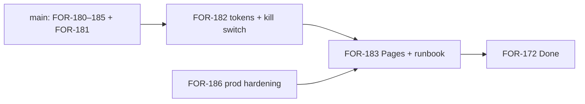

# Plan 0043 — Admin ops console follow-up remediation (review 2)

**Status:** DRAFT  
**Date:** 2026-06-22  
**Related:**
[plan-0042](plan-0042-admin-ops-remediation.md),
[plan-0041](plan-0041-canopy-admin-ops-console.md),
[FOR-172](https://linear.app/forestrie/issue/FOR-172),
PRs [#47–#51](https://github.com/forestrie/canopy/pulls?q=is%3Apr+admin-ui)

---

## Purpose

Second review after FOR-180–185 and FOR-181 landed on `main` (through PR #51).
Documents **resolved** plan-0042 items, **remaining** medium/high findings, and
the closure path for FOR-172 (FOR-182, FOR-183, FOR-186–188).

---

## Review baseline (merged)

| PR | Issue | Deliverable |
|----|-------|-------------|
| #47 | FOR-180 | Admin JSON API, CORS PUT, phase-0 hardening |
| #48 | FOR-184 | CAS approve/reject, reject webhook |
| #49 | FOR-185 | JSON problem details on admin routes |
| #51 | FOR-181 | Request queue UI (`admin-app.js`) |

Note: stacked PR #50 merged to the FOR-185 branch only; **#51** landed UI on
`main`. Prefer PRs targeting `main` (or rebase stack tip onto `main`) before
merge.

---

## Resolved from plan-0042

| ID | Finding | Resolution |
|----|---------|------------|
| R-01 | Approve/reject blind writes | FOR-184 CAS |
| R-02 | UI XSS via innerHTML | FOR-181 DOM `textContent` |
| R-04 | Admin errors returned CBOR | FOR-185 `admin-json-response` |
| R-05 | PII without no-store | FOR-180 phase 0 |
| R-06 | Unbounded rejectReason | FOR-180 cap 512 |
| R-09 | No reject webhook | FOR-184 |
| R-12 (partial) | Admin JSON test gaps | Extended in #47/#49 |
| R-13 | Ad hoc error assertions | `test/helpers/admin-json.ts` |
| R-14 (partial) | Duplicated jsonResponse | Shared admin-json module |

---

## Remaining findings

### High

| ID | Dimension | Finding | Target |
|----|-----------|---------|--------|
| R-03 | Security | Ops bearer in `sessionStorage` — XSS on Pages origin = full ops compromise | FOR-186 + FOR-183 |
| R-07 | Security | CORS `Access-Control-Allow-Origin: *` on worker | FOR-186 prod allowlist |

### Medium

| ID | Dimension | Finding | Target |
|----|-----------|---------|--------|
| R-08 | Security | No rate limit on `/api/*/admin/**` | FOR-186 |
| R-10 | Liveness | `countNonTerminalRequestsForBinding` O(n) R2 scan on create | FOR-188 monitor → spike |
| R-11 | Liveness | `admin/tokens` unpaginated | FOR-188 |
| R-16 | Test coverage | No Playwright / UI smoke; mandate live stops before provision | FOR-187 |
| N-01 | Best practice | Stacked PR can merge without updating `main` | Document in plan-0041; always verify `main` |
| N-02 | UX / liveness | UI status filter applies to **loaded pages only**; pending on later pages invisible until Load more | FOR-182 or FOR-189 |
| N-03 | Coverage | FOR-181 manual AC (S1–S7) not recorded in repo checklist | FOR-183 README |
| N-04 | Scope | Tokens + kill-switch tabs stubbed | FOR-182 |
| N-05 | Scope | No Pages deploy / HTTPS origin | FOR-183 |
| R-18 | Modern standards | No CSP / Referrer-Policy on static admin | FOR-186 / FOR-183 |

### Low (defer)

| ID | Finding |
|----|---------|
| R-17 | Kill switch PUT lacks confirm dialog + audit note |
| R-15 (partial) | Loose `Content-Type` sniff on reject (`includes`) — acceptable for v1 |
| N-06 | `file://` local open may hit CORS; README recommends `python -m http.server` |

---

## Recommended remediation phases

### Phase A — FOR-182 (tokens + kill switch UI)

**Branch:** `for/admin-ui-3-tokens-killswitch` from `main`

- Enable Tokens / Kill switch tabs (remove disabled stubs)
- Token list from `GET /api/onboarding/admin/tokens`
- Kill switch: `GET/PUT /api/payments/admin/registrations/{R}/enabled`
- Confirm dialog on kill-switch toggle
- Scenario rows S8–S13 (manual)

**Optional in same PR (N-02):** default filter `pending` + server-side
`?status=pending` query if added to API; otherwise document “Load all / filter
pending” ops runbook.

---

### Phase B — FOR-183 (Pages deploy + runbook)

**Branch:** `for/admin-ui-4-pages-deploy`

- Cloudflare Pages project + optional `deploy-canopy-admin.yml`
- README manual checklist (S1–S15) with FOR-178 cross-links
- Close FOR-172 when A–B complete and manual sign-off recorded

---

### Phase C — FOR-186 (prod hardening)

Can ship with FOR-183 or immediately after prod URL known:

- `CANOPY_ADMIN_ALLOWED_ORIGINS` env + reflected Origin on admin routes
- Ops admin rate limiter binding
- CSP + Referrer-Policy headers (Pages `_headers` or meta policy v1)

---

### Phase D — FOR-188 + FOR-187 (scale + verification)

- Token list pagination (API + UI)
- Binding-index spike if create p95 degrades
- Mandate live provision extension post FOR-101
- Optional Playwright smoke against Pages preview URL

---

## Suggested new Linear issue (optional)

| Issue | Title | Maps to |
|-------|-------|---------|
| FOR-189 | Admin UI server-side status filter or pending-first fetch | N-02 |

Parent: FOR-172. Only open if N-02 pain appears in ops before FOR-182 ships.

---

## Dependency graph (updated)



FOR-186 can parallel FOR-182; must complete before prod Pages cutover.

---

## Validation commands

```bash
# API regression
pnpm --filter @canopy/api test -- test/onboard-admin-json.test.ts \
  test/onboard-request-cas.test.ts test/registration-enabled.test.ts

# Local UI (serve; do not use file://)
cd packages/apps/canopy-admin && python3 -m http.server 8080
# Configure dev API URL + Doppler CANOPY_OPS_ADMIN_TOKEN
```

---

## Decision log

| Decision | Rationale |
|----------|-----------|
| Re-review after #51 not #50 | #50 did not update `main` |
| N-02 medium not high | Ops can Load more + filter; fix in FOR-182 or small API query |
| FOR-172 stays In Progress | FOR-182 + FOR-183 remain |
| Defer FOR-189 unless needed | Avoid API surface creep before FOR-182 |
