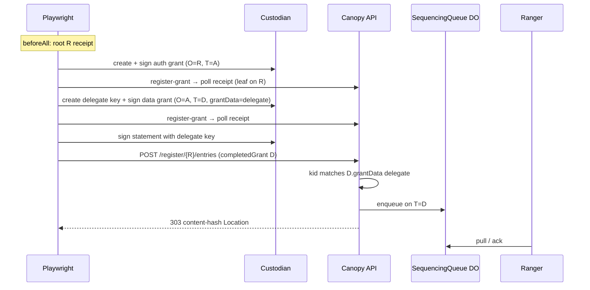
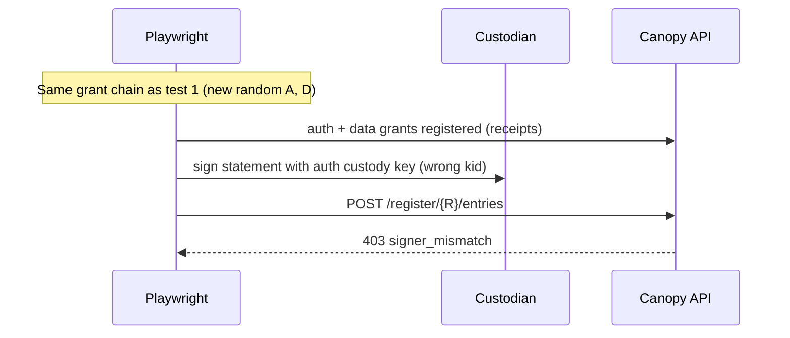

# System e2e — `auth-data-log-chain.spec.ts`

**Spec:** `tests/system/auth-data-log-chain.spec.ts`  
**Index:** [README.md](./README.md)  
**Prerequisites:** [overview.md](./overview.md) — flows A, B, C

Serial suite; `beforeAll` bootstraps root `R` once; each test builds a **new**
auth log `A` and data log `D` (and delegated signer id).

## What this spec proves

- **Three-level hierarchy:** root → auth log → data log.
- Data log grant is signed by **auth custody** key but embeds **delegated**
  signer pubkey in `grantData`.
- **`POST /register/{R}/entries`** on data log `D` succeeds when the statement is
  signed by the **delegated** key.
- Same setup fails when the statement is signed by the **auth** custody key
  (`signer_mismatch`).

## Auth under test

```text
R  root
 └── A  auth     ownerLogId=R,  grant leaf sequenced on R
      └── D  data     ownerLogId=A,  grant signed by auth key
                      grantData = delegated pubkey
                      statements on D must use delegated kid
```

| Step | Authorization interaction |
|------|---------------------------|
| Auth grant | Child-auth-first on `R`; `O=R`, `T=A` |
| Data grant | Child-data-first on `A`; `O=A`, `T=D`; signer = auth custody |
| Statement | Completed grant on `D` + Sign1 kid = `grantData` delegate |

## Test cases

### Shared `beforeAll`

[Base flow B](./overview.md#base-flow-b--register-grant-through-scitt-receipt) on
`e2eReceiptBootstrapRootLogId()` only (root cold → hot).

### 1. Delegated signer posts register-statement on data log

**Happy path.**



### 2. register-statement rejects auth key when delegate required

**Negative path.**



## Helpers

- `dataLogCreateExtendFlags` — data log grant bitmap
- `e2eDataLogDelegationStatementPayload` — `multi-log-grant-chain.ts`
- `buildCompletedGrantBase64` after data grant receipt

## Auth-focused logical flows

**Happy**

```text
[R hot]
  register auth (A on R) ──► receipt
  register data (D on A, grantData=delegate) ──► completedGrant(D)
  sign(statement) with delegate kid ──► 303 on D
```

**Negative**

```text
  completedGrant(D)
  sign(statement) with auth kid ≠ grantData ──► 403
```

## Related platform doc

Hierarchical authority model:
[ARC-0017](https://github.com/forestrie/devdocs/blob/main/arc/arc-0017-hierarchical-authority-logs-and-fee-distribution.md).
