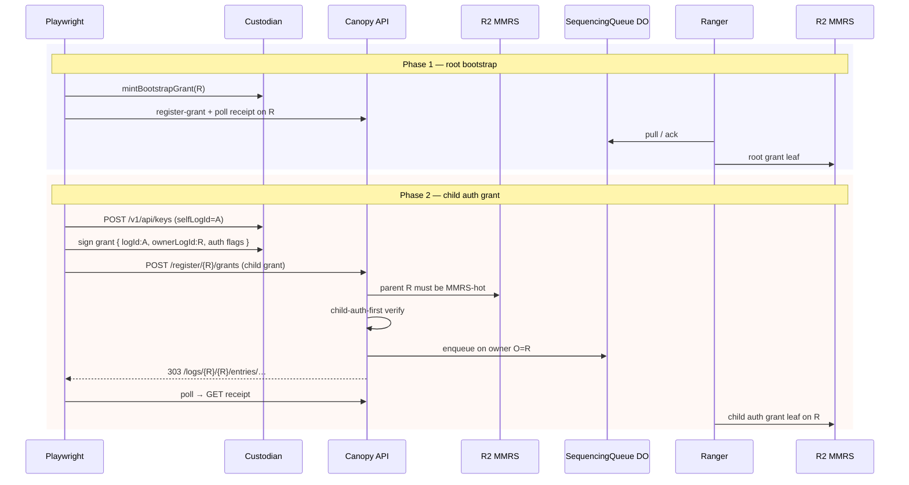

# System e2e — `bootstrap-child-auth-grant.spec.ts`

**Spec:** `tests/system/bootstrap-child-auth-grant.spec.ts`  
**Index:** [README.md](./README.md)  
**Prerequisites:** [overview.md](./overview.md) — flows A, B

Single serial test; long timeout (600s) for receipt polling.

## What this spec proves

- After root bootstrap, a **child auth log** `A` can receive its first grant with
  `ownerLogId = R` and `logId = A`.
- The grant is **sequenced on the parent log `R`** (not on `A`’s own MMR as target
  for the status URL).
- Custodian creates a **separate custody key** for `selfLogId = A` to sign the child
  grant; KMS CryptoKey id matches normalized `selfLogId`.

## Auth under test

```text
R  root (MMRS-hot after bootstrap receipt)
 └── A  auth child
        logId = A, ownerLogId = R
        grant: auth-log bootstrap-shaped flags
        grantData = child custody x‖y
        sequencing owner O = R  →  status /logs/{R}/{R}/entries/…
```

| Verification branch | When                                                          |
| ------------------- | ------------------------------------------------------------- |
| Bootstrap (genesis) | Root only, cold MMRS                                          |
| Child-auth-first    | Parent `R` MMRS-hot; COSE vs child `grantData`; curator paths |
| Receipt             | Later grants on hot logs                                      |

## Test case

### POST /register/grants (child) → 303 on parent path; receipt polls

**Happy path only.**



## Helpers

- `signGrantPayloadWithCustodyKey`, `postCustodianCreateEs256Key` —
  `custodian-custody-grant.ts`
- `authLogBootstrapShapedFlags` — `e2e-grant-flags.ts`
- `completeGrantRegistrationThroughReceipt` — generic child grant poll

## Auth-focused logical flow

```text
Genesis(R) + bootstrap grant on R ──► MMRS-hot R
Create key(A) ──► sign child grant (O=R, T=A)
Canopy child-auth-first ──► enqueue on R
Receipt proves grant leaf on R (not on A's id as owner path segment)
```

## Assertions of note

- `statusUrlAbsolute` contains `/logs/{root}/{root}/entries/`
- Does **not** contain `/logs/{root}/{child}/entries/` for the registration status
  of this child-first auth grant.
