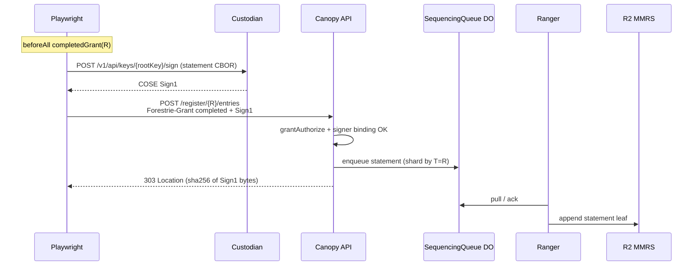
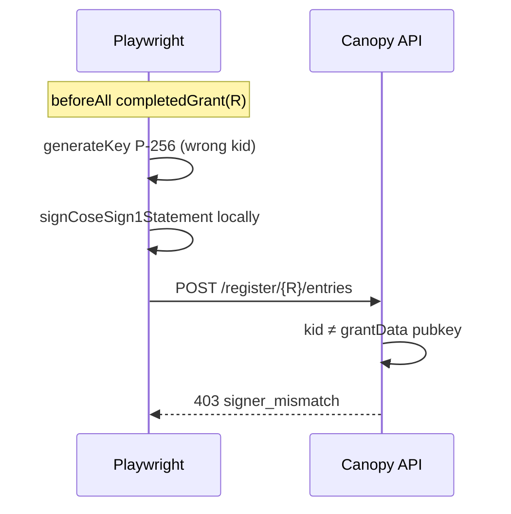

# System e2e — `bootstrap-log-first-entry.spec.ts`

**Spec:** `tests/system/bootstrap-log-first-entry.spec.ts`  
**Index:** [README.md](./README.md)  
**Prerequisites:** [overview.md](./overview.md) — flows A, B, C

Serial suite with shared `beforeAll`: one root bootstrap + receipt, then two
tests against the same **completed grant**.

## What this spec proves

- After root bootstrap, **`POST /register/{R}/entries`** accepts a COSE Sign1
  statement when the Sign1 `kid` matches the **root signer** bound in the
  completed grant’s `grantData` (ES256: 32-byte x; KS256: 20-byte address).
- A statement signed with a **different** key is rejected with
  **`signer_mismatch`** even when the grant/receipt are valid.

## Auth under test

```text
R  (root)
   completedGrant: receipt inclusion on R + grantData = root signer binding
   statement: COSE Sign1 kid MUST match grantData (x or KS256 address)
```

| Check               | Mechanism                                                      |
| ------------------- | -------------------------------------------------------------- |
| Grant authorization | `grantAuthorize` — completed Forestrie-Grant + receipt         |
| Statement signer    | Compare Sign1 protected `kid` to `statementSignerBindingBytes` |

## Test cases

### Shared `beforeAll`

Runs [base flow B](./overview.md#base-flow-b--register-grant-through-scitt-receipt) on
`e2eReceiptBootstrapRootLogId()` → `shared.completedGrantB64`,
`shared.rootCustodySignKeyId`.

### 1. POST /register/entries returns 303 with content-hash Location

**Happy path.**



### 2. POST /register/entries rejects wrong signer

**Negative path** — no Custodian call; ephemeral browser key.



## Helpers

- `postLogEntriesCoseSign1` — `tests/utils/post-entries-e2e.ts`
- `postCustodianSignRawPayloadBytes` — happy path signing
- `assert303ContentHashLocation` — Location contains expected content hash

## Auth-focused logical flow

```text
[Flow B] ──► completedGrant(R)
             │
             ├─► Happy: sign with root custody kid ──► 303 enqueue
             └─► Negative: sign with other kid ──► 403 signer_mismatch
```
