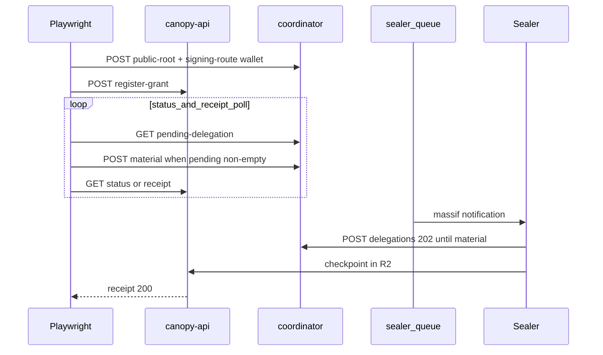

# System e2e — `byok-checkpoint-seal.spec.ts`

**Spec:** `tests/system/byok-checkpoint-seal.spec.ts`  
**Index:** [README.md](./README.md)  
**Playwright project:** `system` (default tier — Package D / FOR-76)

Runs when coordinator + ops admin env is set (same guards as Mode C webhook seal).
Skipped when prerequisites are missing.

## Purpose

End-to-end proof of BYOK checkpoint sealing: runner-held log root,
coordinator `public-root`, Sealer ephemeral delegated keys, wallet-signed
material, Ranger massif commit, R2 checkpoint, and SCRAPI receipt verification.

## Flow



## Differences from coordinator BYOK specs

| Aspect               | `coordinator-byok-material`      | This spec                      |
| -------------------- | -------------------------------- | ------------------------------ |
| Pending creation     | Explicit `POST /api/delegations` | Sealer-driven                  |
| Checkpoint / receipt | No                               | Full SCRAPI poll               |
| Custodian            | None                             | Genesis + grants via Custodian |

## Operational notes

- Use catalog `CANOPY_BASE_URL` (e.g. `api-forest-2.forestrie.dev`), not stale
  Doppler `api-dev` hosts.
- Status may redirect to receipt URL before checkpoint exists; the spec polls
  `GET …/receipt` until 200.
- Poll stats: if material was signed but receipt stays 404 with empty pending,
  check Sealer logs for `verify delegation lease` errors.

## Run

```bash
doppler run --project canopy --config dev -- \
  pnpm --filter @canopy/api-e2e exec playwright test \
    tests/system/byok-checkpoint-seal.spec.ts
```
