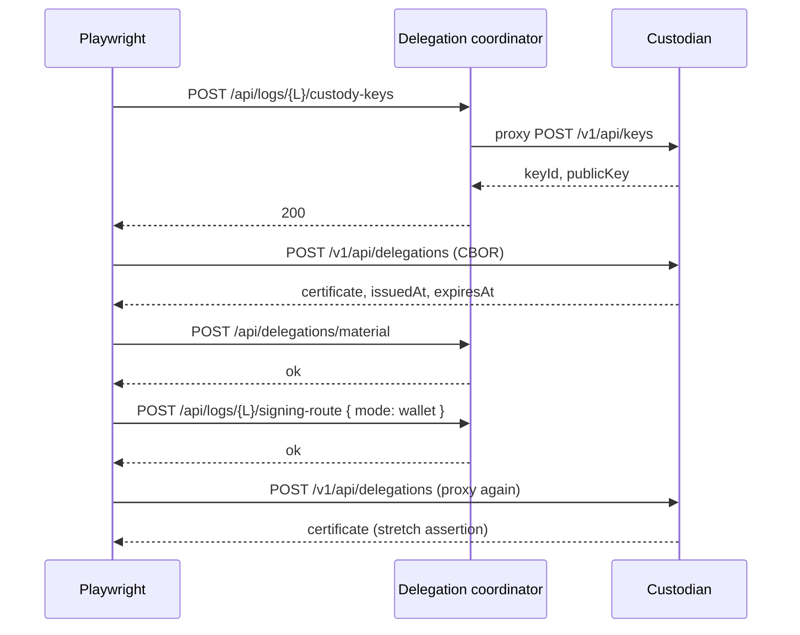

# System e2e — `coordinator-delegation-issuance.spec.ts` (stretch)

**Spec:** `tests/system/coordinator-delegation-issuance.spec.ts`  
**Index:** [README.md](./README.md)

**Opt-in:** `E2E_COORDINATOR_SEALER_STRETCH=1` and coordinator env vars. Skipped in
default `test:e2e:system` / CI system project.

This spec is **not** part of the SCRAPI register-grant / forest hierarchy flows in
[overview.md](./overview.md). It lives under `tests/system/` for manual stretch runs
only.

## What this spec proves

- **Wallet-managed** signing route on `delegation-coordinator`.
- **Custodian** `POST /v1/api/delegations` can issue delegation material for a log
  after coordinator creates custody keys and stores material.

**Out of scope (by design):** Sealer defer/recover polling; SCRAPI receipts; Ranger.

## Components

| Component | Role |
|-----------|------|
| Playwright | Orchestrates coordinator + Custodian HTTP |
| `@canopy/delegation-coordinator` | custody-keys proxy, material store, signing-route |
| Custodian | KMS keys + delegation certificate issuance |

## Auth / trust model (simplified)

```text
Coordinator (COORDINATOR_APP_TOKEN)
    └── proxies custody key create ──► Custodian (CUSTODIAN_APP_TOKEN)
    └── stores delegation material (certificate CBOR) in coordinator DO shards

Custodian POST /v1/api/delegations
    └── signs delegation certificate for (logId, mmr range, delegatedPublicKey)
```

No forest genesis, Forestrie-Grant, or ownerLogId chain in this spec.

## Test case

### wallet-managed log: material + custodian proxy issuance

**Happy path only** (when stretch env set).



## Related e2e

Default coordinator coverage (not stretch):
`tests/coordinator/coordinator-api.spec.ts` and
[package README](../../../README.md#delegation-coordinator-e2e).
