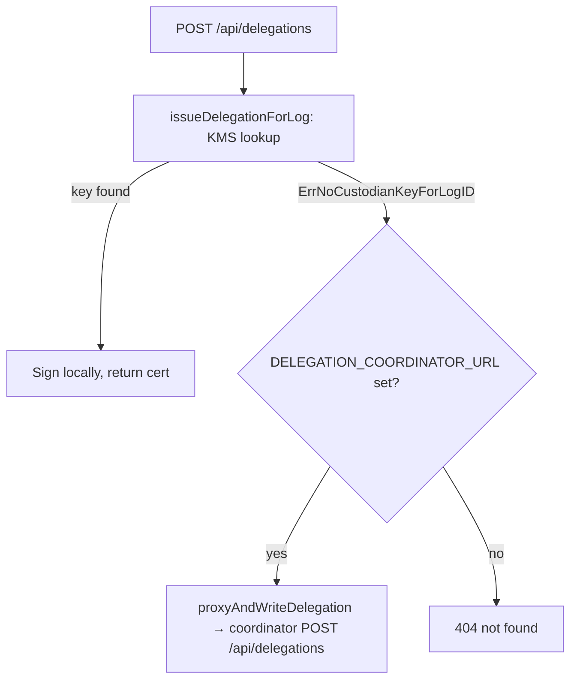
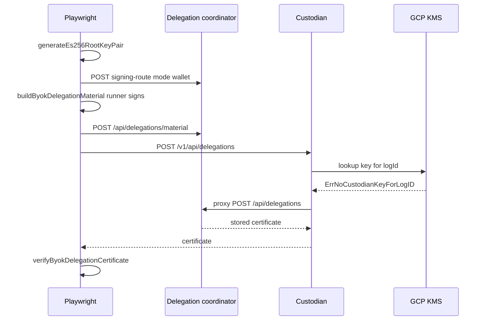

# System e2e — `coordinator-delegation-issuance.spec.ts` (stretch)

**Spec:** `tests/system/coordinator-delegation-issuance.spec.ts`  
**Index:** [README.md](./README.md)

**Opt-in:** `E2E_COORDINATOR_SEALER_STRETCH=1` plus coordinator and custodian env vars.
Skipped in default `test:e2e:system` / CI system project via `test.skip` inside the
spec (the file also matches the **prod** project but still skips unless the env is set).

This spec is **not** part of the SCRAPI register-grant / forest hierarchy flows in
[overview.md](./overview.md). It is the **system-tier** e2e for **log root keys not
held by Custodian** on the **delegation issuance** path.

---

## Purpose

Prove that a runner-owned log root can authorize delegation material stored on the
Delegation Coordinator, and that **Custodian** `POST /v1/api/delegations` returns
that material by **proxying** to the coordinator when Custodian KMS has **no key**
for the log id.

The coordinator-only twin (503 pending → material → coordinator direct issue) lives in
[`coordinator-byok-material.spec.ts`](../../coordinator/coordinator-byok-material.spec.ts).

---

## Production Custodian routing

Custodian routes `POST /api/delegations` from **local KMS presence only** — it does
not consult coordinator `signing-route.mode`:



Implementation: [`arbor/services/custodian/src/handle_delegations.go`](../../../../../../arbor/services/custodian/src/handle_delegations.go).

Deployed custodian (ledger-a) must have `DELEGATION_COORDINATOR_URL` set for the
proxy path to succeed. Outbound coordinator calls use `DELEGATION_COORDINATOR_TOKEN`
(or `AppToken` fallback) — not the caller's inbound bearer.

---

## Non-Custodian log-root coverage

| Spec                                                                                       | Tier                     | Custodian role                  |
| ------------------------------------------------------------------------------------------ | ------------------------ | ------------------------------- |
| [`coordinator-byok-material.spec.ts`](../../coordinator/coordinator-byok-material.spec.ts) | coordinator (default CI) | None — coordinator direct issue |
| **This stretch spec**                                                                      | system (opt-in)          | Proxy on KMS miss               |

Both use `generateEs256RootKeyPair`, `buildByokDelegationMaterial`, and
`verifyByokDelegationCertificate` from
[`coordinator-delegation-helpers.ts`](../../utils/coordinator-delegation-helpers.ts).

---

## What the stretch spec runs

1. Runner generates ES256 root key pair + delegated public key CBOR.
2. `POST …/signing-route { mode: wallet }` on coordinator (coordinator-internal record).
3. Runner signs delegation cert with **non-Custodian root** (`buildByokDelegationMaterial`).
4. `POST …/delegations/material` on coordinator.
5. `POST /v1/api/delegations` on **Custodian** — KMS miss → proxy → stored cert returned.
6. Assert cert bytes and timestamps match uploaded material; `verifyByokDelegationCertificate`.



**Important:** The stretch spec must **not** call coordinator `custody-keys` or
Custodian local mint for the same log id before step 5 — that would create a KMS
key and force the local signing path instead of the proxy.

---

## What this spec does not prove

| Gap                                                                        | Future work                                                                                                                                   |
| -------------------------------------------------------------------------- | --------------------------------------------------------------------------------------------------------------------------------------------- |
| SCRAPI register-grant with non-Custodian grant signer                      | [arbor plan-0003](../../../../../../arbor/docs/plan-0003-non-custodial-checkpoint-support.md)                                                 |
| Sealer obtains delegation using non-Custodian trust root on deployed stack | [arbor plan-0005](../../../../../../arbor/docs/plan-0005-sealer-trust-root-end-to-end.md)                                                     |
| Canopy receipt verify against non-Custodian root in Playwright             | plan-0003 receipt-authority phase; [arbor plan-0004](../../../../../../arbor/docs/plan-0004-coordinator-backed-byok-lease-proof.md) follow-up |
| Full checkpoint seal (Ranger + Sealer + MMRS) with BYOK delegation         | plan-0005                                                                                                                                     |
| Coordinator `GET …/public-root`                                            | plan-0005 scope item 1                                                                                                                        |

---

## How to run

```bash
E2E_COORDINATOR_SEALER_STRETCH=1 \
  CANOPY_FQDN=api-forest-2.forestrie.dev \
  CANOPY_BASE_URL=https://api-forest-2.forestrie.dev \
  doppler run --project canopy --config dev -- \
  pnpm --filter @canopy/api-e2e exec playwright test \
    tests/system/coordinator-delegation-issuance.spec.ts
```

Primary BYOK coordinator lifecycle (no Custodian hop):

```bash
doppler run --project canopy --config dev -- \
  pnpm --filter @canopy/api-e2e test:e2e:coordinator
```

---

## Related docs

- [plan-0021](../../../../docs/plans/plan-0021-delegation-coordinator-apis.md) — Phase 3 coordinator APIs
- [arbor plan-0004 (ACCEPTED)](../../../../../../arbor/docs/plan-0004-coordinator-backed-byok-lease-proof.md)
- [arbor plan-0003 § Custodian routing](../../../../../../arbor/docs/plan-0003-non-custodial-checkpoint-support.md)
- [package README — coordinator e2e](../../../README.md)
