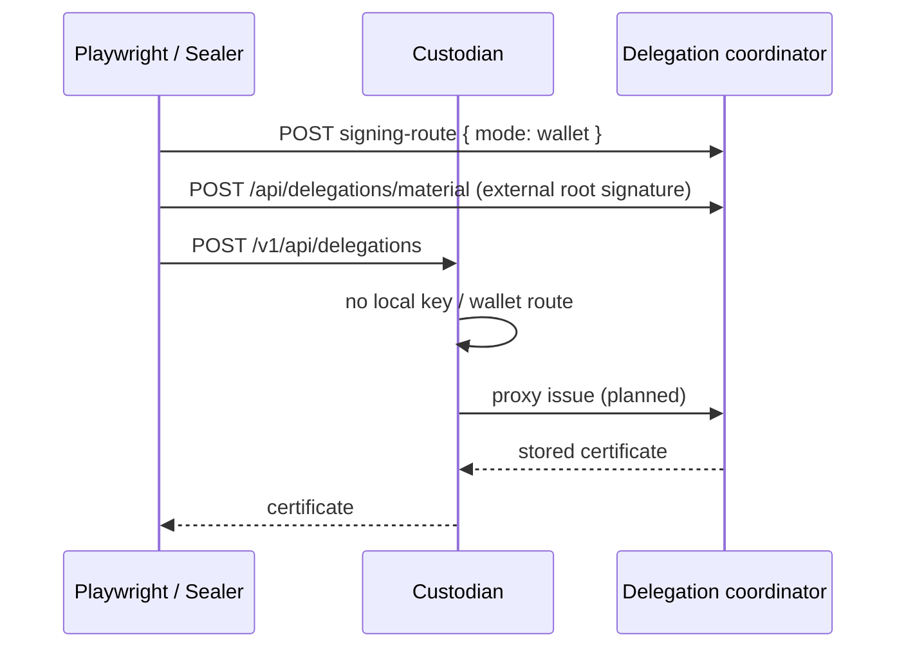

# System e2e — `coordinator-delegation-issuance.spec.ts` (stretch)

**Spec:** `tests/system/coordinator-delegation-issuance.spec.ts`  
**Index:** [README.md](./README.md)

**Opt-in:** `E2E_COORDINATOR_SEALER_STRETCH=1` and coordinator env vars. Skipped in
default `test:e2e:system` / CI system project.

This spec is **not** part of the SCRAPI register-grant / forest hierarchy flows in
[overview.md](./overview.md). It lives under `tests/system/` for manual stretch runs
only.

---

## Incremental development context (BYOK / Phase 3)

Delegation work is landing in slices documented in
[plan-0021-delegation-coordinator-apis.md](../../../../docs/plans/plan-0021-delegation-coordinator-apis.md)
(Phase 3 **management APIs** on `@canopy/delegation-coordinator`, custodial trust
root first; wallet UI and full BYOK verification deferred).

**Target production shape (not fully wired yet):**

```text
Client / Sealer  ──►  Custodian  POST /api/delegations
                           │
                           ├─► local KMS custody key exists AND log is custodial?
                           │       └── sign delegation cert locally (today: only path implemented)
                           │
                           └─► else: wallet-managed and/or local-key miss
                                   └── HTTP to Delegation coordinator
                                         └── return stored material (no Custodian sign)
```

**Coordinator → Custodian** appears today only as a **management convenience**:
`POST /api/logs/{logId}/custody-keys` on the coordinator is a **create-only proxy**
to Custodian `POST /v1/api/keys` (see
`delegation-coordinator/src/handlers/post-custody-keys.ts`). That is **orchestration**
for ops/tests that want a single coordinator token to provision keys — **not** the
BYOK trust model, where the root key never lives in Custodian.

**Coordinator → Custodian for issuance** is explicitly **out of scope** for the
coordinator worker (plan 0021: coordinator must not call Custodian sign endpoints).

So yes: reading this stretch spec as “the coordinator creates custody keys” reflects
**incremental Phase 3 scaffolding**, not the end-state BYOK loop.

---

## Why this stretch spec does not exercise Custodian → Coordinator

The stretch test does the following (see spec source):

1. **`POST …/custody-keys` on the coordinator** → Custodian creates a **local** KMS
   key for the log.
2. **`POST /v1/api/delegations` on Custodian** → today always
   **`issueDelegationForLog` (local custody sign only)** —
   `arbor/services/custodian/src/handle_delegations.go`.
3. Runner uploads the resulting cert to the coordinator (`POST …/delegations/material`).
4. Runner sets **`signing-route: wallet`** on the coordinator.
5. **`POST /v1/api/delegations` on Custodian again** (comment: “proxy again”).

**Problem for the intended loop:** once step 1 has run, Custodian’s store **already**
has a custody key for that `logId`. The **planned** Custodian behavior is to consult
**local store first**, then delegate to the coordinator only on **miss** or for
**wallet-managed** logs (plan 0021 acceptance criteria — **not implemented** in
Custodian at the time of this writing; no `DELEGATION_COORDINATOR_URL` usage in
`services/custodian`).

Therefore:

- Steps 2 and 5 both hit the **same local KMS issuance path**, not
  Custodian → Coordinator → stored material.
- Step 5 does **not** prove “Custodian proxies to coordinator when wallet-managed,”
  even after step 4, **unless** future Custodian code **skips** local signing for
  wallet-managed logs (or keys are never created in Custodian for those logs).
- Creating the key via **coordinator custody-keys** before testing wallet mode
  **actively prevents** observing a local-key **miss** on the Custodian side.

This is a **test-design limitation** aligned with an **incomplete vertical slice**,
not evidence that the final architecture prefers coordinator-provisioned keys for
BYOK.

**Intended smaller slice before full wallet signing:** the stretch spec was meant to
validate that coordinator **material storage**, **signing-route**, and **Custodian
local delegation issuance** can be composed manually in one env — and (when Sealer
work lands) to reserve headroom for defer/recover polling. The spec comment “proves
proxy issuance only” describes **aspirational** Custodian proxy behavior; **current**
Custodian code does not call the coordinator for issuance.

---

## What this spec actually proves today

| Step | What is exercised | What is *not* exercised |
|------|-------------------|-------------------------|
| Coordinator `custody-keys` | Coordinator → Custodian **create key** proxy | BYOK (no custodial root) |
| Custodian `POST /api/delegations` | Local delegation cert signing (KMS) | Coordinator proxy on miss / wallet |
| Coordinator `material` + `signing-route` | DO persistence + wallet route API | Sealer defer/recover |
| Second Custodian `delegations` | Another **local** cert (same code path) | Custodian → Coordinator loop |

**Out of scope (by design in spec):** Sealer defer/recover polling; SCRAPI receipts;
Ranger; forest genesis / Forestrie-Grant hierarchy.

---

## Where to test the real BYOK / coordinator-issue paths

Use the **`coordinator`** Playwright project (`tests/coordinator/`), not this
stretch spec.

| Spec | What it targets |
|------|-----------------|
| [`coordinator-api.spec.ts`](../../coordinator/coordinator-api.spec.ts) | Phase 3 APIs: custody-keys proxy, **custodian mint before wallet route**, material upload, wallet route, then **`POST /api/delegations` on the coordinator** (reads stored material — **no** Custodian proxy loop). |
| [`coordinator-byok-material.spec.ts`](../../coordinator/coordinator-byok-material.spec.ts) | **BYOK:** wallet route **without** Custodian custody key; coordinator issue → **503 pending**; runner-signed material; coordinator issue succeeds; pending cleared. Root key owned by test runner, not Custodian. |

Those specs match the in-flight design: **material enters via coordinator** (runner
or pre-wallet custodian mint + upload); **coordinator** serves issue requests;
**future** Custodian `POST /api/delegations` becomes a façade that forwards to the
coordinator when appropriate.

---

## Sequence diagram (what the stretch spec runs today)

Accurate for **current** code paths (local Custodian issuance both times):

```mermaid
sequenceDiagram
    participant PT as Playwright
    participant COO as Delegation coordinator
    participant CUS as Custodian (local sign only)
    participant KMS as GCP KMS

    PT->>COO: POST /api/logs/{L}/custody-keys
    COO->>CUS: proxy POST /v1/api/keys
    CUS->>KMS: create CryptoKey
    CUS-->>COO: keyId, publicKey
    COO-->>PT: 200

    Note over PT,CUS: Custodian now has local key — miss path unavailable

    PT->>CUS: POST /v1/api/delegations
    CUS->>KMS: sign delegation (local)
    CUS-->>PT: certificate

    PT->>COO: POST /api/delegations/material
    PT->>COO: POST signing-route { mode: wallet }

    PT->>CUS: POST /v1/api/delegations (again)
    Note over CUS: Still local issueDelegationForLog;<br/>does not call coordinator
    CUS->>KMS: sign delegation (local)
    CUS-->>PT: certificate
```

**Target diagram (plan 0021, not fully implemented)** for wallet-managed logs **without**
a Custodian custody key:



---

## Related docs

- [plan-0021](../../../../docs/plans/plan-0021-delegation-coordinator-apis.md) —
  scope, acceptance criteria (Custodian proxy on miss + wallet-managed).
- [package README — coordinator e2e](../../../README.md#delegation-coordinator-e2e).
- Default coordinator CI: `coordinator-api` + `coordinator-byok-material` projects;
  **not** this stretch file.
