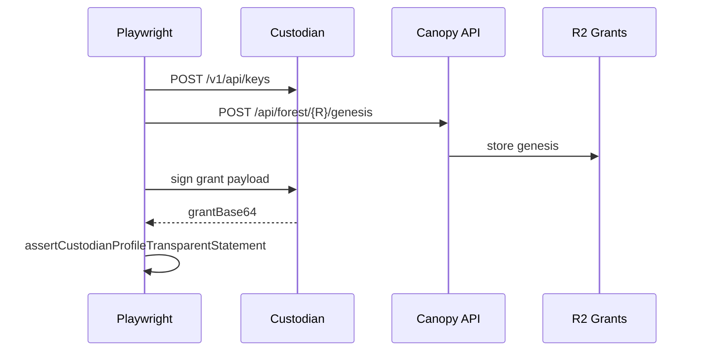
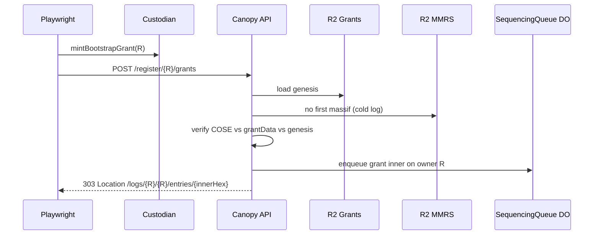
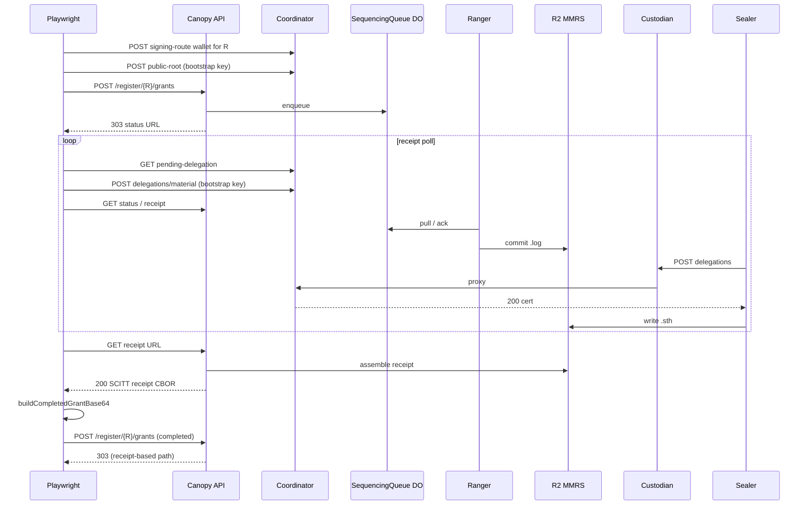

# System e2e — `grants-bootstrap.spec.ts`

**Spec:** `tests/system/grants-bootstrap.spec.ts`  
**Index:** [README.md](./README.md)  
**Prerequisites:** [overview.md](./overview.md) — base flows A (mint) and B (register → receipt)

Serial suite; uses a **fresh UUID** per test except the long poll test which uses
`e2eReceiptBootstrapRootLogId()` for stable receipt polling.

## What this spec proves

- **Ephemeral Imutable chain binding**: genesis POST with real `(chain-id, univocity-addr)`.
- Root creation grant signed by **contract bootstrap key** (ES256 PEM or KS256 wallet).
- **Cold MMRS** root accepts `POST /register/{R}/grants` (**303**).
- End-to-end **sequencing + SCITT receipt** (`mmrIndex` 0 for a fresh log).
- Runs for **ES256** and **KS256** variants via `describeForEachBootstrapVariant`.

## Auth under test

| Field             | Value                                                        |
| ----------------- | ------------------------------------------------------------ |
| Bootstrap log `R` | `logId === ownerLogId === R` (fresh UUID per test)           |
| Trust             | `grantData` matches on-chain `bootstrapConfig()` for variant |
| Chain binding     | Ephemeral Imutable contract from `task test:e2e:preflight`   |
| Signer            | Contract bootstrap key (not per-log Custodian custody key)   |

## Coordinator delegation loop (bootstrap receipt path)

Contract-bootstrap root logs have **no Custodian custody key**. Sealer calls
Custodian → coordinator proxy → **202 pending** until delegation material exists.
Playwright closes the loop (same pattern as BYOK specs):

1. `POST coordinator …/api/logs/{R}/signing-route { mode: "wallet" }`
2. Optional `POST …/public-root` with provision bootstrap key (ES256 x/y or KS256 address)
3. During receipt poll: `GET pending-delegation` + `POST delegations/material`
   signed with `E2E_UNIVOCITY_ES256_BOOTSTRAP_PEM_FILE` or
   `E2E_UNIVOCITY_KS256_BOOTSTRAP_KEY_FILE`

Requires `DELEGATION_COORDINATOR_URL` + `COORDINATOR_APP_TOKEN`
(`assertBootstrapReceiptE2eEnv`).

## Test cases

### 1. Bootstrap mint yields Custodian-profile transparent statement

**Happy path only.**

### 2. POST /register/{bootstrap}/grants returns 303 (enqueued)

### 3. Bootstrap mint + register, poll sequencing, receipt, mmrIndex 0

Uses coordinator-aware receipt polling (parallel to BYOK checkpoint seal).

## Helpers

- `mintBootstrapGrant` — `tests/utils/bootstrap-grant-flow.ts`
- `completeBootstrapGrantWithReceipt` — coordinator-aware poll in
  `bootstrap-delegation-coordinator.ts` + `bootstrap-grant-flow.ts`
- `assertCustodianProfileTransparentStatement` — grant v0 in COSE header `-65538`

## Failure modes (operational)

| Symptom                | Typical cause                                                          |
| ---------------------- | ---------------------------------------------------------------------- |
| 503 on register        | Missing `CUSTODIAN_APP_TOKEN` / queue binding on worker                |
| Not 303 on register    | MMRS already has massif for `R` (not cold)                             |
| Poll timeout           | forestrie-ingress or Ranger not running on env                         |
| Receipt 404            | Sealer pending delegation — check coordinator material loop            |
| KS256 describe skip    | Missing key file or stale ES256/KS256 address pair — re-run preflight  |
| KS256 first-entry fail | Deploy worker without KS256 register-statement support — see plan-0033 |
| `mmrIndex !== 0`       | Concurrent bootstrap on same `R`                                       |

## Local KS256 hygiene

Re-run `task test:e2e:preflight` when `ks256ChainBindingSkipReason` reports
stale addresses (`contract bootstrap is ES256, spec requires KS256`). Source
`.work/e2e-univocity.env` before tests.
