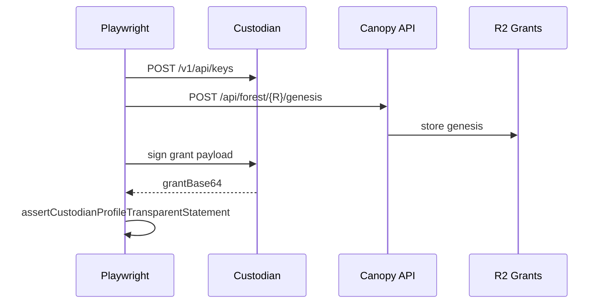
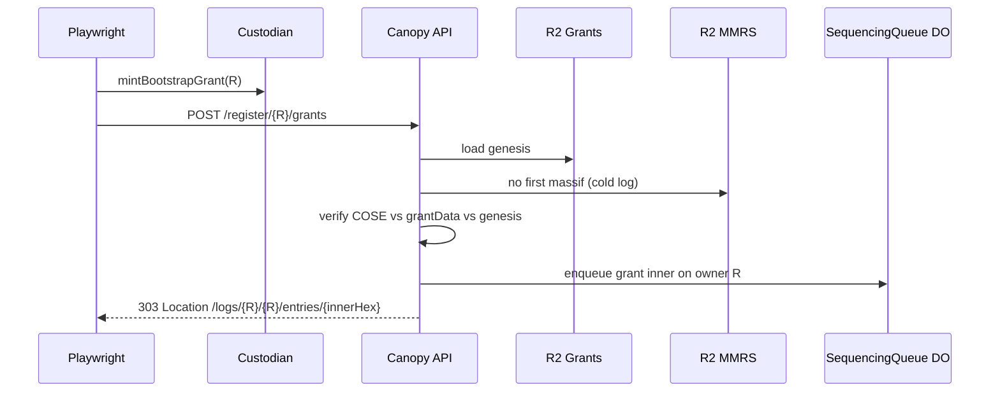
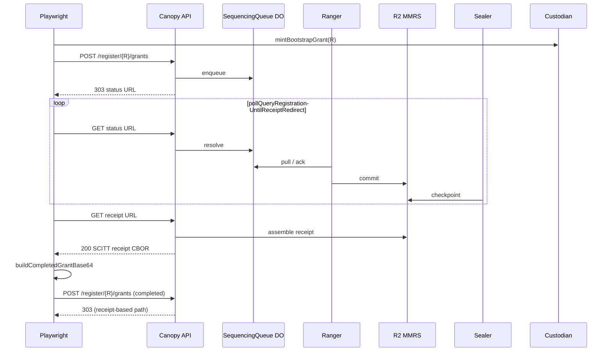

# System e2e — `grants-bootstrap.spec.ts`

**Spec:** `tests/system/grants-bootstrap.spec.ts`  
**Index:** [README.md](./README.md)  
**Prerequisites:** [overview.md](./overview.md) — base flows A (mint) and B (register → receipt)

Serial suite; uses a **fresh UUID** per test except the long poll test which uses
`e2eReceiptBootstrapRootLogId()` for stable receipt polling.

## What this spec proves

- Runner-side **bootstrap mint** matches Custodian Forestrie-Grant wire profile.
- **Cold MMRS** root accepts `POST /register/{R}/grants` on the bootstrap branch
  (**303** with registration-status `Location`).
- End-to-end **sequencing + SCITT receipt** (`mmrIndex` 0 for a fresh log).
- **Completed grant** (grant + receipt + idtimestamp) is accepted on a second
  register-grant once the log is MMRS-initialized.

## Auth under test

| Field             | Value                                                         |
| ----------------- | ------------------------------------------------------------- |
| Bootstrap log `R` | `logId === ownerLogId === R`                                  |
| Trust             | `grantData` x‖y **equals** curator genesis for `R`            |
| Flags             | create + extend (bootstrap bitmap)                            |
| Signer            | Per-root Custodian custody ES256 key (not `:bootstrap` alias) |

## Test cases

### 1. Bootstrap mint yields Custodian-profile transparent statement

**Happy path only.**

### 2. POST /register/{bootstrap}/grants returns 303 (enqueued)

### 3. Bootstrap mint + register, poll sequencing, receipt, mmrIndex 0

Uses [base flow B](./overview.md#base-flow-b--register-grant-through-scitt-receipt).

## Helpers

- `mintBootstrapGrant` — `tests/utils/bootstrap-grant-flow.ts`
- `completeBootstrapGrantWithReceipt` — `register-grant-through-receipt.ts`
- `assertCustodianProfileTransparentStatement` — grant v0 in COSE header `-65538`

## Failure modes (operational)

| Symptom             | Typical cause                                           |
| ------------------- | ------------------------------------------------------- |
| 503 on register     | Missing `CUSTODIAN_APP_TOKEN` / queue binding on worker |
| Not 303 on register | MMRS already has massif for `R` (not cold)              |
| Poll timeout        | forestrie-ingress or Ranger not running on env          |
| `mmrIndex !== 0`    | Concurrent bootstrap on same `R`                        |
