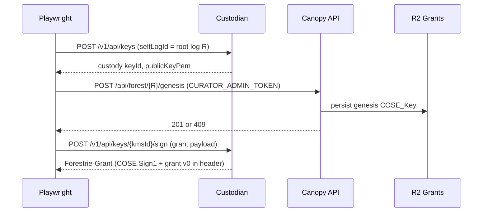
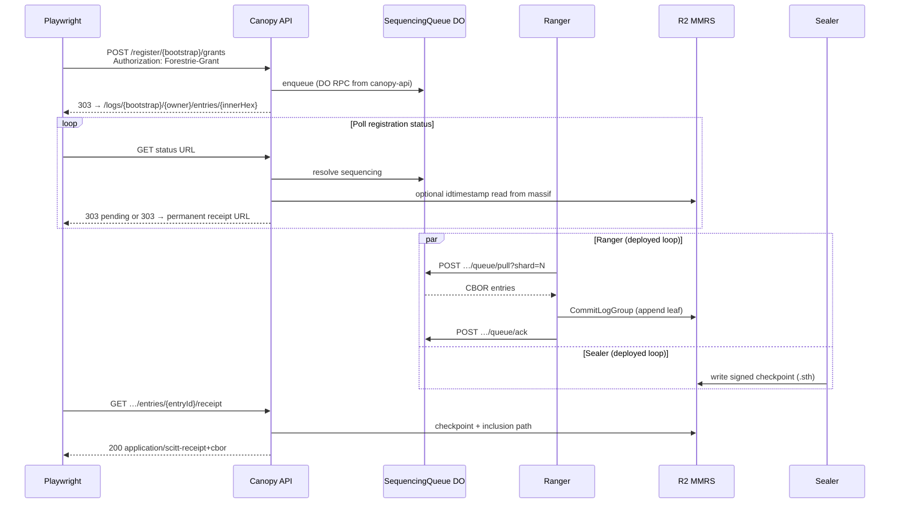
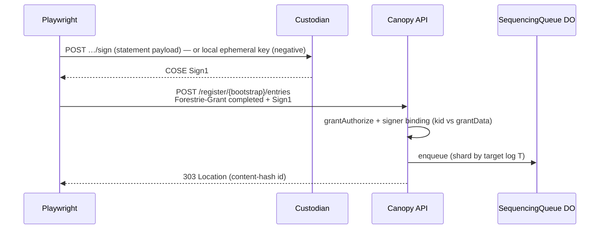

# System e2e — architecture overview

Playwright **system** tests (`tests/system/*.spec.ts`) run against a **deployed**
Canopy stack plus Arbor backends. They do not start `wrangler dev` locally.
Shared helpers live in `tests/utils/` (mint, register-grant, poll receipt).

For the **test index** (happy / negative paths and auth-focused summaries), see
[README.md](./README.md).

## Components

| Component              | Repository / package        | Role in system e2e                                                     |
| ---------------------- | --------------------------- | ---------------------------------------------------------------------- |
| **Playwright**         | `@canopy/api-e2e`           | Runner: mints grants, polls SCRAPI, calls Custodian                    |
| **Canopy API**         | `@canopy/api`               | SCRAPI, forest genesis admin, register-grant/entries, status, receipts |
| **SequencingQueue DO** | `@canopy/forestrie-ingress` | Enqueue + resolve; Ranger pulls via HTTP                               |
| **R2_MMRS**            | Cloudflare R2               | Massifs + signed checkpoints (`.sth`)                                  |
| **R2_GRANTS**          | Cloudflare R2               | Forest genesis per bootstrap log id                                    |
| **Custodian**          | Arbor `services/custodian`  | ES256 custody keys (KMS), sign, `curator/log-key`                      |
| **Ranger**             | Arbor `services/ranger`     | `queue/pull` → commit MMR leaves to MMRS                               |
| **Sealer**             | Arbor `services/sealer`     | Signs checkpoints into R2 (async; required for receipts)               |

**Not used by default system specs:** `delegation-coordinator` (see
[coordinator-delegation-issuance.md](./coordinator-delegation-issuance.md) and
[README § BYOK delegation](./README.md#non-custodian-log-root-signing-key-byok-delegation)),
direct Custodian-only suite (`tests/custodian/`), integration-only Canopy checks
(`tests/integration/`).

### SCRAPI vs BYOK delegation e2e

Three layers — do not conflate them:

1. **SCRAPI system specs** (`grants-bootstrap`, `auth-data-log-chain`, …) — grants
   and statements signed with **Custodian KMS custody keys**; full forest hierarchy
   through register-grant, sequencing, and receipts.
2. **BYOK delegation e2e** — **runner-held log root** signs delegation certificates;
   covered by [`coordinator-byok-material.spec.ts`](../../coordinator/coordinator-byok-material.spec.ts)
   (coordinator tier) and opt-in [`coordinator-delegation-issuance.spec.ts`](../coordinator-delegation-issuance.spec.ts)
   (system tier + Custodian proxy). See [README § BYOK](./README.md#non-custodian-log-root-signing-key-byok-delegation).
3. **Future** — Sealer and SCRAPI flows with non-Custodian roots on deployed stack
   ([arbor plan-0005](https://github.com/forestrie/arbor/blob/main/docs/plan-0005-sealer-trust-root-end-to-end.md)).

## Authorization hierarchy (ARC-0017)

System tests model a **forest** rooted at a **bootstrap log id** (UUID). Grants
and statements use **Forestrie-Grant** (COSE Sign1 + embedded grant v0).

```text
Bootstrap / root log R          ownerLogId = logId = R
    │
    ├── Child auth log A        ownerLogId = R,  logId = A   (grant leaf on R)
    │
    └── Data log D              ownerLogId = A,  logId = D   (grant leaf on A)
            └── Statements on D signed by key in grantData (delegated signer)
```

| Log      | Typical `ownerLogId` (sequencing) | What gets sequenced                               |
| -------- | --------------------------------- | ------------------------------------------------- |
| Root `R` | `R`                               | Root bootstrap grant; later grants when `O === R` |
| Auth `A` | `R`                               | Auth grant (child-first on parent MMR)            |
| Data `D` | `A`                               | Data grant; statements on `D`                     |

**Trust anchors**

- **Genesis** (`POST /api/forest/{R}/genesis`, curator token) → stored in R2_GRANTS;
  bootstrap grants must match `grantData` x‖y to genesis.
- **Completed grant** = transparent grant + SCITT receipt + idtimestamp (after
  first successful register-grant poll).
- **Receipt branch** (log MMRS-hot): register-grant / entries require valid
  inclusion receipt on the **owner** log’s MMR.
- **Queue-independent authorization**: no authorization decision reads
  SequencingQueue Durable Object state. A child-**data** first grant under an
  intermediate auth log `A` is gated on `A`'s **completed creation-grant receipt**
  (supplied in the CBOR request body `{ parentGrant }`), not on `isLogInitializedMmrs(A)`
  or queue inclusion. The DO is still used for sequencing, status polling, and enqueue dedupe.

## Base flow A — runner-side mint (bootstrap grant)

Used by every system spec that calls `mintBootstrapGrant` or
`mintTransparentBootstrapGrantBase64`.



**Worker checks on register-grant (bootstrap branch):** load genesis from R2_GRANTS;
no first MMRS massif for target log; verify COSE vs `grantData` vs genesis; enqueue
on owner log `R`.

Spec detail: [grants-bootstrap.md](./grants-bootstrap.md).

## Base flow B — register-grant through SCITT receipt

Used via `completeGrantRegistrationThroughReceipt` /
`completeBootstrapGrantWithReceipt` (all specs that poll for receipts).



**Enqueue vs pull:** Canopy API enqueues through a **Durable Object binding**.
Ranger consumes the **HTTP** surface on `forestrie-ingress`
(`{CANOPY_FQDN}/canopy/ingress-queue/queue/pull`).

**Completed grant:** runner attaches receipt + idtimestamp to the transparent
grant for subsequent `POST /register/{bootstrap}/grants` or
`POST /register/{bootstrap}/entries`.

## Base flow C — register signed statement

After a **completed** grant for log `T`:



Spec detail: [bootstrap-log-first-entry.md](./bootstrap-log-first-entry.md),
[auth-data-log-chain.md](./auth-data-log-chain.md).

## Environment

See [package README](../../../README.md): `CANOPY_BASE_URL` / `CANOPY_FQDN`,
`CURATOR_ADMIN_TOKEN`, `CUSTODIAN_URL`, `CUSTODIAN_APP_TOKEN`, deployed worker
bindings (`SEQUENCING_QUEUE`, `R2_MMRS`, …). Without **forestrie-ingress** and
Ranger on the same env, poll/receipt tests **fail** (no skip).

## Related docs

- [devdocs architecture](https://github.com/forestrie/devdocs/blob/main/architecture.md) — platform-wide view
- [ARC-0017 hierarchical authority logs](https://github.com/forestrie/devdocs/blob/main/arc/arc-0017-hierarchical-authority-logs-and-fee-distribution.md)
